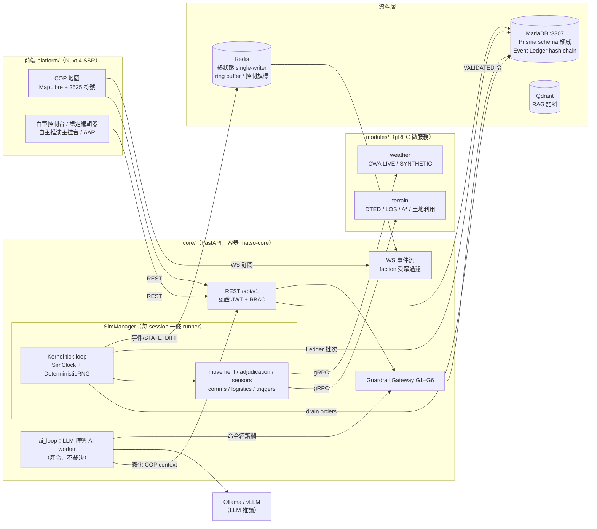

# MATSO — Military Analysis & Tactical Simulation Orchestrator

AI 輔助兵棋推演系統。**Neuro-Symbolic 架構**：確定性物理引擎（Python，tick 制）與 LLM 戰術推理**嚴格分離**——AI 只產生命令、提供參謀意見，永不裁決物理事實（命中/可見/可達）；所有裁決由純函數引擎依決定性隨機數完成，同一想定＋同一種子＝逐位元相同的結局（golden replay 保證）。

> 本檔是**系統現況的完整解剖**：架構、功能、每個檔案的用途與相互關係。
> 規格權威是 [SPEC_FULL.md](SPEC_FULL.md)（含四份擴充規格）；下一階段的差距分析與開發規劃見 [SPEC_V2.md](SPEC_V2.md)。
> 工程規範（agent 守則/程式紀律/陷阱）見 [HOW_TO.md](HOW_TO.md)；跨 session 進度帳本是 [PROGRESS.md](PROGRESS.md)。

## 目錄

1. [系統定位與設計原則](#1-系統定位與設計原則)
2. [架構總覽](#2-架構總覽)
3. [技術棧與環境速查](#3-技術棧與環境速查)
4. [Repo 頂層地圖](#4-repo-頂層地圖)
5. [模擬核心引擎（core/app/engine 與執行期）](#5-模擬核心引擎)
6. [領域層（intel/factions/ai_loop/guardrails/orders/models/scenario/comms）](#6-領域層)
7. [API・認證・狀態・串流層](#7-api認證狀態串流層)
8. [前端 COP（platform/）](#8-前端-copplatform)
9. [外圍模組・契約・資料庫・維運（modules/contracts/db/ops）](#9-外圍模組契約資料庫維運)
10. [AI 指揮參謀子系統與文件層（ai/・docs/・SPEC 體系）](#10-ai-指揮參謀子系統與文件層)
11. [關鍵資料流](#11-關鍵資料流)
12. [紅線總表（違反＝錯誤實作）](#12-紅線總表)
13. [測試與品質閘門](#13-測試與品質閘門)
14. [已知限制與缺口（→ SPEC_V2）](#14-已知限制與缺口)

---

## 1. 系統定位與設計原則

MATSO 面向**營旅級陸戰為主的分析型／訓練型兵棋推演**：想定驅動、多陣營（N-faction 關係矩陣）、人類指揮官與 LLM 陣營 AI 可混合對抗、白軍統裁全程監控、事後 AAR 溯源到逐事件。五大設計原則（SPEC_FULL §1.2，全模組強制）：

| # | 原則 | 落實位置 |
|---|------|----------|
| P1 | **AI 永不裁決物理** | 裁決全在 `core/app/adjudication/`（純同步純函數）；LLM 產出經護欄 G1–G6 過濾後只變成「命令」 |
| P2 | **決定性優先** | `SimClock` 整數 tick、`DeterministicRNG`（master_seed × stream 派生）、golden replay 6 案例釘住行為 |
| P3 | **契約先行** | `contracts/`（OpenAPI/proto/JSON Schema）先改先驗，再實作；前端型別由契約生成、禁手寫 |
| P4 | **模擬時間與牆鐘分離** | 模擬邏輯禁用 `datetime.now()`/`time.time()`；節奏/降頻屬 `runtime.py` 牆鐘層 |
| P5 | **Fog of War 只在後端** | 陣營過濾在 API/串流層強制（units/intel/map-features/WS 受眾標籤）；前端拿到的已是該視角的世界 |

## 2. 架構總覽



要點：

- **Kernel 是熱狀態與 Ledger 的唯一寫入者**（single-writer）。REST 側的「即時編輯」（彈藥、拖放座標）走 Redis side-band 命令佇列，由 runner 的 `pre_tick` 在 tick 邊界套用，不與 tick 內寫入競態。
- **物理服務可退化不可阻斷**：terrain/weather gRPC 斷線時 LOS 回 True、天氣係數回 1.0、路由退直線——模擬繼續跑且退化路徑保持決定性。
- **LLM 是外掛**：AI_OFF 模式下整個系統是純人操兵推；AI_BARE/AI_FULL 只是多了產令者與參謀，物理閉環不變。

## 3. 技術棧與環境速查

| 層 | 技術 |
|----|------|
| 後端 | Python 3.12 + FastAPI + SQLAlchemy（讀）/ Prisma（schema 權威與 migration）+ numpy（PCG64 RNG）|
| 前端 | Nuxt 4 + Vue 3 + PrimeVue v4（Aura Dark；**勿升 v5**，授權水印破壞 air-gapped）+ MapLibre GL + milsymbol + Pinia |
| 模組 | gRPC（buf 管契約）+ rasterio/DTED + h3（res-8 六角格）|
| 資料 | MariaDB（**對外 3307**；本機 3306/8080 屬使用者其他容器，勿動）+ Redis + Qdrant |
| AI | Ollama/vLLM（OpenAI 相容 API）+ 自建 RAG（SPEC_INGEST 規劃中）|

```bash
# Python：repo root 單一 venv（ADR 001）
uv sync && uv run pytest

# 服務（MariaDB/Redis/Qdrant/core/frontend；tiles 另有 profile）
cd ops/compose && docker compose up -d --wait

# 前端一律跑 container（不要 npm run dev）——改了前端要看效果：
cd ops/compose && docker compose up -d --build frontend   # 單獨 build 不會換掉執行中的容器

# 全部品質閘門
uv run pytest ; uv run ruff check . ; uv run mypy
npx @bufbuild/buf lint ; uv run python ops/tools/schema_sync_check.py
cd platform && npm run lint && npm run typecheck
```

連接埠：core **8000**、前端 **3000**、MariaDB **3307**、Redis 6379、Qdrant 6333、tileserver-gl **8081**（`--profile tiles`）。乾淨 checkout 後先 `uv run python ops/tools/gen_proto.py`（ADR 005 離線 codegen）。

## 4. Repo 頂層地圖

| 路徑 | 內容 | 詳見 |
|------|------|------|
| `core/app/` | FastAPI 應用 + 模擬引擎 + 領域層（150 檔） | §5–§7 |
| `core/tests/` | 121 檔：unit / integration / golden replay | §13 |
| `platform/` | Nuxt 4 前端（COP/白軍/編輯器/AAR/自主推演） | §8 |
| `modules/` | terrain / weather / comms / vision / _sdk（gRPC 微服務與插件 SDK） | §9 |
| `ai/` | matso_ai 套件（角色/推論/護欄評測）+ rag + prompts + evals | §10 |
| `contracts/` | OpenAPI（core_api.yaml）/ proto / JSON Schema / mobility_matrix / ws_protocol | §9 |
| `db/prisma/` | schema.prisma（**DB 權威**）+ migrations | §9 |
| `ops/` | docker compose / prometheus / grafana / 工具腳本（golden 重錄、schema 同步檢查） | §9 |
| `scenarios/` | 想定範例（scenario package JSON） | §9 |
| `docs/` | ADR ×7、worklog ×80+、DEPLOYMENT、PARAMS（參數四層分類） | §10 |
| `SPEC_FULL.md` 等 | 規格體系：FULL（權威）+ AUTONOMY/MOVEMENT/EXTEND（已實作）+ INGEST（未實作） | §10 |

---

## 5. 模擬核心引擎

### core/app/engine
#### 角色與職責
模擬核心引擎：提供決定性基礎設施（SimClock/DeterministicRNG）、每 tick 固定順序的 Kernel tick loop、子系統 Protocol 介面與 no-op stub，以及把純函數裁決/偵測模型接進活執行期的接線層（wiring）。是「AI 與物理嚴格分離」架構中物理側的心臟：所有時間、隨機性、事件產生皆源自此處，Kernel 是熱狀態與 Ledger 的唯一寫入者。

#### 檔案明細
| 路徑 | 用途 | 關鍵類別/函數 | 呼叫關係 |
|---|---|---|---|
| `engine/__init__.py` | re-export：`SimClock`/`SimTime`/`Kernel`/`TickReport`/`DeterministicRNG` | — | 各子系統經此匯入 |
| `engine/clock.py` | 模擬時間唯一來源；整數 tick 推進避免浮點誤差 | `SimTime`（frozen，可排序）、`SimClock.now()/advance()` | `advance()` 語意上僅 Kernel 可呼叫；其餘元件只 `now()`。checkpoint 復原以 `start_tick` 重建 |
| `engine/rng.py` | 決定性隨機來源；(master_seed, stream_id) 經 SHA-256 派生子種子 → numpy PCG64 | `DeterministicRNG.random()/uniform()/choice()` | 每子系統獨立 stream（"adjudication"/"movement"/"sensors"）互不干擾；由 `sim_runtime` 建構注入 |
| `engine/kernel.py` | tick loop：drain orders → 逐一裁決 → movement → sensors → comms → logistics → triggers →（超預算）TICK_OVERRUN → 批次寫 Ledger → 廣播 → checkpoint → 推進時鐘 | `Kernel.run_tick()/run()`、`TickReport` | 依賴全以 Protocol 注入（`subsystems.py`）；寫入 `app.state.ledger`/`hot_state`/`checkpoint`；同步 driver 以 `asyncio.to_thread` 執行 |
| `engine/subsystems.py` | Kernel 子系統介面（Protocol）+ no-op stub | `MonotonicClock`/`OrderSource`/`Adjudicator`/`MovementSystem`/`SensorSystem`/`CommsSystem`/`LogisticsSystem`/`TriggerChecker`/`Broadcaster`/`EventSink` 與各 `NoOp*`、`NullMonotonicClock` | Kernel 建構參數的型別來源；golden replay 以全 no-op 空跑 |
| `engine/movement.py` | 活執行期 MOVE 執行器（O10.1/#28/#80–84）：admit 時解析機動/規劃路線/行軍與強穿耗損，逐 tick 沿 waypoints 推進、地形/道路/天氣調速、油耗與油盡停駛 | `UnitMovementSystem.step()`、`_advance_unit`、`_plan_route`、`_apply_march_attrition`、`_apply_forced_attrition`、`_haversine_km` | 由 `sim_runtime` 裝配進 Kernel；依賴 `movement/`（mobility/router/fuel/attrition/mobility_matrix）、`app.comms`（通信閘門）、`sim_params`；寫 DB `Order`/`TacticalUnit` + 熱狀態 |
| `engine/engage_wiring.py` | 交戰接線（I/O 邊界）：單位→武器 profile 快取、戰鬥狀態播種、環境快照（射程+LOS+天氣+遮蔽） | `WeaponResolver`（weapon_for/weapons_for/quantity_for）、`WeaponEntry`、`seed_combat_state`、`make_engage_env`、`make_combined_weapons_for` | `sim_runtime` 於 runner 啟動時建構一次；讀 DB `EquipmentInstance/Template`、terrain gateway `has_los`、`WeatherState`；產出餵 `adjudication/` 純函數 |
| `engine/sensor_wiring.py` | 偵測接線（#97）：單位→感測器規格（裝備導出，缺則內建目視 EO_DAY 4km）、單位→陣營、(觀測者,目標)→`DetectionEnv`（LOS+天氣） | `SensorResolver`、`make_detect_env`、`INTRINSIC_OPTICAL` | 餵 `app.intel.sensor_system.SensorSweepSystem`（偵測數學在 intel/，範圍外）；`faction_for` 亦供 broadcaster 的 fog 受眾判定 |
| `engine/comms.py` | 通訊子系統（#33）：每 N tick 以 link_budget 純模型重算各陣營網狀連通，寫 `comms_state`（ONLINE/DEGRADED/OFFLINE）入熱狀態，轉移時記 `COMMS_STATE_CHANGED` | `CommsSystem.evaluate()`、`_profile_from_stats` | 依賴 `app.comms`（mesh_states，範圍外）；BATTALION 以上視為指揮/中繼錨點；後果由 movement/adjudicator 的通信閘門消費 |
| `engine/logistics.py` | 補給執行（#85/#87）：`RESUPPLY` 令對同陣營目標就近撥交油料與彈藥，逐 tick 依速率補到滿或載運用罄 | `ResupplySystem.consume()`、`_ammo_shortfall`、`_refill_ammo` | 依賴 `movement/fuel`（load_supply_cargo/refuel）、`sim_params.resupply_range_km`；事件 `RESUPPLY_TICK/COMPLETED/FAILED` |

#### 資料流與跨子系統關係
- 入：`OrderSource.drain()` 從 DB 拉 VALIDATED 指令；wiring 層讀 DB（編裝/單位）、terrain gRPC（LOS/路徑/取樣）、weather gRPC（快照）、Redis 熱狀態。
- 出：所有子系統回傳 `list[LedgerEvent]` → Kernel 單批寫 `LedgerWriter`（MariaDB append-only hash chain）→ `RedisBroadcaster` 推 WS 事件流與 STATE_DIFF；熱狀態 diff 經 `hot_state.drain_diff()` 廣播。
- 介面形式：Kernel 內全部函數呼叫（Protocol 注入）；對外只經 Ledger（DB）、Redis pub、gRPC client。

#### 設計決策與紅線
- 紅線 1（決定性）：`clock.py`/`rng.py` 即紅線的實作本體；`kernel.py` 的牆鐘僅用於 TICK_OVERRUN 量測且經 `MonotonicClock` 注入（replay 用 `NullMonotonicClock`）；TICK_OVERRUN 的 duration 放 `detail`（不入 hash chain）。
- 紅線 2（AI 不裁物理）：wiring 層 docstring 明文「本層不裁決」——engage/sensor wiring 只收集係數，數學在 `adjudication/`/`intel/`。
- 紅線 3（fog 後端）：`sensor_wiring.faction_for` 餵 `RedisBroadcaster` 做事件受眾標記；contact 的 faction-scope 由 intel/store 強制。
- 服務退化紀律：terrain/weather 服務中斷 → LOS 回 True、天氣回 1.0、路線退直線（不凍結戰鬥/移動），且退化路徑保持決定性。
- 單一寫入者：movement/comms 皆經 `hot_state.update_unit` 累積 diff，由 Kernel 統一廣播。

#### 現況限制與缺口
- `TriggerChecker` 在活執行期仍是 `NoOpTriggerChecker`（MSEL 觸發器/勝利條件 O7.2 未接進 tick loop；勝負判定目前走 sim_runtime 的 victory monitor 旁路）。
- `make_engage_env` 不計算 `EnvSnapshot.trajectory_clear`（恆預設 True）——彈道飛彈拋物線淨空僅在下令 precheck（`orders/precheck.py`）判定，活執行期裁決不再複驗。
- `EnvSnapshot.shooter_suppression_modifier`/`target_posture_modifier` 恆 1.0：壓制與姿態系統尚未存在。
- `WeaponResolver`/`SensorResolver` 於 runner 啟動建構一次：session 進行中新增/變更裝備不會反映（需 restart 旗標重建 runner）；彈藥即時同步另走 `live_ammo` side-band。
- 天氣為 session 啟動時單一快照（v0）；逐 weather-tick 刷新列於 Backlog。
- comms 的裝備 profile 每次重算都逐單位查 DB（`_comms_profile` N+1）；僅每 interval tick 執行故可接受，但無快取。

### core/app/sim_runtime.py / core/app/sim_control.py / core/app/runtime.py
#### 角色與職責
執行期（runtime）層：把 Kernel 從「可被呼叫的引擎」變成「每個 session 一條長跑迴圈」。`sim_runtime.SimManager` 掃描 session、組裝全套子系統並起 runner；`runtime.py` 提供牆鐘節奏（TickPacer）與自動降頻；`sim_control.py` 定義 White Cell 暫停/收場/重啟的 Redis 旗標鍵。刻意置於 `engine/` 之外，維持 engine 無牆鐘依賴。

#### 檔案明細
| 路徑 | 用途 | 關鍵類別/函數 | 呼叫關係 |
|---|---|---|---|
| `sim_runtime.py` | Session Kernel 執行期管理：掃描迴圈 + per-session runner 組裝（movement/engage/sensors/comms/logistics 全接真實實作）+ AI worker/勝負監視器啟停 | `SimManager.run()/_ensure()/_run_session()/_prepare_engage()/stop()`、`_engage_gateway`、`_weather_snapshot` | 由 `main.py` lifespan 啟動（STUB_GATEWAY / `MATSO_DISABLE_SIM=1` 時不啟動）；組裝 `engine/*`、`adjudication/adjudicator`、`intel/sensor_system`、`ai_loop/*`、`state/*`；讀 `sim_params` |
| `sim_control.py` | 活模擬控制旗標的鍵名單一真相 | `session_pause_key`/`session_concluded_key`/`session_restart_key` | `api/control.py`（PAUSE/RESUME 端點）設鍵；`sim_runtime` 迴圈輪詢 |
| `runtime.py` | 真實牆鐘 + 節奏 + 自動降頻（SPEC §3.3「超預算 MUST 降頻不丟事件」） | `PerfCounterClock`、`TickPacer.next_delay_s()`（連續 overrun ≥3 → 間隔 ×2，上限 ×8，恢復後衰減）、`run_paced()`（should_stop/should_pause/pre_tick 掛點） | `sim_runtime` 呼叫；`pre_tick` 消費 `live_ammo`/`live_position` 的 side-band 編輯命令 |

#### 資料流與跨子系統關係
- `SimManager` ← DB（未封存 session 清單）、Redis（autonomy 指派、pause/concluded/restart 旗標、live tick）。
- runner 組裝時：DB → WeaponResolver/SensorResolver/relations/SimParams（各讀一次）；`seed_combat_state` 把血量/裝甲/彈藥/座標播入 Redis 熱狀態。
- AI 自主推演（O11）：有指派時每 AI 陣營一條 async worker + victory monitor（皆非 tick 內、不阻塞 Kernel）；收場時寫 `SESSION_CONCLUDED` 事件 + concluded 旗標。
- 對前端：透過 Kernel 的 RedisBroadcaster（WS）與 DB（REST GET /units 等）。

#### 設計決策與紅線
- 時間壓縮/節奏屬牆鐘層（TickPacer），與 SimClock 的模擬時間嚴格分離（P4）。
- RNG 一律由 session `master_seed` 派生（`_prepare_engage` 回傳 seed → "adjudication"/"movement"/"sensors" 三條 stream）。
- side-band 編輯（彈藥/拖放座標）走 Redis 命令佇列，由 runner 自己的 `pre_tick` 以同一 hot 實例套用——不違反 single-writer、不與 tick 內寫入競態；golden replay 不走 `run_paced` 故不受影響。
- `sim_params` 於 runner 啟動讀一次：進行中的局不因設定變更改變物理規則（#93 紀律）。

#### 現況限制與缺口
- **活執行期未傳 `checkpointer`**：`sim_runtime` 建 Kernel 時未給 `checkpointer`（預設 None）→ 活 session 不落 checkpoint（Kernel 有此能力、O1.5 復原機制在 replay/測試側使用）。
- 速度後備常數 `_UNIT_SPEED_KMH=40` 仍傳入（per-unit 機動已於 #80 覆蓋，僅編裝導不出時退回）。
- restart 旗標只為重讀 AI 指派設計；WeaponResolver/SensorResolver/relations 的過期同樣得靠它，但無自動偵測（編裝變更不會自動觸發 restart）。
- 掃描間隔 3s、每 session 一條 asyncio task：單行程模型，無跨行程 failover。

### core/app/adjudication
#### 角色與職責
交戰裁決引擎——P1 原則「AI 永不裁決物理」的落點。全目錄為純同步純函數（除接線檔 `adjudicator.py` 與 seed 檔），輸入 frozen dataclass、隨機性僅經注入的 `DeterministicRNG(stream="adjudication")`。涵蓋四條裁決路徑：單發、squad 齊射（volley）、聯合兵種武器組合加總（combined）、營級以上聚合 Lanchester（aggregate），外加飛彈拋物線淨空與戰力→效能曲線。

#### 檔案明細
| 路徑 | 用途 | 關鍵類別/函數 | 呼叫關係 |
|---|---|---|---|
| `__init__.py` | re-export 主要 API（engagement/aggregate/weapon/seed） | — | — |
| `weapon.py` | 武器參數領域物件：由 `EquipmentTemplate.baseStats`（contracts/weaponeering.schema.json `kinetic` $def）解析；命中率插值（linear/拉格朗日）、包絡、pk/damage 表、飛彈旗標 | `WeaponProfile.from_base_stats()/base_ph()/in_envelope()/expected_casualties()`、`ballistic` property | wiring（engage_wiring）建構；engagement/combined 讀取。**參數不寫死**（資料驅動） |
| `effectiveness.py` | 戰力比→作戰效能凹形折點曲線（30% 損失＝喪失戰力） | `interp_effectiveness`/`effectiveness_pct`/`health_state`、`DEFAULT_EFFECTIVENESS_CURVE` | engagement/adjudicator/engine.movement 共用（health 為導出值非獨立 HP） |
| `engagement.py` | 單場交戰裁決管線 [a]合法性→[b]P_hit 乘法係數→[c]擲骰→[d]傷害/戰力→[e]事件 | `resolve_engagement`、`_resolve_volley`（#30 齊射：期望值+單次 dispersion 抽樣）、`Shooter`/`Target`/`EnvSnapshot`/`EngagementResult`/`Resolution`、`_legality_reason` | 由 `adjudicator.py`/`combined.py` 呼叫；REJECTED 不擲骰不耗 RNG（重播穩定） |
| `combined.py` | 聯合兵種加總（SPEC_EXTEND P2/P3）：逐武器篩選（政策+合法性）→ 各合格武器一次 dispersion → Σ 期望毀傷夾在剩餘戰力內；輸出 per_weapon 明細 + 逐武器彈藥消耗 | `resolve_combined_engagement`、`CombinedWeapon`、`FIRE_POLICIES`（FREE/SMALL_ARMS_ONLY/ANTI_ARMOR_HOLD）、`_policy_allows` | `adjudicator._resolve_combined` 呼叫；REJECTED 原因帶優先序與中文彙總（戰況 feed） |
| `aggregate.py` | 營級以上聚合 Lanchester（square/linear 混合律 + 隨機化；能量守恆夾制）；N 方混戰版 | `should_aggregate`（規模 ≥ BATTALION）、`resolve_aggregate_tick`、`resolve_multiway_tick`、`AggregateForce/Env/Result`、`MultiwayResult` | `adjudicator._resolve_aggregate`（成對版）；multiway 供 §12.1 多陣營（見缺口） |
| `trajectory.py` | 彈道飛彈拋物線淨空純幾何：障礙（含高度）與地形高程 vs 弦上高度 | `apex_m`/`arc_height_at`/`obstacle_blocks_arc`/`terrain_blocks_arc`、`ArcObstacle`/`ArcBlock` | 由 `orders/precheck.py` 呼叫（下令端）；借用 `movement/attrition` 的幾何原語 |
| `adjudicator.py` | Kernel 接線（O3.6，非純函數層）：`EngageOrderSource` drain VALIDATED ENGAGE（含 #33b 通信閘門）；`EngagementAdjudicator.resolve` 分流四路徑並把結果落熱狀態+DB | `EngageCommand`、`EngageOrderSource.drain`、`EngagementAdjudicator.resolve/_resolve_aggregate/_resolve_combined/_apply/_complete` | Kernel 的 `order_source`/`adjudicator`；寫熱狀態（彈藥/血量/戰力）、DB（`TacticalUnit.current_strength`、`EquipmentInstance.currentState.ammo` #53） |
| `effectiveness.py`/`seed_weapons.py` | 種子武器/火砲/載具/後勤範本（v0 佔位值，對 schema 驗證） | `SEED_WEAPONS`/`SEED_ARTILLERY`/`SEED_VEHICLES`/`SEED_LOGISTICS` | `seed_equipment.py` 落 DB |
| `seed_equipment.py` | 種子範本 upsert + session 單位預設配發（冪等） | `ensure_weapon_templates`/`ensure_mobility_templates`/`seed_session_equipment` | `scenario/loader.py` 呼叫 |
| `.gitkeep` | 占位 | — | — |

測試：`core/tests/unit/test_engagement_*`、`test_combined_engagement`、`test_adjudicator`、`test_trajectory`、`test_effectiveness`、`test_missile_engage` 等整組覆蓋四條路徑與插值/守恆性質。

#### 資料流與跨子系統關係
- 入：`EngageCommand`（DB Order payload：target/weapon_id/fire_policy）、熱狀態（座標/戰力/彈藥）、`EnvSnapshot`（engage_wiring 收集）、`WeaponProfile`（DB 範本）。
- 出：`ENGAGEMENT_RESOLVED`/`AGGREGATE_ENGAGEMENT_RESOLVED` 事件（含全部中間係數供 AAR 溯源）→ Kernel → Ledger/WS；熱狀態與 DB 戰損/彈藥寫回在 `adjudicator._apply`。
- 分流順序（`resolve`）：營級以上 → aggregate；未指定武器且 ≥2 武器系統 → combined；否則單發/齊射。

#### 設計決策與紅線
- 純函數紀律：`engagement/combined/aggregate/trajectory/weapon/effectiveness` 不碰 DB/Redis/時鐘/RPC；I/O 全部隔離在 `adjudicator.py` 與 wiring。
- RNG 消耗紀律：REJECTED 不抽樣；combined 對「合格武器」每件恰一次抽樣且順序＝穩定序（weapon_id 排序）→ golden replay 位元穩定；新增路徑皆設計成「舊情境不改變 RNG 序列」（quantity=1、單武器、平台級走原路徑）。
- 資料驅動：武器全由 baseStats 解析（KINETIC/ARTILLERY/MISSILE 同管線）；`pk_by_armor_class` 缺時退回 `damage/100` 相容舊種子。
- 能量守恆：volley/combined/aggregate 的戰損皆夾在當前戰力內。

#### 現況限制與缺口
- `resolve_multiway_tick`（N 方混戰）已實作並匯出，但 `adjudicator` 只走成對 `resolve_aggregate_tick`——多方同格混戰未接進活執行期。
- 聚合係數 `_AGG_LETH_SCALE/_AGG_MIN_LETH/_AGG_RETURN_FIRE_LETH/_AGG_VARIANCE` 為 v0 校準佔位；目標返火用固定小係數（不看目標武器）。
- 聚合門檻寫死 `BATTALION`（`should_aggregate` 的 threshold 參數存在，但 adjudicator 未從 scenario 的 `aggregate_adjudication_level` 讀取）。
- `trajectory.py` 只在下令 precheck 使用；活執行期 `EnvSnapshot.trajectory_clear` 恆 True（移動後彈道可能已被地形擋住而不再複驗）。
- 壓制/姿態係數無來源（恆 1.0）；`ph_interp="polynomial"` 不保證單調（已夾 [0,1] 但曲線可能出現非物理波動）。
- 任務板 #48（目標編成組成 + 多目標火力分配）未做：combined 仍把目標視為單一裝甲類。

### core/app/movement
#### 角色與職責
移動領域模型庫：機動能力導出（編裝→FOOT/WHEELED/TRACKED 與速度）、地形成本矩陣、A* 路線轉 waypoints、油料模型、路徑耗損/障礙幾何、與預覽/執行共用的參數。執行器本體在 `engine/movement.py`；本目錄提供其（與 API 預覽端）共用的純函數與 DB 存取件。

#### 檔案明細
| 路徑 | 用途 | 關鍵類別/函數 | 呼叫關係 |
|---|---|---|---|
| `__init__.py` | re-export O3.4 版 MovementSystem 族（見缺口） | — | — |
| `params.py` | 移動參數單一真相：tick=60s、後備 40km/h、徒步速度、行軍磨耗率、tempo 倍率 | `MOVE_TICK_RATE_MS`、`MARCH_ATTRITION_PER_KM`、`TEMPO_SPEED_FACTOR/ATTRITION_FACTOR`、`march_attrition_per_km` | `sim_params`（可調預設值來源）、mobility、engine.movement、api/movement |
| `mobility.py` | 編裝→機動能力（#80）：TRACKED>WHEELED>FOOT、車隊取最慢、合計油耗/油量；批次版避免 N+1 | `UnitMobility`（step_km/speed_kmh/needs_fuel）、`mobility_from_stats`、`resolve_unit_mobility`、`resolve_session_mobility`、`_fuel_burn_per_km`（per-tick→per-km 換算） | engine.movement admit 時、AI context、api/movement 預覽 |
| `mobility_matrix.py` | 讀 `contracts/mobility_matrix.json`：(profile, terrain_class, slope)→成本倍率（-1＝不可通行→None）；#83 道路速度係數 | `step_cost`、`road_speed_factor`（lru_cache） | engine.movement 的地形調速/道路優先 |
| `router.py` | #82 Phase C：A* hex 路徑→可執行 waypoints；**任意精確起訖點不被吸附格心**；不可達/服務中斷→退直線並帶原因 | `plan_route`、`PlannedRoute`、`PathFn` | engine.movement `_plan_route`；path_fn 由 terrain_sampler 建構 |
| `terrain_sampler.py` | 地形存取建構（執行器與預覽共用）：cell 取樣器（terrain_class|road_class + slope）與 A* path_fn；STUB/失敗→None | `build_terrain_cell_sampler`、`build_terrain_path_fn` | sim_runtime 組裝、api/movement 預覽 |
| `fuel.py` | #84/#85 油料模型：油存 `EquipmentInstance.currentState`（惰性滿油、免遷移）；共同油池各車分攤；補給載運量（FUEL/AMMO 多類別） | `UnitFuel`（range_km）、`load_unit_fuel`、`burn_fuel`、`refuel`、`SupplyCargo.draw`、`load_supply_cargo` | engine.movement（burn）、engine.logistics（refuel/cargo） |
| `attrition.py` | #28 路徑成本/耗損純函數：haversine、線段/環/影響圓幾何、穿越分類、路線估計、強穿隨機耗損（唯一隨機＝注入 rng） | `Obstacle`/`Crossing`/`RouteEstimate`、`classify_crossings`、`estimate_route`、`forced_extra_attrition`、`route_distance_m`、`segments_intersect`/`point_in_ring` | engine.movement、api/movement 預覽、`adjudication/trajectory`（借幾何原語） |
| `system.py` | O3.4 早期 hex 逐格移動系統（Protocol 注入 OrderStore/PathPlanner/passable；MOVE_STARTED/COMPLETED/INTERRUPTED/HALTED_FUEL） | `MovementSystem`、`MoveCommand`、`Mission` | **未接活執行期**（見缺口）；測試 `test_movement_system` 覆蓋 |
| `db_store.py` | O3.4 的 DB OrderStore（from_h3 由 DB 座標推導、走 orders 狀態機） | `DbOrderStore` | 只被 `system.py` 生態使用 |
| `planner.py` | O3.4 的 terrain gRPC PathPlanner 轉接 | `TerrainClientPlanner` | 同上 |

#### 資料流與跨子系統關係
- 入：DB（EquipmentInstance/Template 的 mobility/logistics 區塊、MapFeature 障礙）、terrain gRPC（cell batch / get_path）、`contracts/mobility_matrix.json`。
- 出：純導出值（UnitMobility/RouteEstimate/PlannedRoute）與 DB 寫回（fuel 寫 currentState）。
- 消費端：`engine/movement.py`（執行）、`api/movement`（預覽——與執行讀同一份參數與函數，確保估計＝實跑）、`ai_loop`（context 的機動速度）。

#### 設計決策與紅線
- 決定性：attrition 的強穿耗損唯一隨機來源為注入 rng（stream="movement"）；其餘全確定性；mobility_matrix 靜態可 lru_cache。
- 契約先行：機動成本公式權威在 `contracts/mobility_matrix.json`（與 modules/terrain 同源）；油料/載運位置遵 SPEC_FULL §5.3（currentState，免 schema 變更）。
- 退化紀律：terrain 不可用→不調速/退直線，**不否決移動**（避免超出 hex 快取範圍的長距離誤拒）。
- 惰性預設：惰性滿油/滿載——既有資料免遷移即可運作。

#### 現況限制與缺口
- `system.py`/`db_store.py`/`planner.py`（O3.4 hex 逐格版）已被 `engine/movement.py` 的連續座標版取代，**未接進活執行期**，僅測試使用；`__init__.py` 仍 re-export 它們——屬легacy 平行實作，SPEC_V2 應決定去留。
- `attrition.estimate_route` 的 `_FUEL_PER_KM=1.0`/`_ATTRITION_PER_KM=0.0` 為預覽端佔位，與執行端實際油耗（per-unit `fuel_burn_per_km`）不同源——預覽油耗與實跑可能不一致。
- 幾何為平面近似（tactical 尺度）；跨大範圍/高緯度誤差未處理。
- BOAT/AIR 機動 profile 未實作（mobility docstring 明列為後續）。
- 道路網僅以「單格有 road_class」判定，無沿路連續性檢查（格與格間道路是否相連不驗證）。

### core/app/footprint.py
#### 角色與職責
武器/雷達射界的地形裁切（viewshed fan，#11）：逐方位射線查 LOS，取遮蔽前最大通視距離，把理想幾何扇形/圓裁成貼合地形的多邊形，供 COP 顯示攻擊範圍/雷達涵蓋。

#### 檔案明細
| 路徑 | 用途 | 關鍵類別/函數 | 呼叫關係 |
|---|---|---|---|
| `footprint.py` | 純幾何 + 注入式 LOS：方位取樣、球面正解、扇形/全圓環組裝 | `compute_footprint`、`bearings`、`dest_point`、`is_full_circle`、`Footprint`/`BearingSample`、`LosRangeFn` | `api/map_features.py` 呼叫（RPC 編排在 API 層）；#43 裁切結果持久化亦在 API 層 |

#### 資料流與跨子系統關係
入：射源座標、射程/方向/張角、注入的 `los_range`（API 層包 terrain gateway）。出：閉合環 `[[lng,lat],…]` + 逐方位樣本 → REST 回前端 MapCanvas。

#### 設計決策與紅線
純幾何、不碰時鐘/RNG/DB/RPC；LOS 以 callable 注入 → 可單元測試（`test_footprint.py`）、給定 DEM 決定性 → replay 安全。

#### 現況限制與缺口
- 每方位僅以 max_range 端點查一次 LOS，遮蔽距離取決於 gateway 回的 `clear_range_m`——中途「遮蔽後又通視」的多段可見區間無法表達（單一距離裁切）。
- 取樣密度固定由呼叫端 `steps` 決定，無自適應加密（狹窄稜線缺口可能被跳過）。

### core/app/aar
#### 角色與職責
行動後檢討（AAR，SPEC_FULL §14）：一切由不可變 Event Ledger 推導——時間軸重播、統計指標、（可注入 LLM 的）敘事報告與引用查核、JSON/CSV 匯出與匿名化。全部純函數（events.py 讀 DB 除外）。

#### 檔案明細
| 路徑 | 用途 | 關鍵類別/函數 | 呼叫關係 |
|---|---|---|---|
| `__init__.py` | re-export `AarEvent`/`read_events` | — | — |
| `events.py` | Ledger 讀取 + AAR 事件視圖（依 seq 排序，順序即真相） | `AarEvent`、`read_events` | `api/aar.py` 及本目錄各模組 |
| `replay.py` | O8.1：tick→frames、關鍵事件書籤、任一 tick 狀態重建（讀事件內權威後態） | `build_timeline`、`bookmarks`、`reconstruct_states`、`replay_summary`、`BOOKMARK_TYPES` | api/aar；narrative 借書籤 |
| `stats.py` | O8.2：§14.2 指標（交戰數/命中率/總戰損/護欄攔截/各陣營承受戰損） | `compute_metrics`、`AarMetrics` | api/aar、narrative |
| `narrative.py` | O8.3：AAR_ANALYST 敘事 + **引用查核**（引用 seq 必須存在於 Ledger，防杜撰）；無真模型時 fallback 結構化敘事 | `generate_narrative`、`fallback_narrative`、`verify_citations`、`Narrator` type | api/aar；真 LLM narrator 由部署層注入 |
| `export.py` | O8.4：JSON/CSV 匯出 + 匿名化（UNIT-N 標籤、去 ai_decision/CoT） | `export_json`、`export_csv`、`_anon_map` | api/aar |

#### 資料流與跨子系統關係
入：MariaDB `TacticalEventLog`（Ledger）——唯一事實來源；faction 對照由呼叫端（API 層查 DB）提供。出：REST（`api/aar.py`）給前端 AAR 頁；匯出檔案由 API 回傳。

#### 設計決策與紅線
- 單一事實來源：狀態重建讀事件記錄的權威後態（`target_health_after`/`*_strength_after`），與 checkpoint 熱狀態同源一致。
- AI 邊界：LLM 只產敘事文字，且引用 seq 經 `verify_citations` 對 Ledger 查核；物理數字全來自事件。
- 匿名化紅線：匿名匯出不得含使用者名/單位真名——一律去除 `ai_decision`/`reasoning_chain`。

#### 現況限制與缺口
- 真 LLM narrator 未接線（僅 fallback 敘事；接線屬部署層，尚無實作點）。
- `reconstruct_states` 只重建 health 與座標：彈藥、油料、comms_state 等不在重播狀態內；且 `UnitState.health` 同時被個體交戰的 `health_after`（效能%）與聚合的 `strength_after`（戰力點）覆寫——兩者量綱不同，混用時數值語意不一致。
- `stats.hit_rate` 分母僅個體 `ENGAGEMENT_RESOLVED`（含 REJECTED），聚合交戰不計入命中率；`damage_by_faction` 依 `damage_calc` 歸給 target——聚合事件的雙方戰損只歸 target 一側（initiator 承受的 loss 不入帳）。
- 匯出無串流/分頁：大 session 全量載入記憶體。

### core/app/sim_params.py
#### 角色與職責
推演參數（#93）：把散落各處的移動/補給/偵測/節奏/AI 常數收斂為一份可由系統設定頁調整的 frozen dataclass，存於 `SystemConfiguration.integrationConfig["sim"]`（JSON 欄位，免 migration）。核心紀律：預設值＝原硬編碼（未設定時行為位元相同，golden replay 不受影響）。

#### 檔案明細
| 路徑 | 用途 | 關鍵類別/函數 | 呼叫關係 |
|---|---|---|---|
| `sim_params.py` | 參數 dataclass + 解析（壞值逐欄退預設）+ DB 載入 + 回寫序列化 | `SimParams`（速度/磨耗/補給距離/偵測範圍與頻率/tick_rate/壓縮/comms 頻率/AI 心跳與上限）、`parse_sim_params`、`load_sim_params`、`to_config` | `sim_runtime`（runner 啟動讀一次）、`api/movement`（預覽每請求讀）、`api/system`（設定頁）、`engine/movement`/`engine/logistics`、`ai_loop/orchestrator` |

#### 資料流與跨子系統關係
DB 單例 `SystemConfiguration` → `load_sim_params` → 明確傳遞（不做全域可變狀態）。執行端 runner 啟動綁定（進行中的局不變）；預覽端每請求即時反映（刻意設計：預覽＝「現在下令會怎樣」）。

#### 設計決策與紅線
- 決定性/可重現：參數於 runner 啟動快照一次，半場不改物理規則；壞設定逐欄退預設，不讓一個壞值癱瘓推演。
- 預覽與執行同源（消滅「估計與實跑不一致」bug 的延續）。

#### 現況限制與缺口
- 覆蓋面不全：交戰側常數（聚合 Lanchester 係數、volley dispersion 區間、效能曲線、強穿耗損比例）與 `mobility_matrix.json` 皆不可調——僅移動/補給/偵測/節奏/AI 納管。
- `intrinsic_optical_range_m` 欄位存在，但 `sensor_wiring.INTRINSIC_OPTICAL` 直接用 SEED_SENSORS["EO_DAY"] 建構——此參數是否實際生效需在 intel 接線端確認（sensor_wiring 未讀 SimParams，docstring 亦註「日後調校移入設定（#93）」）。
- 參數變更後需封存/複製重跑才生效於執行端，無「套用至下一局」的顯式 UI 提示機制（僅文件說明）。

## 6. 領域層

### core/app/intel
#### 角色與職責
偵測與情報子系統（SPEC §7.2 / §13.3）：實作感測器偵測模型、每 tick 偵測掃描、per-faction 情報儲存與投影查詢，是 fog of war 的後端唯一實施點。每個陣營「看到的世界」＝自己的偵測結果集合；ground truth 連結（`target_unit_id`）永不下發前端。純函數裁決層（sensor/sweep）與 I/O 層（store/service/sensor_system）嚴格分離。

#### 檔案明細
| 路徑 | 用途 | 關鍵類別/函數 | 呼叫關係 |
|---|---|---|---|
| `intel/__init__.py` | re-export 套件公開介面（ContactView、IntelService、sweep 等） | — | 供 `sim_runtime`、`api/intel.py`、`engine/sensor_wiring.py` 匯入 |
| `intel/sensor.py` | 偵測模型純函數：SensorProfile（資料驅動，對映 `contracts/weaponeering.schema.json` sensor $def）、距離衰減曲線插值、偵測機率、情報等級推導 | `SensorProfile.from_base_stats`、`DetectionEnv`、`detect_probability()`、`fidelity_for()`、`ERROR_RADIUS_M` | 被 `sweep.py`、`engine/sensor_wiring.py` 呼叫；只依賴 `models.enums` |
| `intel/sweep.py` | 偵測掃描核心：H3 k-ring 空間預過濾（O(N²)→近線性）＋精確 haversine 距離＋擲骰；迭代順序固定（皆按 unit_id 排序）保證確定性 | `sweep()`、`SensorUnit`、`TargetUnit`、`Contact`、`_candidates_near()` | 被 `sensor_system.py` 呼叫；依賴 `sensor.py`、`engine/rng.DeterministicRNG`、`factions.FactionRelations`、h3 |
| `intel/sensor_system.py` | Kernel 偵測接線（O3.6）：每 interval tick（預設 5）從熱狀態建觀測/目標清單→跑 sweep→同陣營多觀測者收斂為最佳一筆→落 intel store→回 SENSOR_CONTACT Ledger 事件 | `SensorSweepSystem.sweep()`、`_best_per_target()` | 由 `sim_runtime.py` 於 session 起跑時裝配（sensor/faction/env 以 callable 注入，來自 `engine/sensor_wiring.py`）；寫 DB（store）＋回事件給 Kernel |
| `intel/store.py` | Per-faction intel 持久層：upsert（同 (session, faction, target) 一筆；位置取最新、fidelity 取歷來最佳不降級）；`query` 一律以 faction 過濾 | `record()`、`record_all()`、`query()` | 被 `sensor_system.py`（寫）與 `service.py`（讀）呼叫；讀寫 `IntelContact` 表 |
| `intel/service.py` | Faction-scoped 查詢服務：投影＋去識別化（依 fidelity 逐級揭露 unit_type/designation/faction）；White Cell 全知走 `god_view`（非 WHITE_CELL 拒絕） | `IntelService.visible_contacts()`、`god_view()`、`_project()` | 由 `api/intel.py` REST 端點呼叫；依賴 store、`TacticalUnit` 表 |
| `intel/schemas.py` | 下發前端的 Pydantic 視圖：`contact_id` 用 IntelContact 自身 id，永不含 target ground-truth id | `ContactView` | service 產出、API 回傳 |
| `intel/seed_sensors.py` | 4 種種子感測器模板（EO_DAY/IR_THERMAL/GROUND_RADAR/ACOUSTIC_ARRAY），EquipmentTemplate.baseStats 格式，v0 佔位值 | `SEED_SENSORS` | 被 `engine/sensor_wiring.py` 用作單位固有光學感測後備 |
| 測試 | `core/tests/unit/test_intel_store.py`、`test_intel_api.py`、`test_intel_isolation.py` 覆蓋 upsert 規則、faction 隔離、API 投影 | — | — |

#### 資料流與跨子系統關係
- 輸入：`HotStateStore.get_all()`（單位位置）、`engine/sensor_wiring.py` 注入的 sensor lookup（裝備→SensorProfile，退回 SEED_SENSORS 固有光學）與 DetectionEnv lookup（terrain LOS + weather 修正）、`DeterministicRNG`、該局 `FactionRelations`（#98，sim_runtime 傳入）。
- 輸出：`IntelContact` 表（MariaDB）；`SENSOR_CONTACT` Ledger 事件（ground truth，White Cell/AAR 可讀）；REST `GET /intel`（`api/intel.py`→`IntelService`）供前端敵情圖層。

#### 設計決策與紅線
- **fog 只在後端**：`store.query` 強制 faction WHERE；`service._project` 依 fidelity 去識別化；`god_view` 僅 WHITE_CELL。前端拿不到 ground truth id。
- **決定性**：sweep 迭代順序固定、RNG 注入（`DeterministicRNG`）、`_best_per_target` 取最佳而非最後寫，可重播。
- **純函數裁決**：`sensor.py`/`sweep.py` 不碰 DB/時鐘/RPC（同 adjudication 規範，HOW_TO §3）；環境係數由 kernel 事先收集注入。
- **契約先行**：SensorProfile 欄位對映 `contracts/weaponeering.schema.json` 的 sensor $def。

#### 現況限制與缺口
- 感測掃描已接入活 sim（`sim_runtime.py` 裝配 SensorSweepSystem，MEMORY 中「sensors NoOp」已過時），**但 AI 決策迴路仍未消費 IntelService**——`ai_loop/worker.py` 的 `enemy_visibility` 預設仍是 `ground_truth_enemies`（見 ai_loop 節）。
- `seed_sensors.py` 為 v0 佔位值；偵測不含目標特徵資料驅動（`target_signature_modifier`/`concealment_modifier` 由 env lookup 給，尚無單位側 signature 資料）。
- `sensor_system.py` 註解稱執行期取不到關係矩陣已過時——sim_runtime 已傳入（#98）；註解待清。
- 情報「老化/遺忘」未實作：contact 一旦建立永久保留（last_seen_tick 更新但不過期）。
- comms 的 `intel_granularity`（DEGRADED→COARSE 粗化）尚未接到 intel 投影上。

### core/app/factions
#### 角色與職責
多陣營模型的單一權威（SPEC_FULL §12.1、ADR 006）：faction id 為想定定義字串（非封閉 enum），本套件負責 id 格式驗證、保留字（WHITE_CELL）、以及敵我關係矩陣（ALLIED/NEUTRAL/HOSTILE）。專案紅線：任何子系統的敵我判斷 MUST 經此套件，禁止自行 `faction != mine` 判敵。

#### 檔案明細
| 路徑 | 用途 | 關鍵類別/函數 | 呼叫關係 |
|---|---|---|---|
| `factions/__init__.py` | faction id 格式驗證（`^[A-Z][A-Z0-9_]{1,31}$`）與 WHITE_CELL 保留字；re-export relations | `WHITE_CELL`、`is_valid_faction_id()`、`validate_faction_id()` | 被 scenario loader（驗證陣營 id）、intel service（god_view 檢查）、API 層呼叫 |
| `factions/relations.py` | 對稱三值關係矩陣；未宣告配對預設 HOSTILE（既有 BLUE/RED 零遷移）；同陣營＝ALLIED；局中調整（宣戰/停火）產 `FACTION_RELATION_CHANGED` Ledger 事件；JSON 三元組序列化/反序列化（#98，刻意寬容：格式異常回全 HOSTILE 而非拋錯） | `Relation`、`FactionRelations`（`relation/is_hostile/is_allied/is_neutral/declarations/to_triples/set_relation`）、`relations_from_triples()` | 被 orders precheck（ROE）、intel sweep（盟軍不成 contact）、ai_loop（context 關係輸出）、scenario loader（建矩陣）、engine/comms（分陣營網）呼叫；純模組不碰 DB |
| `factions/session_store.py` | 執行期讀該局持久化關係矩陣（`WargameSession.factionRelations` JSON 欄）；查無/NULL→全 HOSTILE | `load_session_relations()` | 被 `sim_runtime`、`ai_loop/orchestrator` 呼叫；依賴 relations.py + `WargameSession` 表 |
| 測試 | `test_factions.py`、`test_faction_context.py`、`test_stream_faction.py` | — | — |

#### 資料流與跨子系統關係
- 想定宣告（scenario.yaml `relations`）→ loader 建 `FactionRelations` → `create_session_from_scenario` 以 `to_triples()` 落 `WargameSession.factionRelations`（#98）→ 執行期各子系統經 `load_session_relations` 取回。
- 消費者：`orders/precheck.py`（ENGAGE ROE）、`intel/sweep.py`（ALLIED 不偵測）、`ai_loop`（context relations + G3/submit）、White Cell 局中 `set_relation`（事件入 Ledger）。

#### 設計決策與紅線
- 敵我判斷單一權威（紅線見模組 docstring），未宣告＝HOSTILE 是兵推常態預設且保證既有局零遷移。
- `relations_from_triples` 刻意寬容（髒資料跳過該筆、不毀整局）——可用性優先於嚴格性，語義退回既有預設。
- 純數學模組（relations.py）與 DB 讀取（session_store.py）分檔，維持可決定性單測。

#### 現況限制與缺口
- `set_relation` 產生的事件僅回傳給呼叫端，局中宣戰/停火後**未見把新矩陣回寫 `factionRelations` 欄**的路徑——重啟 session 後局中調整會遺失（各執行期消費者持有的是啟動時載入的快照）。
- 關係為全域對稱三值，無單向敵對、無時間性（停火期限）等進階語義。

### core/app/ai_loop
#### 角色與職責
自主 AI 決策迴路（SPEC_FULL §9/§10、SPEC_AUTONOMY）：把單一陣營的戰場視角組成 LLM prompt、呼叫 LLM 產生決策、經 Guardrail G1–G6 與物理預檢後落為正式 Order，並以固定心跳的 async worker 週期執行；另含勝負監視器。紅線：AI 只產令、永不裁決物理、不寫熱狀態；AI_OFF 時迴路拒絕啟動。

#### 檔案明細
| 路徑 | 用途 | 關鍵類別/函數 | 呼叫關係 |
|---|---|---|---|
| `ai_loop/__init__.py` | re-export（AiTurnResult、OpforDecider、run_faction_turn/run_opfor_turn） | — | — |
| `ai_loop/context.py` | O11.1 faction COP context builder：純讀零 I/O，把熱狀態快照＋單位靜態身分（UnitMeta：faction/designation/固定旗標/機動 profile/速度/油料剩餘行程）＋**已霧化**敵情＋關係＋目標組成 dict，並渲染為中文 briefing | `UnitMeta`、`build_faction_context()`、`render_context_prompt()`、`unit_status()` | 被 `worker.run_decision_cycle` 呼叫；`render_context_prompt` 被 `decider.py` 呼叫 |
| `ai_loop/decider.py` | O11.2 LlmFactionDecider：OpforDecider 實作。system prompt（`matso_ai.prompts.build_system_prompt`）＋context briefing＋輸出格式指示 → OpenAI 相容後端（Ollama/vLLM/雲端）→ 容錯 JSON 擷取。本機後端以行程級鎖序列化（單 GPU 不互搶）；record/replay client 選擇（O11.6 決定性重播） | `LlmFactionDecider.decide()`、`OUTPUT_INSTRUCTION`、`_extract_json()`、`build_llm_client()`、`make_llm_faction_decider()` | 由 `orchestrator.start_ai_workers` 以 factory 建立；依賴 `matso_ai.inference.client`（LLMClient/Recording/Replay）、`guardrails.modes` |
| `ai_loop/opfor.py` | 決策回合骨架：decide → gateway.evaluate（G1–G6）→ 不過附回饋重試（≤2）→ 仍不過走 doctrine fallback（空令＝不行動）。`run_faction_turn` 為陣營中性別名 | `OpforDecider`（Protocol）、`AiTurnResult`、`run_opfor_turn()/run_faction_turn()` | 被 `worker.py` 呼叫；依賴 `guardrails`（Gateway、require_ai_enabled） |
| `ai_loop/orders_bridge.py` | O11.3 三件事：(1) `tactical_order_to_request` 把 AI dict 令映成 OrderRequest（MOVE 收 lat/lng→伺服端換 H3；ENGAGE 收 target_unit_id+fire_policy；RESUPPLY #85；HOLD/RECON/POSTURE 回 None）(2) `PrecheckFeasibility` 實作 G3（只查物理、不查權限；terrain 抖動時暫予放行、由 submit 端權威 precheck 再驗）(3) `submit_faction_orders` 把過欄的令經 OrderService.submit 落 VALIDATED（一週期上限 25 令防洗版） | `tactical_order_to_request()`、`PrecheckFeasibility.is_feasible()`、`submit_faction_orders()`、`BridgeResult` | 被 `worker.py` 呼叫；依賴 `orders`（precheck/schemas/service/validator）、`movement.mobility`（#80 機動 profile lookup） |
| `ai_loop/worker.py` | O11.4 每陣營決策 worker：獨立 async 任務（非 pre_tick，LLM 於 to_thread 不阻塞 Kernel）；心跳預設 45s（下限 5s）；`load_unit_meta`（DB→UnitMeta，含 #80 機動、#84 油料行程）；`ground_truth_enemies`（首版敵情可見性）；`run_decision_cycle`（快照→context→run_faction_turn→落單）；韌性：失敗續跑、累計落單 runaway 守衛（預設 500）、`status_sink` 遙測（#79 COP 顯示思考中/閒置） | `run_faction_worker()`、`run_decision_cycle()`、`FactionWorkerDeps`、`load_unit_meta()`、`ground_truth_enemies()`、`EnemyVisibility`（Protocol） | 由 `orchestrator` 起 task；`load_unit_meta` 亦被 `victory.py` 複用 |
| `ai_loop/orchestrator.py` | O11.4b 裝配：session 起跑時讀 Redis `session:{id}:ai_config`（缺→不啟動）＋#54 系統 AI 設定（SystemConfiguration.integrationConfig.ai）→ 為每個 AI 陣營 `ensure_ai_participant`（role=COMMANDER 非 override、`ai-{faction}` 不可登入帳號）→ 起 worker task；讀 #98 關係矩陣、#93 心跳/上限全域設定；AI 心跳狀態寫 Redis hash `session:{id}:ai_status` | `start_ai_workers()`、`ensure_ai_participant()`、`read_system_ai()`、`autonomy_config_key()`、`ai_status_key()` | 由 `sim_runtime` 於 session 起跑時呼叫；依賴 Redis client、db_factory、PhysicsGateway |
| `ai_loop/victory.py` | O11.5 勝負綁定：從活熱狀態組 TriggerContext（陣營戰力和＋位置）；預設「最後存活陣營」條件；async 勝負監視器週期評估（預設 5s），有勝方→`on_conclude(winners, tick)`（sim_runtime 接 SESSION_CONCLUDED＋停 runner） | `build_trigger_context()`、`last_standing_conditions()`、`resolve_victory_conditions()`、`run_victory_monitor()` | 由 `sim_runtime` 起 task；複用 `scenario/triggers.check_victory`（確定性 DSL，非 LLM 裁定） |
| 測試 | `test_ai_loop.py`、`test_llm_faction_decider.py`、`test_orders_bridge.py`、`test_faction_context.py` 覆蓋回合骨架/JSON 擷取/橋接/context 霧化 | — | — |

#### 資料流與跨子系統關係
- 輸入：`HotStateStore`（快照）、DB（TacticalUnit/EquipmentInstance/SystemConfiguration）、Redis（ai_config 指派、tick、ai_status 遙測）、`matso_ai` 套件（prompt/LLM client）、`FactionRelations`。
- 輸出：Order（經 `OrderService.submit`，與人類同入口，Kernel 照常 drain）；GUARDRAIL_INTERVENTION/SESSION_CONCLUDED 事件（上層轉）；Redis ai_status（COP 觀測）。
- 與 guardrails：`run_faction_turn` 每回合過 `GuardrailGateway.evaluate`；G3 checker＝`PrecheckFeasibility`（orders/precheck 包裝）。

#### 設計決策與紅線
- **AI 不裁決物理**：G3＋submit 各跑一次 run_precheck（雙保險）；AI issuer 為一般 COMMANDER participant，仍受 faction/權限檢查（LLM 幻想命令他方→submit 擋）。
- **決定性重播**：`build_llm_client` 依 env（`MATSO_LLM_REPLAY_DIR`/`RECORD_DIR`）切 Replay/Recording client（O11.6），air-gapped/CI 零網路。
- **時序解耦**：worker 用牆鐘心跳（合法——非 kernel 模擬邏輯，時間戳屬遙測）；kernel tick 不被 LLM 阻塞。
- **韌性**（O11.8）：LLM 逾時 180s（env 可調）、重試≤2→HOLD fallback、週期令上限 25、累計上限 500、心跳下限 5s。

#### 現況限制與缺口
- **敵情用 ground truth**：`ground_truth_enemies` 是感測 NoOp 期的權宜；SensorSweepSystem 已上線但 orchestrator 未把 `enemy_visibility` 換成 IntelService——AI 目前全知敵方存活單位位置（fog 對 AI 不成立）。協定（`EnemyVisibility`）已備好，屬接線缺口。
- RECON/POSTURE 令不橋接（對應子系統 NoOp）；HOLD＝不落單。
- `run_decision_cycle` 的 `no_strike_hexes` 由 deps 傳入但 orchestrator 未從想定/白軍設定讀取（恆為空 frozenset）→ G4 實際上無保護目標可攔。
- `citation_verifier` 未在 orchestrator 注入（None→G5 走 AI_BARE 語義），與 RAG 長期空庫現實一致。
- worker 的 `recent_events` 未組（context 有欄位，恆空）；mission/objectives 只來自 Redis ai_config。

### core/app/guardrails
#### 角色與職責
Guardrail Gateway（SPEC_FULL §10）：AI 輸出與 Ledger 之間的強制閘道，任何 AI 輸出 MUST 依序過 G1–G6。屬 core（受信任側）而非 ai 子系統——AI 永不自我裁決合規。紅線 3：Gateway 沒有任何 bypass 參數，嚴格度只由 profile 調。

#### 檔案明細
| 路徑 | 用途 | 關鍵類別/函數 | 呼叫關係 |
|---|---|---|---|
| `guardrails/__init__.py` | re-export（Gateway、modes、profiles、schemas） | — | — |
| `guardrails/gateway.py` | G1–G6 實作：G1 JSON Schema（對 `contracts/ai_output.schema.json` $defs 驗，失敗即不接受）；G2 CoT 存在與最小步驟（編號行計數）；G3 物理可行性（注入 checker，逐條剔除不可行 order，非致命）；G4 IHL/ROE（打 no-strike hex→移除＋硬阻擋＋升 White Cell）；G6 量化加嚴（量化部署時 ENGAGE 令升白軍逐條確認）；G5 引用查核（模式感知：AI_BARE/空庫→引用必空否則判捏造剔除；AI_FULL→逐筆查核，未過降信心度 50%） | `GuardrailGateway.evaluate()`、`OrderFeasibilityChecker`（Protocol）、`_filter_orders()`、`_orders_of()` | 被 `ai_loop/opfor.run_faction_turn` 呼叫；讀 `contracts/ai_output.schema.json`（lru_cache） |
| `guardrails/modes.py` | AI 模式解析與閘門：session override 優先、無法解析→AI_OFF（保守）；`require_ai_enabled` 於 AI 端點/迴路入口拒絕 AI_OFF | `resolve_ai_mode()`、`require_ai_enabled()` | 被 `ai_loop/opfor`、`ai_loop/orchestrator`、AI API 端點呼叫 |
| `guardrails/profiles.py` | 讀 `guardrail_profiles.yaml` → GuardrailProfile（cot_min_steps/citation 閾值/adapter_quantized）；quantized 可由 Settings env 覆寫 | `GuardrailProfile`、`load_profile()` | Gateway 建構時載入 |
| `guardrails/guardrail_profiles.yaml` | 嚴格度參數設定檔（只調參數、不能關掉任何 G） | — | — |
| `guardrails/schemas.py` | 型別與共用件：GuardrailFinding/GuardrailOutcome；CitationVerifier Protocol（真實現於 RAG O6.3）；NoRagCitationVerifier（空庫預設：任何引用皆捏造）；`intervention_events` 把被攔 finding 轉 GUARDRAIL_INTERVENTION Ledger 事件 | `GuardrailFinding`、`GuardrailOutcome`、`CitationVerifier`、`NoRagCitationVerifier`、`intervention_events()` | 被 gateway、ai_loop、sim_runtime（事件落 Ledger）使用 |
| 測試 | `test_guardrails.py` | — | — |

#### 資料流與跨子系統關係
- 輸入：AI 輸出 dict（decider）、schema_ref（opfor_decision/coa_recommendation）、AiMode、no_strike_hexes、G3 checker（`ai_loop.orders_bridge.PrecheckFeasibility`）、CitationVerifier（RAG 側）。
- 輸出：GuardrailOutcome（accepted/sanitized/findings/escalate_white_cell）→ ai_loop 決定重試或 fallback；blocked findings → GUARDRAIL_INTERVENTION 事件入 Ledger（hash chain，AAR 統計 AI 可靠度）。

#### 設計決策與紅線
- **不可 bypass**（紅線 3）：`evaluate` 無跳過參數；yaml 只有嚴格度。G1/G2 失敗→整包拒收；G4 硬阻擋→fallback＋升白；G3/G5/G6 為清洗/標記（sanitized 深拷貝，不改原輸出）。
- **模式感知 G5**：與「RAG 長期空庫」的資料現實對齊——空庫非錯誤而是預設狀態（NoRagCitationVerifier docstring 明言）。
- 契約先行：G1 直接對 `contracts/ai_output.schema.json` 驗證。

#### 現況限制與缺口
- G4 只認 `target_h3` 欄位；AI MOVE 令現以 `target_lat/lng` 為主（decider OUTPUT_INSTRUCTION），ENGAGE 用 `target_unit_id`——**實務上 AI 令幾乎不帶 target_h3，G4 形同空轉**；且上游 orchestrator 未供 no_strike_hexes（見 ai_loop 節）。
- G5 AI_FULL 路徑（真 CitationVerifier）尚無執行期注入者；`citation_similarity_threshold` 僅供 RAG 查核器讀取的預留值。
- G6 的「白軍逐條確認」只做到 escalate 旗標＋事件，尚無白軍 UI 確認流程回路。
- G2 步驟計數對非編號多行文本退化為「非空行數」，可被格式繞過（弱驗證）。

### core/app/orders
#### 角色與職責
命令生命週期（SPEC §2.3 八步的 [1]–[3]）：下令→語法/權限驗證→同步物理預檢（<50ms，呼叫 terrain）→VALIDATED 入 pending queue 或 REJECTED。狀態機是所有 OrderStatus 轉移的唯一權威；物理事實（可達/可見/射程）由確定性 terrain/彈道裁決，AI 與前端永不介入。

#### 檔案明細
| 路徑 | 用途 | 關鍵類別/函數 | 呼叫關係 |
|---|---|---|---|
| `orders/__init__.py` | re-export | — | — |
| `orders/schemas.py` | Pydantic 模型（對映 `contracts/core_api.yaml`）：OrderType（MOVE/ENGAGE/RECON/RESUPPLY/POSTURE）、OrderRequest（issuer 由 token 推導不入 body）、MovePayload（to_h3＋精確 to_lat/lng #2＋tempo #80）、EngagePayload（target+weapon+ammo）、PrecheckCheck/Result、OrderResponse | 各 class | API 層、validator、precheck、ai_loop 橋接共用 |
| `orders/state_machine.py` | 狀態轉移唯一權威：PENDING→VALIDATED/REJECTED/CANCELLED；VALIDATED→EXECUTING/CANCELLED；EXECUTING→COMPLETED/REJECTED/CANCELLED；使用者可取消含 EXECUTING（取消移動＝就地凍結 #15） | `next_status()`、`can_transition()`、`is_user_cancellable()`、`TERMINAL_STATUSES` | service、Kernel 執行系統（movement/adjudicator）使用 |
| `orders/validator.py` | 步驟 [1] 純檢查：session/單位存在、下令權限（participant faction 相符或白軍/導演 override、unit_scope 限縮）、固定單位不可 MOVE（ORDER_UNIT_FIXED）、payload 解析 typed 模型 | `validate_order()`、`ValidatedOrder`、`_check_permission()` | 被 service.submit 呼叫 |
| `orders/precheck.py` | 步驟 [2] 物理預檢：MOVE→terrain A* 可達；ENGAGE→ROE（經 FactionRelations，非敵對拒）＋依武器飛行剖面判可達（直瞄 LOS/間瞄免視線/可變軌飛彈僅射程/彈道飛彈拋物線淨空：地圖障礙＋地形高程取樣）＋射程包絡＋彈種；聯合兵種（#49）：未指定武器且 ≥2 武器→任一可打即 feasible（免 terrain 武器先評短路；全不可打時逐武器列原因、有彈者決定錯誤碼 #51）；`PhysicsGateway` Protocol 隔離 gRPC；`TerrainGatewayAdapter` 為真 TerrainClient 轉接 | `run_precheck()`、`precheck_error_code()`、`PhysicsGateway`、`TerrainGatewayAdapter`、`_precheck_engage_any()`、`_ballistic_trajectory_check()` | 被 service.submit、ai_loop G3 呼叫；依賴 `adjudication.weapon.WeaponProfile`、`adjudication.trajectory`、`MapFeature` 表、h3 |
| `orders/service.py` | 編排：submit（validate→去重 idempotent→precheck→落庫 PENDING→VALIDATED/REJECTED、不可行拋 PrecheckFailedError→API 422）；list_orders（faction 過濾下推 SQL，非全知者不載入敵方指令）；cancel（非全知者對他陣營令回「不存在」防洩漏） | `OrderService.submit/list_orders/cancel` | 由 `api/orders.py`（REST）與 `ai_loop.orders_bridge`（AI 落單）呼叫；`issued_at_tick` 由注入 tick_source 提供 |
| 測試 | `test_order_state_machine/validator/precheck/service/orders_api/orders_contract.py`、`_order_fakes.py`（假 gateway） | — | — |

#### 資料流與跨子系統關係
- 輸入：REST `POST /sessions/{id}/orders`（issuer 自 token）、AI 橋接（同入口）；terrain gRPC（經 PhysicsGateway/TerrainGatewayAdapter）；FactionRelations（ROE）。
- 輸出：Order 表（VALIDATED 為 Kernel pending queue）→ `engine/movement.py`、`adjudication/adjudicator.py` 每 tick drain 執行（並經 comms `order_admissible` 判送達）；PrecheckResult 持久化供 AAR 溯源與前端顯示。

#### 設計決策與紅線
- **AI 永不裁決物理**（紅線 2）：precheck 全部走確定性 terrain/幾何計算；terrain 不可達→`TerrainUnavailableError` 冒泡（API 503，硬依賴，不降級放行）。
- 前端不可信（SPEC §12）：issuer 由認證推導；faction 過濾/取消授權皆在後端 SQL/服務層。
- 錯誤可解釋：每項 check 帶 detail（含遮蔽點座標、射程包絡、逐武器原因），對映契約 error code 表（`_CHECK_ERROR_CODES`）。
- 去重 idempotent：多機同看同操作時同 payload 未終結令回既有令。

#### 現況限制與缺口
- RECON/RESUPPLY/POSTURE 無物理預檢（`run_precheck` 回空 checks＝一律可行）；payload 也不做 typed 驗證（raw dict）。
- MOVE 預檢只驗 to_h3 可達，不驗 `to_lat/lng` 與 to_h3 一致性；燃料是否足以完成移動不在預檢（油料耗盡於執行期拋錨，#84）。
- 彈道拋物線地形取樣固定 10 步、直線插值採樣（非大圓），長射程精度有限。
- `_resolve_weapon` 未指定武器時取 `instances[0]`（DB 順序），非「最適武器」選擇。

### core/app/models
#### 角色與職責
SQLAlchemy ORM 層——**唯讀跟隨** `db/prisma/schema.prisma`（SPEC_FULL §15.4）。schema 權威在 prisma、migration 只走 `prisma migrate`，Python 端永不自行 migrate；一致性由 `ops/tools/schema_sync_check.py` 在 CI 強制（drift＝CI 失敗）。

#### 檔案明細
| 路徑 | 用途 | 關鍵類別/函數 | 呼叫關係 |
|---|---|---|---|
| `models/__init__.py` | re-export 全部 tables 與 enums | — | 全後端 import 入口 |
| `models/base.py` | DeclarativeBase | `Base` | tables.py 繼承 |
| `models/enums.py` | 與 prisma enum 完全一致的 StrEnum：SessionMode、UnitLevel（THEATER…INDIVIDUAL 十級）、CommsState、UserRole（7 角色）、OrderStatus、IntelFidelity、AiMode（AI_OFF/BARE/FULL，§9.0）。Faction 刻意**非** enum（字串 id，ADR 006） | 各 enum | 全域使用 |
| `models/tables.py` | 15 張表，Python snake_case 屬性對映 prisma camelCase 欄位；只在 prisma 有 @relation 處加 ForeignKey。要點：`WargameSession`（masterSeed、archived_at #31、world_start_time #16、orbat_edit_factions #6、faction_relations #98）；`TacticalUnit`（faction 字串、is_fixed、authorized/current_strength＋personnel（真實化交戰）、comms_status）；`EquipmentTemplate/Instance`（baseStats JSON 資料驅動、quantity #30 建制數量）；`MapFeature`（點線面＋influence_radius＋attributes，供彈道障礙/工事）；`TacticalEventLog`（Ledger：seq unique、prev_hash/self_hash 證據鏈、detail 非證據性刻意不入 hash）；`User/SessionParticipant`（unit_scope 限縮指揮）；`Scenario`（package blob+checksum）；`Order`；`IntelContact`；`SimCheckpoint`（ledger_seq 為時間軸身分，O1.7/R3）；`AIInvocationLog`（prompt_hash/tokens/guardrail_result）；`AARReport`；`PluginRegistry`；`SystemConfiguration`（integrationConfig.ai＝#54 LLM 設定） | 各 model class | 被所有領域子系統讀寫 |
| 測試 | 無獨立 models 測試（由 schema_sync_check.py 與各子系統測試覆蓋） | — | — |

#### 資料流與跨子系統關係
- 上游權威：`db/prisma/schema.prisma`（契約先行紅線 4）；下游：所有領域服務經 SQLAlchemy Session 讀寫 MariaDB（compose 對外 3307）。
- `TacticalEventLog` 是 Ledger 唯一落點（hash chain）；`SimCheckpoint` 支援 rollback/replay。

#### 設計決策與紅線
- 契約先行：改 schema 一律 prisma → migrate → 同步本檔；CI drift 檢查。
- Ledger 證據性設計：`detail` 欄位明文標註不入 hash（可含牆鐘等非決定性值）——決定性紅線的具體落實。
- Faction 字串化（O6.7/ADR 006）支援 N 方想定。

#### 現況限制與缺口
- ORM 幾乎不宣告 relationship()（只有 FK），跨表查詢皆手寫 join/get——刻意簡單但無延遲載入便利。
- `WargameSession.current_weather` 欄位存在但活天氣走 gRPC 快照，DB 欄位更新語義未見統一。
- `TacticalUnit.elevation` 多數路徑未維護（位置只用 lat/lng）。

### core/app/scenario
#### 角色與職責
想定管理（SPEC_FULL §11）：scenario package（scenario.yaml + orbat/*.yaml + msel.yaml）的載入、全量驗證（JSON Schema＋語意，**精確錯誤路徑**）、開局落庫、匯出（編輯器 roundtrip）、以及觸發條件 DSL（MSEL 注入與勝利判定共用）。factions/relations 以 scenario 為權威。

#### 檔案明細
| 路徑 | 用途 | 關鍵類別/函數 | 呼叫關係 |
|---|---|---|---|
| `scenario/__init__.py` | re-export | — | — |
| `scenario/loader.py` | 載入與驗證：`load_scenario_package`（檔案目錄）與 `load_scenario_bundle`（編輯器記憶體 bundle，O7/#7）共用驗證——schema（`contracts/scenario.schema.json`/`orbat.schema.json`/`msel.schema.json`）→ faction id 驗證（WHITE_CELL 不得為交戰方）→ relations 建矩陣→ victory 條件陣營檢查→ orbat（parent 存在性）→ MSEL。`create_session_from_scenario` 開局：建 WargameSession（faction_relations 持久化 #98）＋TacticalUnit（兩段式建 parent 連結）＋可選 `seed_session_equipment` | `LoadedScenario`、`ScenarioError`、`load_scenario_package()`、`load_scenario_bundle()`、`create_session_from_scenario()` | 由 `api/scenarios.py`（POST /scenarios、create-from-scenario）呼叫；依賴 factions、contracts、adjudication（配裝） |
| `scenario/dump.py` | O7.3 匯出（loader 逆操作）：LoadedScenario → scenario.yaml dict / orbat / msel 寫檔；dump 後重載須等價（roundtrip 測試保證） | `scenario_to_dict()`、`dump_scenario_package()` | 編輯器匯出端點使用 |
| `scenario/triggers.py` | 條件 DSL（time/faction_eliminated/strength_below/unit_in_region/all/any）純函數評估；`check_victory` 回達成陣營；`MselEngine` 實作 Kernel TriggerChecker：每 tick 評估、once 邊緣觸發、成立→注入 LedgerEvent | `evaluate_condition()`、`check_victory()`、`TriggerContext`、`MselEntry`、`MselEngine.check()` | `check_victory` 被 `ai_loop/victory.py` 複用；MselEngine 由 kernel 裝配（context_fn 注入）；狀態經 TriggerContext 與 DB/kernel 解耦 |
| 測試 | `test_scenario_loader.py`、`test_scenario_roundtrip.py`、`test_scenarios_api.py`、`test_scenarios_manage.py` | — | — |

#### 資料流與跨子系統關係
- 輸入：scenario package（YAML）或編輯器 bundle（JSON）；contracts 的三個 JSON Schema。
- 輸出：DB（WargameSession/TacticalUnit/Scenario blob）；FactionRelations→隨局持久化；victory_conditions→`ai_loop/victory` 監視器；MSEL 事件→Ledger。

#### 設計決策與紅線
- 契約先行：所有輸入先過 contracts JSON Schema，再做語意驗證；錯誤帶 `<檔>: <路徑>: <訊息>` 精確定位。
- 確定性：triggers 為純函數，勝負由 DSL 對物理狀態求值（非 LLM，ai_loop/victory 紅線）。
- #98 修復：relations 從「loader 建完即丟」改為隨 session 持久化，執行期各子系統可取回。

#### 現況限制與缺口
- `dump.py` 的 `scenario_to_dict` 未匯出 units 的 `fixed` 旗標（`_orbat_dict` 只寫 designation/unit_level/lat/lng/parent）——含固定單位的想定 roundtrip 會丟失 fixed。
- MSEL inject 事件只落 Ledger，尚無把注入事件轉為實際世界效果（如增援單位生成）的執行器。
- 條件 DSL 無「持續 N ticks」「hex 佔領」等進階條件；`unit_in_region` 只做 bbox。
- orbat 不含裝備清單（配裝走 `seed_default_equipment` 統一預設，非想定宣告）。

### core/app/comms
#### 角色與職責
通訊與電磁模組的 Core 端（SPEC §6）：`link_budget` 算物理鏈路（鏈路預算＋網狀 multi-hop 連通），`consequences` 強制 §6.2 戰術後果（指令延遲/拒收、位置回報降頻/凍結、敵情粒度）。全部純同步純函數，確定性可重播。

#### 檔案明細
| 路徑 | 用途 | 關鍵類別/函數 | 呼叫關係 |
|---|---|---|---|
| `comms/__init__.py` | re-export（LinkState 由 consequences 定義、link_budget 沿用，避免重複列舉） | — | — |
| `comms/consequences.py` | §6.2 MUST enforce：`command_delivery`（ONLINE 即時/DEGRADED 延遲 N=3 ticks/OFFLINE 拒收）；`order_admissible`（執行期 admit 閘門，以 issued_tick 與 now_tick 差判延遲——決定性不用時鐘）；`position_report_frozen/interval`（OFFLINE 凍結、DEGRADED ×3 降頻）；`intel_granularity`（FULL/COARSE/FROZEN）；`CommsState`（每單位鏈路快照，查無→ONLINE 樂觀預設）；`parse_link_state` | `LinkState`、`CommsState`、`CommandDelivery`、`order_admissible()`、`intel_granularity()` | `order_admissible`＋`parse_link_state` 被 `engine/movement.py` 與 `adjudication/adjudicator.py` 於執行期消費（#33b 已接線）；CommsState 由 `plugins/comms_client` 產出 |
| `comms/link_budget.py` | §6.1 鏈路預算：margin = tx+gains − (FSPL＋近地雙徑 d⁴ 超額＋NLOS 25dB) − 天氣衰減 − 干擾 − 靈敏度；門檻 >6dB ONLINE / 0–6 DEGRADED / <0 OFFLINE；`mesh_states`：兩兩邊（雙向取較差）組圖，自指揮節點 BFS——全強鏈 ONLINE、含弱鏈 DEGRADED、不可達 OFFLINE（孤島；無指揮節點退化以任一節點為錨） | `CommsProfile`、`CommsNode`、`fspl_db()`、`link_margin_db()`、`link_state()`、`mesh_states()` | 被 `engine/comms.py`（CommsSystem：每 5 tick 分陣營重算、寫熱狀態 `comms_state`）呼叫；也被 `modules/comms` 插件重用同模型 |
| 測試 | `test_comms.py`、`test_comms_link_budget.py`、`test_comms_consequences_gate.py`、`test_comms_system.py`、`test_comms_integration.py` | — | — |

#### 資料流與跨子系統關係
- 活 sim 路徑：`engine/comms.CommsSystem` 每 interval 讀熱狀態位置＋DB 通訊裝備→`mesh_states`→寫 `comms_state` 進熱狀態→`engine/movement`/`adjudication/adjudicator` 以 `order_admissible` 判指令是否送達（OFFLINE 保留待恢復、DEGRADED 延遲）。
- gRPC 路徑：`plugins/comms_client.CommsClient` 呼叫 `modules/comms` 插件（同一 link_budget 模型），地形遮蔽/天氣衰減由 Core 蒐集後隨 request 攜入。

#### 設計決策與紅線
- 純函數紅線：不碰時鐘/RNG/DB/RPC；地形遮蔽以布林注入；`order_admissible` 用 tick 差非牆鐘→確定性重播。
- 降級哲學：comms 非硬依賴（不像 terrain）——插件不可達→全 ONLINE，不懲罰玩家、不 PAUSE。
- 近地雙徑超額損耗：修正純 FSPL 讓 VHF 數百公里仍上線的不真實。

#### 現況限制與缺口
- `intel_granularity`（DEGRADED→COARSE）與 `position_report_*` 已定義但**未見消費者**——COP 位置凍結/敵情粗化尚未接到 intel 投影與前端。
- `mesh_states` 的 `obstructed`（地形 NLOS）在 `engine/comms.py` 實際接線時是否逐對查 terrain 需上游確認；天氣 RF 衰減注入為單一標量（非逐 cell）。
- CommsProfile 由裝備推導的路徑在 engine 側是簡化預設（v0 手持 VHF 佔位）。
- OFFLINE 單位「執行最後有效指令/doctrine fallback」的完整語義只實作到「新令保留」。

### core/app/plugins
#### 角色與職責
Core 端插件 gRPC 客戶端（SPEC §16.3/§17）：terrain（Phase 1 **硬依賴**：斷路器＋健檢＋DOWN→PAUSE 全 session）、weather 與 comms（**非硬依賴**：不可達即降級為中性效果）。隔離插件故障不拖垮 Core。

#### 檔案明細
| 路徑 | 用途 | 關鍵類別/函數 | 呼叫關係 |
|---|---|---|---|
| `plugins/__init__.py` | re-export | — | — |
| `plugins/terrain_client.py` | Terrain gRPC 封裝＋韌性：`CircuitBreaker`（連續 5 失敗→OPEN 快速失敗、5s 冷卻→HALF_OPEN 試探）；`TerrainClient`（GetElevation/CheckLos/GetPath/GetCellBatch #81，每呼叫 deadline 0.2s，失敗轉 `TerrainUnavailableError`）；`HealthMonitor`（背景執行緒每 10s 健檢，連續 3 失敗→DOWN→`SessionController.pause_all`，恢復→resume）。執行期基礎設施用 `time.monotonic` 合法（非模擬引擎），時鐘注入可測 | `TerrainClient`、`CircuitBreaker`、`BreakerState`、`HealthMonitor`、`SessionController`（Protocol） | 被 `orders/precheck.TerrainGatewayAdapter`、`movement/planner`/`terrain_sampler`、`engine/sensor_wiring`（LOS）消費；stub 來自 `matso_sdk._generated` |
| `plugins/weather_client.py` | Weather gRPC：GetWeather→`WeatherState`；不可達→`WeatherState.clear()`（全晴降級） | `WeatherClient.fetch_state()` | 由 sim_runtime 每天氣 tick 呼叫；產物餵 `app/weather.py` 映射 |
| `plugins/comms_client.py` | Comms gRPC：ComputeLinks→`CommsState`；不可達→全 ONLINE 降級；地形遮蔽/天氣衰減由 Core 蒐集隨 request 攜入（保持 comms 模組純） | `CommsClient.fetch_state()` | 供部署層/通訊 tick 使用 |
| 測試 | `test_terrain_client_grpc.py`、`test_weather_integration.py`、`test_comms_integration.py`；插件端測試在 `modules/*/tests` | — | — |

#### 資料流與跨子系統關係
- gRPC 對 `modules/terrain`、`modules/weather`、`modules/comms` 獨立 process（proto 契約在 `contracts/`，經 buf lint）；斷路器/健檢狀態影響 `PluginRegistry.health_state` 與 session PAUSE 預案。

#### 設計決策與紅線
- 硬依賴分級：terrain DOWN→PAUSE（物理預檢不可無它）；weather/comms→中性降級不懲罰玩家。
- 契約先行：所有訊息型別出自 `matso_sdk._generated`（proto 生成）。
- deadline 0.2s 對齊物理預檢 p99<50ms 裕度。

#### 現況限制與缺口
- weather/comms client 無斷路器（僅 deadline＋降級；反覆逾時每 tick 白付 0.2s）。
- `SessionController` 的 resume 語義是全域 resume_all——不區分「因 terrain 暫停」與「使用者手動暫停」的恢復衝突。
- comms_client 的活 sim 主路徑目前由 `engine/comms.py`（in-core link_budget）承擔，gRPC 插件路徑屬替代接線，兩者並存需部署層擇一。

### core/app/terrain.py
#### 角色與職責
地形對交戰命中的效果係數（真實化交戰 Phase 3）：terrain 服務無地表分類查詢，本模組把 LOS 查詢回傳的「最小餘隙 clearance_m」映為地形遮蔽命中修正（cover），讓真實地形進入 p_hit。單檔純函數。

#### 檔案明細
- `core/app/terrain.py`｜餘隙→命中係數線性映射（≥25m 開闊→1.0；≤0 掠地→0.55；之間內插；None/間瞄→1.0）｜`engagement_cover_modifier()`｜被 `engine/engage_wiring.py` 於交戰裁決環境組裝時呼叫；無任何依賴（僅 math）。

#### 資料流與跨子系統關係
`engine/engage_wiring` 從 terrain LOS 結果取 clearance→本函數→cover modifier 進 `adjudication` 的 p_hit 計算。

#### 設計決策與紅線
純函數、given clearance 具決定性→replay 安全；cover（命中）與 concealment（偵測）刻意分離。

#### 現況限制與缺口
以餘隙代理地物遮蔽是概估——無森林/城鎮地表分類資料前的權宜；門檻（25m/0.55）為 v0 手調值。

### core/app/weather.py
#### 角色與職責
天氣效果整合（O5.3，SPEC §5.3）：Core 不解讀氣象學，只消費 weather 模組算好的 per-cell 效果係數（CellEffects），映射為交戰/偵測/聚合/移動各自的 weather_modifier。非硬依賴：無資料→CLEAR（全中性）。

#### 檔案明細
- `core/app/weather.py`｜`CellEffects`（RF 衰減/機動/光學/IR/UAV/旋翼/砲兵散佈，鏡像 weather_payload effects）；`WeatherState`（格網化快照，查無 cell→CLEAR，帶 stale 旗標）；映射函數：`engagement_weather_modifier`（直瞄用光學、間瞄用 1/散佈）、`detection_weather_modifier`（OPTICAL/IR 各自，其餘 1.0）、`aggregate_weather_modifier`、`movement_mobility_modifier`、`uav_operable`/`rotary_wing_operable`｜由 `plugins/weather_client` 產 WeatherState；被 `engine/engage_wiring`、`engine/sensor_wiring`、`engine/movement` 消費。

#### 資料流與跨子系統關係
weather gRPC（每天氣 tick）→ WeatherState 快照 → 各 engine wiring 依單位所在 h3 cell 取 effects → 填入 EnvSnapshot/DetectionEnv/AggregateEnv 的 weather_modifier（原佔位 1.0）。

#### 設計決策與紅線
關注點分離：氣象學在 weather 模組、Core 只做係數映射；降級為 CLEAR 不 PAUSE；純函數確定性。

#### 現況限制與缺口
- 雷達/聲學/電子偵蒐 v0 視為不受天氣影響；`rf_attenuation_db` 已在 CellEffects 但**接入 comms 鏈路預算的天氣衰減路徑未完整**（engine/comms 的 weather 注入為標量）。
- `uav_operable`/`rotary_wing_operable` 尚無消費者（無空中單位系統）。
- `stale` 旗標僅攜帶，無告警/處置邏輯。

---
**跨子系統總覽（本範圍內的關鍵鏈）**：scenario loader→（factions 矩陣持久化 #98）→ orders precheck（ROE）＋intel sweep（盟軍不偵測）＋ai_loop context；ai_loop worker→guardrails G1–G6（G3＝orders precheck 包裝）→orders service（與人類同入口）→Kernel drain 時經 comms `order_admissible` 判送達；terrain/weather 效果經 `terrain.py`/`weather.py` 純映射進裁決與偵測。**最大差距**：AI 敵情仍用 ground truth（IntelService 已可用未接）、G4 no-strike 實際無資料源且欄位不匹配 AI 令格式、comms 的位置回報/敵情粒度後果未接前端、scenario dump 丟失 fixed 旗標。

## 7. API・認證・狀態・串流層

### core/app（應用組裝與橫切基礎設施）

#### 角色與職責
FastAPI 應用的進入點與全域基礎設施：組裝所有 REST/WS router、啟動活模擬（SimManager）生命週期、集中管理環境設定（含生產環境 fail-fast 檢查）、提供 DB/Redis 連線工廠，以及全系統統一的領域例外階層。它是「REST API 層」與「模擬核心（kernel/sim_runtime）」的黏合處，但本身不含任何裁決邏輯。

#### 檔案明細

| 路徑 | 用途 | 關鍵類別/函數 | 呼叫關係 |
|---|---|---|---|
| `core/app/main.py` | FastAPI 進入點：CORS、錯誤處理器、19 個 router 掛載、`/healthz`。lifespan 內啟動 `SimManager`（活模擬掃描迴圈；`STUB_GATEWAY=1` 或 `MATSO_DISABLE_SIM=1` 不啟動） | `app`、`_lifespan()`、`healthz()` | 依賴 `app.api.*`、`app.config.Settings`、`app.sim_runtime.SimManager`；由 uvicorn 啟動 |
| `core/app/config.py` | 環境變數設定（pydantic-settings）。DB/Redis/terrain/weather 位址、JWT 參數、CORS、`STUB_GATEWAY`、AI 模式預設。`ensure_production_safe()` 在 `MATSO_ENV=production` 時對預設 JWT secret / stub gateway / CORS 萬用字元拒絕啟動 | `Settings`（`sqlalchemy_url`、`cors_origin_list`、`jwt_secret_is_default`、`ensure_production_safe`） | 被 main.py、api/deps.py、db.py、cache.py 使用 |
| `core/app/db.py` | 同步 SQLAlchemy engine + session factory。Prisma `mysql://` URL 轉 `mysql+pymysql://`；`pool_pre_ping` 防閒置斷線 | `make_engine()`、`make_session_factory()`、`default_session_factory()`（lru_cache 單例） | 被 api/deps.py `get_db` 與 sim_runtime 使用；schema 權威在 db/prisma（SPEC_FULL §15.4） |
| `core/app/errors.py` | 全部領域例外的唯一定義處（HOW_TO §3.1）。每個例外帶 `error_code`（對應 contracts/core_api.yaml）與 `http_status`。涵蓋認證、帳號管理、想定、Order pipeline、checkpoint/rollback、AI 護欄、faction 驗證 | `MatsoError` 基底 + ~20 個子類（`AuthForbiddenError`、`OrderValidationError`、`PrecheckFailedError`、`TerrainUnavailableError`…） | 全 codebase 拋出；由 `app.api.errors.install_error_handlers` 統一轉 HTTP |
| `core/app/cache.py` | Redis client 工廠（`decode_responses=True`，回 str 方便 `json.loads`） | `make_redis()` | 被 api（lobby/units/autonomy/deps）、state、sim_runtime 使用 |

#### 資料流與跨子系統關係
- main.py lifespan → `app.sim_runtime.SimManager.run()`（asyncio task）：活模擬與 API 同行程但邏輯分離；API 從不直寫熱狀態。
- Settings 是唯一的環境設定來源；`api/deps.get_settings()` 以 lru_cache 注入各端點。
- 錯誤流：service 層拋 `MatsoError` 子類 → `app.api.errors` 轉 `{"error": {code, message, details}}`（契約格式）。

#### 設計決策與紅線
- **紅線 3 的部署面延伸**：`ensure_production_safe()` 讓「護欄不可 bypass」延伸到部署設定（config.py:61-77）。
- CORS 萬用字元與 credentials 不相容時自動關閉 credentials 而非讓瀏覽器整組拒絕（main.py:82-84）。
- db.py 刻意不用 async engine——tick loop 單一寫入者、同步 session 保持裁決邏輯可測試性。

#### 現況限制與缺口
- JWT secret 開發預設仍可在非 production 環境運行（僅啟動警告）。
- `MATSO_DISABLE_SIM` 為 pytest 專用逃生口，屬環境變數層的測試 affordance（文件化於 docstring，非正式契約）。

---

### core/app/api

#### 角色與職責
REST + WebSocket API 層（契約：contracts/core_api.yaml、contracts/ws_protocol.md）。所有面向前端 COP 的端點在此：認證、lobby、下令、單位/裝備/地圖標註、intel、White Cell 控制（注入/時間控制/自主 AI 指派）、AAR、WS 串流。是 fog of war 與 RBAC 的**後端強制點**——每個查詢端點都做 faction-scope 過濾，前端過濾一律視為不可信。

#### 檔案明細

| 路徑 | 用途 | 關鍵函數/類別 | 呼叫關係 |
|---|---|---|---|
| `api/__init__.py` | 純 re-export：19 個 router + `install_error_handlers`，供 main.py 掛載 | — | main.py |
| `api/deps.py` | 依賴注入中樞：`get_db`（session per-request）、`get_settings`、`get_auth_service`、`get_lobby_service`、`get_current_user`（HTTPBearer→`AuthService.current_user`）、`get_gateway`（真 terrain gRPC 或 `_StubGateway`）、`get_order_service`（含 `_live_tick` 從 Redis 讀當前 sim tick 戳記 `issued_at_tick`）、`get_movement_path_fn` | `_StubGateway`（E2E 許可式物理 stub）、`_live_tick()` | 被所有 router `Depends`；依賴 auth/、lobby/、orders/、plugins、db、cache；測試以 `dependency_overrides` 覆寫 |
| `api/errors.py` | 統一錯誤處理器：`MatsoError` → 契約 Error 格式；`RequestValidationError` → 422 `ORDER_INVALID_PAYLOAD` | `install_error_handlers()` | main.py 安裝 |
| `api/session_scope.py` | 共用 faction-scope 閘門：呼叫者須為該 session 的 `SessionParticipant`，否則 403 | `require_participant()` | 被 orders/units/intel/orbat/equipment/map_features/movement 共用 |
| `api/auth.py` | `/auth/login`、`/refresh`、`/logout`（204 no-op，無狀態 JWT）、`/me` | `login`、`refresh`、`me` | → `AuthService` |
| `api/users.py` | 帳號管理 CRUD（#32）：白軍/統裁/管理建帳號、改角色/密碼、刪帳號 | 4 端點 | → `auth/user_service.UserService`（權限在服務層強制） |
| `api/lobby.py` | session 列表/建局/編輯/封存/還原/複製/刪除。clone 額外把 Redis 的 AI 指派（`autonomy_config_key`）複製到新局 | 7 端點 | → `LobbyService`；clone 依賴 `ai_loop.orchestrator` 的 key 函數 |
| `api/orders.py` | 下令三端點（O3.1/O4.5）：list（faction-scoped）/ issue（回 precheck 結果）/ cancel。stub 模式下下令成功後同步發假裁決事件到 WS | `_emit_adjudication_event()` | → `orders.service.OrderService`（precheck 走 `get_gateway`）；→ `stream.publish.publish_event` |
| `api/units.py` | faction-scoped 單位列表（含 #91 盟軍共享視圖 `_visible_factions`）、單位可用武器（ENGAGE 選武器；不洩漏他方 loadout）、`reposition`（White Cell 拖放編輯：寫 DB + 推 `live_position` 命令通道） | `list_units`、`list_unit_weapons`、`reposition_unit`、`_visible_factions()` | → `factions.session_store.load_session_relations`、`adjudication.WeaponProfile`、`state.live_position.push_pos_cmd` |
| `api/orbat.py` | 編裝編輯（#6）：PATCH 單位參數 + 各軍自編權限（`orbat_edit_factions`）GET/PUT | `edit_unit`、`get/set_orbat_permissions` | 白軍全開；一般角色需「本軍＋該局開放自編」 |
| `api/equipment.py` | 武器庫範本 CRUD（使用中拒刪）+ 單位裝備實例增/刪/改。`base_stats` 依 `contracts/weaponeering.schema.json` 的 `$defs` 逐 category 驗證（契約先行）。改彈藥 → 推 `live_ammo` 命令通道同步活模擬 | `_validate_base_stats()`、`_push_live_ammo()`、`_require_edit/_require_read` | → `state.live_ammo.push_ammo_cmd`；jsonschema 驗證 |
| `api/map_features.py` | 地圖標註/工事 CRUD（點/線/面；fog：共同 WHITE_CELL + 本軍）+ `terrain/footprint`（#11 射界地形裁切：逐方位對 terrain gateway 查 LOS） | `terrain_footprint()`、`_feature_for_edit()` | → `footprint.compute_footprint`、`get_gateway`（terrain 不可達 → 503） |
| `api/movement.py` | 移動路徑預覽（#28/#80–84）：地形 A* 路由、速度/耗損/油耗試算。**預覽與執行共用同一規劃器與同一份 sim_params（#93）**，估計＝實跑 | `preview_movement()`、`_route_cells()`、`_route_terrain_cost()` | → `movement.router.plan_route`、`movement.attrition/fuel/mobility`、`sim_params.load_sim_params` |
| `api/intel.py` | faction-scoped 敵情查詢（O3.3）：己方視圖；全知可 god view 或 `?as_faction=` 切視角 | `get_intel` | → `intel.service.IntelService` |
| `api/relations.py` | 觀測者中心的陣營關係（#91）：只回「我對各陣營」一列，**刻意不回完整矩陣**（不洩漏第三方政治關係） | `get_faction_relations` | → `factions.session_store.load_session_relations` |
| `api/inject.py` | White Cell ad-hoc 事件注入（O7.2）：發到 Redis stream（可指定受眾陣營）。ADMIN 刻意不含（管理≠統裁） | `inject_event` | → `stream.publish.publish_event`；`is_white_cell` |
| `api/control.py` | White Cell 時間控制：PAUSE/RESUME 設/清 Redis 暫停旗標（sim_runtime 輪詢）；ROLLBACK 僅發事件 | `session_control` | → `sim_control.session_pause_key`、`publish_event` |
| `api/autonomy.py` | 自主推演 AI 指派（O11.4b）：PUT/GET/DELETE 存 Redis `ai_config` + 設重啟旗標讓 runner 熱重載；`/ai-status` 回各陣營 AI 心跳（faction-scoped：不得窺知敵方 AI 節奏） | `set/get/clear_autonomy`、`get_ai_status`、`_faction_status()` | → `ai_loop.orchestrator` 的 key 函數、`sim_control.session_restart_key` |
| `api/participants.py` | 參與者名冊：GET（含可指派陣營/單位）、PUT upsert（faction + role + `unit_scope` 逐 id 驗證屬本局本陣營）、DELETE（保護最後一位統裁） | `_require_session_director()`、`assign_participant` | 名冊即 fog-of-war 與下令權限的資料來源（`SessionParticipant`） |
| `api/scenarios.py` | 想定持久化（#7）：存（存前 `load_scenario_bundle` 全量驗證）/列/取/刪；限統裁/管理 | `save_scenario` 等 | → `scenario.load_scenario_bundle`；開局在 lobby `create_session` |
| `api/system.py` | 系統設定（#54）：AI 模式/LLM 後端（存 `SystemConfiguration.integrationConfig.ai`，免 migration）+ #93 推演參數 + 唯讀環境資訊（連線字串遮罩帳密）+ `test-llm` 連線測試 | `put_config`、`test_llm`、`_mask_url()` | → `sim_params.parse_sim_params`、`matso_ai.inference.client.chat_completions_url` |
| `api/aar.py` | AAR 四端點（O8）：replay 摘要/統計/敘事報告（引用驗證）/匯出 json/csv（可匿名化）。存取：參與者、ANALYST、全知 | `require_aar_access()` | → `aar.replay/stats/narrative/export` |
| `api/ws.py` | WS 串流端點（O4.3）：token 認證（accept 前驗完並**立即歸還 DB 連線**防 pool 耗盡）→ HELLO{last_seq} → **先訂閱 pub-sub 再讀 ring**（C2 防漏）→ WELCOME/RESYNC_REQUIRED + 補送 → live 轉發（faction 過濾 + seq 去重 + 背壓，慢 client 4408 斷線） | `session_stream`、`_run_stream`、`_pump_live`、close codes 4401/4403/4408 | → `stream.backfill/faction_filter/identity/sender`；Redis 用 `redis.asyncio` |
| `api/.gitkeep` | 空佔位檔 | — | — |

#### 資料流與跨子系統關係
- **入**：前端 COP（REST + WS）；認證 token → `auth/`；下令 → `orders/`（precheck 經 `get_gateway` 打 terrain gRPC）。
- **出（對活模擬，全部經 Redis、絕不直寫熱狀態）**：彈藥/座標編輯 → `state.live_ammo` / `state.live_position` 命令 list；暫停/重啟旗標 → `sim_control` keys；AI 指派 → `ai_config` key；事件注入 → `stream.publish`（與 Kernel broadcaster 共用原子 seq/ring/channel）。
- **入（自活模擬）**：`_live_tick` 讀 `session:{id}:tick`（broadcaster 每 tick 寫）；WS 讀 ring buffer + pub-sub。
- DB：一律經 `get_db` 的 request-scoped session；權限資料來源為 `User.role`（全域）+ `SessionParticipant`（局內）。

#### 設計決策與紅線
- **fog of war 只在後端（紅線 3）**：`require_participant`、`is_omniscient`、`_visible_factions`、`as_faction` 越權 403 貫穿 units/intel/relations/map_features/movement/ai-status；「不存在」與「他方」回同一錯誤防列舉（units.py:153、equipment.py:130）。
- **AI 不裁物理（紅線 2）**：footprint/precheck/movement 的可見/可達全由 terrain gateway 裁決；stub gateway 僅限 E2E 且 production 拒啟。
- **契約先行（紅線 4）**：錯誤格式、`weaponeering.schema.json` 驗證、ws_protocol.md 的 HELLO/WELCOME/RESYNC 流程皆以 contracts 為權威。
- **single-writer（SPEC_FULL §3.4）**：API 對熱狀態只 RPUSH 命令，由 sim 迴圈 drain 套用（equipment.py:326-331 注解記載了違反時的實際症狀）。

#### 現況限制與缺口
- `system.py` 唯讀資訊硬編碼 `"ai_loop_wired": False`（system.py:117），但 O11 系列已把 AI 決策迴路接入活執行期——此旗標與 docstring 第 11-12 行的說明已過時。
- `control.py` 的 ROLLBACK 只發 `SESSION_CONTROL` 事件，kernel 端實際回滾消費未接線（docstring 自承屬 O1.5/部署層）。
- `orders.py` 的 `_emit_adjudication_event` 僅 stub 模式使用；真裁決事件由 kernel 產出——正常模式下此函數為 no-op（保留的 E2E affordance）。
- ws_protocol 的 RESYNC_REQUIRED 要求 client「GET /state 全量重同步」，但沒有專用的 `/state` 快照端點——前端實際以 `/units` 等組合重建。
- `equipment.py` KINETIC 配發初始彈藥硬編碼 `{"ammo": 100}`（api/equipment.py:295）。
- `deps.get_movement_path_fn` 回傳型別為 `object | None`（鬆散型別，呼叫端 `type: ignore`）。
- `autonomy.py` 的 `_redis` / `units.py` 的 `_reposition_redis` 以 `lru_cache(maxsize=1)` 快取單一 URL 的 client——多 URL 場景（測試切換）會沿用舊 client。

---

### core/app/auth

#### 角色與職責
離線自建帳號的認證與帳號管理（O4.1/#32，SPEC §12）：Argon2id 密碼雜湊、JWT access/refresh 簽發驗證、目前使用者解析、白軍帳號管理服務。不依賴外部 IdP（air-gapped 前提）。

#### 檔案明細

| 路徑 | 用途 | 關鍵類別/函數 | 呼叫關係 |
|---|---|---|---|
| `auth/__init__.py` | re-export（hashing/schemas/service/tokens 全部公開符號） | — | — |
| `auth/hashing.py` | Argon2id 雜湊。import 時預算 `_DUMMY_HASH`，`dummy_verify()` 消除「帳號不存在才不跑 hash」的計時側信道（C4） | `hash_password`、`verify_password`（不拋、回布林）、`needs_rehash`、`dummy_verify` | AuthService、UserService |
| `auth/schemas.py` | Auth/帳號管理 REST 載荷（對應 core_api.yaml）：`LoginRequest`、`TokenPair`、`CurrentUser`、`CreateUserRequest`（密碼 min 8）、`UpdateUserRequest` | 同左 | api/auth.py、api/users.py、api/deps.py |
| `auth/tokens.py` | JWT 簽發/驗證：claims `sub/role/type/iat/exp`；refresh 不可當 access 用（type 檢查）。到期用真實牆鐘（認證屬執行期基礎設施，不違反 SimClock 紅線——docstring 明文論證）；`now` 可注入供測試決定性 | `JwtCodec.issue/decode`、`TokenType`、`TokenClaims` | AuthService；deps.py 建構 |
| `auth/service.py` | 帳密驗證→JWT 對；refresh **滑動續期**（同時換發新 access+refresh，持續操作 session 不中斷）；`current_user` 供依賴注入。列舉防護：帳號不存在與密碼錯回同一錯誤 + dummy_verify | `AuthService.authenticate/refresh/current_user` | api/auth.py、api/deps.py、api/ws.py |
| `auth/user_service.py` | 帳號管理（#32）：限 ADMIN/EXERCISE_DIRECTOR/WHITE_CELL_STAFF。防呆：帳號名唯一、不可刪自己、不可移除/降級最後一個管理帳號（`_guard_last_admin`） | `UserService.list/create/update/delete_user` | api/users.py |

#### 資料流與跨子系統關係
- 入：REST login/refresh；每個受保護端點經 `deps.get_current_user` → `AuthService.current_user`；WS 經 query token → 同路徑。
- 依賴：`app.models.User`（DB）、`Settings`（secret/TTL）。
- 出：`CurrentUser`（id/username/role）為全 API 層的授權主體。

#### 設計決策與紅線
- 牆鐘使用有明文紅線豁免論證（tokens.py docstring）；測試決定性以注入 `now` 達成。
- 密碼絕不落明碼（user_service docstring）；計時側信道防護（hashing.py:16-18、service.py:30）。

#### 現況限制與缺口
- **無 refresh token 撤銷**：舊 refresh 在原到期前恆有效（service.py:41 自承屬 O10.5/C5 backlog）；logout 為 no-op（無黑名單，Phase 1 設計）。
- 登入成功時未實際使用 `needs_rehash` 順手升級雜湊（函數存在但無呼叫端）。
- 無帳號鎖定/嘗試次數限制（brute-force 防護缺）。

---

### core/app/lobby

#### 角色與職責
推演局（WargameSession）生命週期管理：列表（角色過濾）、建局（空局或由想定開局）、編輯、封存/還原、複製、刪除。建局時確定性導出 `master_seed`（全局 RNG 根）。

#### 檔案明細

| 路徑 | 用途 | 關鍵類別/函數 | 呼叫關係 |
|---|---|---|---|
| `lobby/__init__.py` | re-export | — | — |
| `lobby/schemas.py` | REST 載荷：`CreateSessionRequest`、`EditSessionRequest`（#16 世界初始時間）、`CloneSessionRequest`（#79）、`SessionSummary`（status 由 end_time/archived_at 推導；含 `orbat_edit`、`my_unit_scope`） | 同左 | api/lobby.py |
| `lobby/service.py` | 全部 lobby 業務：`list_sessions`（統裁/管理見全部，其餘僅見參與局）、`create_session`（建立者成為 WHITE_CELL 統裁參與者；帶 scenario_id 走 `_create_from_scenario`）、`clone_session`（#79 verbatim 複製單位/裝備/標註/名冊 + 兩階段 parent 重連 + unit_scope 重寫 + #98 關係矩陣複製；跳過 `ai-*` 帳號）、`edit_session`、`set_archived`、`delete_session`（依 FK 安全順序手動清 9 張子表）、`_derive_seed`（BLAKE2b(name:user:session_id) → 63-bit；摻 uuid 防同名碰撞 C15） | `LobbyService`、`_derive_seed()` | api/lobby.py；依賴 `scenario.create_session_from_scenario`、`factions.WHITE_CELL`、models |

#### 資料流與跨子系統關係
- 入：api/lobby.py；出：DB（WargameSession/SessionParticipant/TacticalUnit/EquipmentInstance/MapFeature）。
- `master_seed` 是模擬決定性 RNG 的根（餵給 kernel 的 DeterministicRNG）。
- 開想定局時 `seed_default_equipment=True` 配發預設武器（供資料驅動 ENGAGE）。

#### 設計決策與紅線
- **紅線 1（禁裸 random）**：seed 以 BLAKE2b 確定性導出（service.py:446-453）。
- fog：列表過濾在後端；`archived_at` 用 `datetime.now()` 有明文豁免（真實世界 metadata，非模擬邏輯，service.py:401）。

#### 現況限制與缺口
- 無獨立的「join」端點——參與者加入全靠 participants API 指派（O4.1 docstring 自承範圍）。
- `delete_session` 手動維護子表刪除順序——DB 層多數子表無 onDelete cascade，新增子表時須記得同步這份清單（service.py:410-441）。
- clone 假設「開打前複製＝純淨初始局」，開打後複製會連帶當下戰損/彈藥（文件化行為，非 bug）。

---

### core/app/state

#### 角色與職責
狀態層四件事：(1) Redis 熱狀態（Kernel 為唯一寫入者 + per-tick diff 累積）；(2) append-only Event Ledger（tamper-evident hash chain）；(3) checkpoint/recover/rollback；(4) STATE_DIFF/EVENT 廣播落地（seq、ring buffer、pub-sub）。另含 API→sim 的兩條命令通道（彈藥/座標）。這是決定性與證據性（audit）的核心。

#### 檔案明細

| 路徑 | 用途 | 關鍵類別/函數 | 呼叫關係 |
|---|---|---|---|
| `state/__init__.py` | re-export（77 行，全公開符號） | — | — |
| `state/hot_state.py` | 熱狀態介面 + 兩實作。`_BaseHotState` 共用 diff 累積（`update_unit` 只記實際變動欄位、`drain_diff` 每 tick 取空）；`RedisHotState` 有 **in-process mirror cache**（讀零往返；Redis 為 write-through 副本），要求 `decode_responses=True` 否則建構即拋；`InMemoryHotState` 供單測與 O1.6 決定性 replay | `HotStateStore`（Protocol）、`compute_diff`、`RedisHotState`、`InMemoryHotState` | Kernel（sim_runtime）唯一寫入者；checkpoint restore 呼叫 `restore()` |
| `state/ledger.py` | append-only 帳本 + hash chain（§15.3）。`selfHash = SHA256(prevHash ‖ canonical_json(payload))`；hash 只涵蓋決定性欄位（排除 id/timestamp/`detail`）→ golden replay 可重現。`LedgerWriter` 只有 append；tip 快取撞 UniqueConstraint 時自 DB 重讀重試一次（R1）。`verify_chain` 檢查 seq 連續/prevHash 鏈接/selfHash 重算 | `LedgerWriter.append/tip_seq`、`canonical_json`、`canonical_event_payload`、`compute_self_hash`、`verify_chain`、`LedgerEvent`、`GENESIS_HASH` | Kernel 持有 writer；checkpoint/rollback 寫 ROLLBACK 事件；DB 層另有 revoke UPDATE/DELETE 防線 |
| `state/checkpoint.py` | zstd 壓縮快照存 `SimCheckpoint`（inline LONGBLOB，上限 8MB 護欄）；**時間軸身分＝單調 ledgerSeq 而非 tick**（rollback 後 tick 非單調，R2/R3）。`recover` 由最近 checkpoint 還原並回報 checkpoint 後事件數；`rollback` 還原 + 刪除較晚世代快照（否則 recover 會復活被回滾狀態）+ 寫 ROLLBACK 事件 | `CheckpointManager`、`serialize_state/deserialize_state`、`compute_state_hash`、`recover()`、`rollback()` | Kernel 每 N ticks 呼叫；rollback 由上層（White Cell 流程）呼叫 |
| `state/broadcaster.py` | STATE_DIFF/EVENT/CLOCK envelope 建構 + Redis 落地。`RedisBroadcaster.publish` 以 `asyncio.to_thread` 包同步 redis-py；每 tick 寫 `session:{id}:tick`（供下令端戳記）；閒置時每 5 tick 送 CLOCK 心跳；`event_audience` 標事件受眾陣營（**`observer_faction` 優先**——SENSOR_CONTACT 按單位推導會通知對方「你被發現了」）；`_FEED_EXCLUDE` 濾掉 UNIT_MOVED/TICK_OVERRUN；`reset_stream` 清 seq+ring 供崩潰復原 | `RedisBroadcaster`、`CollectingBroadcaster`（測試）、`build_state_diff_envelope`、`build_event_envelope`、`event_audience`、`RING_CAPACITY=5000` | Kernel 每 tick 呼叫；經 `redis_stream.publish_to_stream` 落地 |
| `state/redis_stream.py` | 原子發佈（C3）：INCR seq + RPUSH + LTRIM + PUBLISH 包成單一 **Lua script**（兩個併發寫入者——Kernel broadcaster 與 API publish_event——共用 seq/ring 時防交錯亂序）；fakeredis 無 EVAL → 退回逐步（單執行緒測試語義等價） | `publish_to_stream()` | broadcaster、stream/publish.py |
| `state/live_ammo.py` | API→sim 彈藥命令通道：API 只 RPUSH，sim 迴圈每 tick 前 `drain`（pipeline LRANGE+DEL 原子）並以自己的 hot 實例套用（mirror 一致）。手動編輯為權威覆寫 | `push_ammo_cmd`、`drain_ammo_cmds`、`apply_ammo_cmds`、`_MAX_DRAIN=256` | push：api/equipment.py；drain/apply：sim_runtime |
| `state/live_position.py` | 同紀律的座標命令通道（White Cell 地圖狀態編輯）；後到覆寫；暫停中編輯 → RESUME 後首 tick 生效 | `push_pos_cmd`、`drain_pos_cmds`、`apply_pos_cmds` | push：api/units.py reposition；drain/apply：sim_runtime |

#### 資料流與跨子系統關係
- 寫入：Kernel（sim_runtime）→ hot_state / ledger / checkpoint / broadcaster；API 僅經命令 list 間接影響。
- 讀取：WS 層讀 ring buffer + pub-sub；API 下令端讀 tick key；AAR 讀 TacticalEventLog。
- Redis keys（單一 session 命名空間）：`session:{id}:unit:{uid}`、`:tick`、`:broadcast_seq`、`:ring`、`:stream`、`:ammo_cmds`、`:pos_cmds`。

#### 設計決策與紅線
- **single-writer 貫徹到實作層**：RedisHotState 的 mirror cache 使「外部行程直寫 Redis」自動失效——違反架構的寫入根本不會被看到（hot_state.py:117-125）；命令通道是唯一合法旁路。
- **決定性/證據性分離**：hash 排除 `detail`（可含牆鐘診斷）；golden replay 依同指令序列重現同 hash chain（ledger.py:12-14、98-102）。
- broadcast seq 是傳輸層計數器、**不耐 Redis 清空**（R7）——復原流程必須 `reset_stream`，WS 層以範圍檢查回 RESYNC。

#### 現況限制與缺口
- **mid-interval 崩潰無自動前滾**：recover 只還原到 checkpoint 當下；之後的事件需確定性 replay 或 RNG 狀態序列化——後者明文列 backlog（checkpoint.py:14-17）。
- 快照超過 8MB 直接拋 `CheckpointTooLargeError`；ADR 002 Phase 2 物件儲存路徑未實作。
- `compute_diff` 不處理欄位移除（固定欄位集假設，文件化）。
- `_publish_events_sync` 逐事件呼叫 Lua script（每事件一往返；事件量大時可批次化）。

---

### core/app/stream

#### 角色與職責
WS 串流的可測試核心（O4.3）：重連補償計畫、faction 過濾、連線身分解析、背壓佇列、通用事件發佈。刻意做成純函數/小類別，與 api/ws.py 的 I/O 殼分離。

#### 檔案明細

| 路徑 | 用途 | 關鍵類別/函數 | 呼叫關係 |
|---|---|---|---|
| `stream/__init__.py` | re-export | — | — |
| `stream/backfill.py` | 重連補償純函數：依 ring 現存 seq 範圍 [ring_min, ring_max] 與 client last_seq 決定「補送/已最新/RESYNC」。**範圍檢查非差值檢查**（R7）：seq 倒退（reset_stream 後）與缺口過大皆 RESYNC | `plan_resume()`、`seq_range()`、`select_backfill()`、`ResumePlan` | api/ws.py |
| `stream/faction_filter.py` | 傳輸層 fog 閘門純函數 + 角色集合定義：`WHITE_CELL_ROLES`（統裁；ADMIN 刻意不含）、`OMNISCIENT_ROLES`（統裁+ADMIN）。`is_visible` 支援單受眾 `faction`（API 端）與清單 `factions`（Kernel 事件，交戰關乎兩方）；皆無＝全域 | `is_visible()`、`is_omniscient()`、`is_white_cell()` | api/ws.py 及**全 API 層的 RBAC 判定**（units/intel/orbat/… 都 import 這裡） |
| `stream/identity.py` | WS 連線身分：token user → 該 session 的 faction+role。參與者取其 faction；全知角色非參與者亦可連（faction=WHITE_CELL）；皆非 → None 拒連 | `resolve_ws_identity()`、`WsIdentity` | api/ws.py |
| `stream/publish.py` | 通用 EVENT 發佈（O4.6）：與 Kernel broadcaster 共用同一原子路徑（seq/ring/channel）——inject/control/stub 裁決事件由此進 stream | `publish_event()` | api/inject.py、api/control.py、api/orders.py（stub） |
| `stream/sender.py` | 背壓有界佇列（HOW_TO §8 禁無限緩衝）：`offer` 非阻塞、滿即拋 `BackpressureError` → WS 層 4408 斷線要求重同步。上限 1000（ws_protocol.md） | `BoundedSender`、`BackpressureError`、`MAX_QUEUE` | api/ws.py |

#### 資料流與跨子系統關係
- 上游：`state/broadcaster` + `stream/publish` 寫 ring/pub-sub；下游：api/ws.py 消費並經 `is_visible` 過濾後推前端。
- `faction_filter` 的角色集合是整個 API 層 RBAC 的單一權威定義（雖然放在 stream/ 目錄，實為全域共用）。

#### 設計決策與紅線
- **fog 只在後端（紅線 3）**：受眾標籤在 server 端強制，「前端過濾不可信」明文寫進 docstring（faction_filter.py:6）。
- 每單位情報投影屬上游 intel 層；此處只裁受眾標籤——關注點分離清楚。
- 純函數設計使補償邏輯可完整單元測試（backfill 不碰 I/O）。

#### 現況限制與缺口
- `RESYNC_REQUIRED` 的「全量重同步」契約端點未落地（見 api 節）；client 收到後的重建流程依賴前端自行組合查詢。
- `faction_filter` 位於 stream/ 但被全 API 層依賴——模組歸屬與實際角色不符（重構候選：上移至 `app.auth` 或獨立 `app.rbac`）。
- envelope 受眾有兩種標籤（`faction` 單數 / `factions` 清單）並存——歷史演化痕跡，契約層未統一。

## 8. 前端 COP（platform/）

### platform/（前端：app、e2e、nuxt.config.ts、Dockerfile、.env.example）

#### 角色與職責
MATSO 的操作介面層——Nuxt 4（SSR）+ Vue 3 + PrimeVue v4（Aura Dark）+ MapLibre GL 的單一前端應用。提供 COP 共同作戰圖台（下令/敵情/圖層/地圖編輯）、白軍控制台、AAR 儀表板、自主推演主控台、大廳/劇本/武器庫/帳號/系統設定等頁面。它只是核心後端（core REST `/api/v1` + WebSocket stream）的「呈現與輸入」層：**不裁決任何物理事實、不做 fog of war 過濾**，一切可見性與可行性由後端決定；並以 air-gapped 為前提（無外部 CDN，底圖可全離線）。

#### 檔案明細

##### 設定與基座
| 路徑 | 用途 | 關鍵內容 | 呼叫關係 |
|---|---|---|---|
| `platform/nuxt.config.ts` | Nuxt 全站設定：PrimeVue v4 + 自訂 `MatsoAura` preset（primary=Blue、恆深色 `html.app-dark`）、模組（pinia/primevue/fonts/eslint）、`components pathPrefix:false`、Tailwind vite plugin | `runtimeConfig.public`：`apiBase`/`tileUrl`/`satelliteUrl`/`basemaps`/`onlineBasemaps`（compose 以 `NUXT_PUBLIC_*` 注入） | 被 Nuxt 建置讀取；底圖設定由 `useMapStyle.buildBasemapSources` 消費 |
| `platform/Dockerfile` | 兩階段 build（node:22-alpine，npm 升 11 對齊 lockfile）→ 只帶 `.output` 的 Nitro SSR 執行映像，port 3000 + wget healthcheck | — | ops/compose 的 frontend 服務 |
| `platform/.env.example` | 本機 `npm run dev` 的環境變數範本（compose 跑時不需要）：`NUXT_PUBLIC_API_BASE`、`NUXT_PUBLIC_TILE_URL`、`NUXT_PUBLIC_ONLINE_BASEMAPS` 等 | 注明線上底圖非 air-gapped、預設應關 | 開發者複製為 `.env` |
| `app/app.vue` | 根元件：`data-hydrated` 水合標記（Playwright 互動前等待，避免 SSR 水合競態）、`<NuxtPage>` + 全域 `<AppToasts>`；非 scoped 全域深色樣式（因 main.css 未掛入 css[]） | `hydrated` ref | 所有頁面之殼 |
| `app/assets/css/main.css` | 僅 `@import "tailwindcss"` 一行 | — | **未被掛進 nuxt.config 的 css[]（見缺口）** |
| `app/middleware/auth.global.ts` | 全域路由守衛：未認證→`/login`、已認證訪 login→`/lobby`；`meta.public` 可豁免 | `PUBLIC_ROUTES` | 依賴 `useAuthTokens()`（cookie，SSR 可讀） |
| `app/types/api.ts` | openapi-typescript **自動生成**的契約型別（paths/components，3117 行，勿手改） | `components['schemas'][…]` | 幾乎所有 composables/stores 以此取型別——契約先行的前端落點 |

##### Stores（Pinia）
| 路徑 | 用途 | 關鍵內容 | 呼叫關係 |
|---|---|---|---|
| `app/stores/auth.ts` | 登入狀態：token 對存 cookie、`user` 由 `/auth/me` 回填 | `login()/fetchMe()/logout()`、`isAuthenticated` | 用 `useApi` 的 `apiLogin/apiFetch`；login.vue、各頁 RBAC 判斷（`auth.user.role`）皆讀它 |
| `app/stores/sessionStream.ts` | Session WebSocket 客戶端（contracts/ws_protocol.md envelope）：HELLO 帶 `last_seq` 補償、指數退避重連（上限 10s）、事件緩衝上限 1000、`STATE_DIFF` 累積成 `unitPatches`（活模擬即時位置/血量/彈藥/油料）、`lastTick` 供牆鐘 | `connect()/disconnect()`、`handleMessage()`（WELCOME/RESYNC_REQUIRED/CLOCK/STATE_DIFF 分流）、`wsUrl()`（token 走 query string） | cop.vue、white-cell.vue 訂閱；連線前經 `refreshAccessToken()` 換新 token |

##### Composables（API 包裝 + 純函數）
| 路徑 | 用途 | 關鍵內容 | 呼叫關係 |
|---|---|---|---|
| `useApi.ts` | REST 基座：`useAuthTokens()`（cookie refs 記憶於 nuxtApp 防競態）、`apiFetch()`（Bearer + 401 `AUTH_TOKEN_EXPIRED` 自動 refresh 重試一次、拋契約 `ApiError`）、`refreshAccessToken()`、`apiLogin()` | `toApiError()` 萃取 `{error:{code,message}}` | **所有** API composable 的底層 |
| `useAar.ts` | AAR 端點包裝：replay/stats/report + `aarExportDownload()`（帶 Bearer 抓內容再 Blob 下載，修 `<a href>` 無標頭 401） | `AarReplay/AarStats/AarReport` 介面 | aar.vue |
| `useAiStatus.ts` | AI 決策心跳狀態輪詢（8s 權威重抓 + 每秒本地倒數平滑）；後端 faction-scoped | `useAiStatus()`、`formatCountdown()` | cop.vue 的 AI 狀態列（#79） |
| `useConditionDsl.ts` | MSEL 觸發條件 DSL 型別（time/faction_eliminated/strength_below/unit_in_region/all/any）+ `emptyCondition()`——**手動鏡像後端 `core/app/scenario/triggers.py`** | `Condition`、`InjectAction` | ConditionBuilder、InjectActionForm、scenario-editor、white-cell |
| `useCoordGrid.ts` | 純函數：視野 bbox → 經緯網格線/標籤、MGRS 交點標記 GeoJSON（`MAX_LINES=200` 防爆量） | `buildLatLngGrid()`、`buildMgrsLabels()`（依賴 `mgrs` 套件） | MapCanvas `refreshGrid()` |
| `useEquipment.ts` | 編裝 API：裝備範本 CRUD、單位裝備增列改刪（含 #30 建制數量）、各軍自編權限（orbat-permissions） | `fetch/create/update/deleteEquipmentTemplate`、`add/edit/removeUnitEquipment` | armory.vue、UnitOrbatEditor、cop.vue、white-cell.vue |
| `useHexGrid.ts` | 純函數：視野 bbox + zoom → H3 cell GeoJSON（zoom≥13 對齊移動格 res 8；可設最細解析度與交戰半徑限制） | `resForZoom()`、`hexCellsForBounds()`（h3-js） | MapCanvas `refreshHex()` |
| `useIntel.ts` | 敵情/關係 API（**紅線 #3 註明：過濾只在後端**，本檔僅投影形狀）：`fetchIntel(as_faction)`、`fetchRelations()`、`toContact()`（ContactView→地圖 Contact，關係由呼叫端注入） | — | cop.vue |
| `useMapFeatures.ts` | 地圖標註/工事：CRUD API + 大量純函數——draft/feature/影響範圍（圓/扇形/viewshed 裁切環）GeoJSON、#99 整形幾何數學（openRing/insert/move/removeVertex/translateRing/midpoints）、旋轉、圓/矩生成、2525C 符號目錄 `NATO_SYMBOLS`；另含 `fetchTerrainFootprint()`（#11 地形裁切）與 `fetchMovementPreview()`（#28 移動預覽） | `featuresToFc/influenceToFc/draftToFc/featureSymbolFc` | cop.vue（狀態管理）、MapCanvas（渲染/整形）、NatoSymbolSelect |
| `useMapStyle.ts` | 離線 MapLibre style（僅 background，無外部 CDN）+ 可抽換底圖來源系統：`buildBasemapSources()`（離線→本地 tileserver 向量街道→衛星→NLSC/Google/Esri 線上→自訂軍方來源）、OpenMapTiles 深色無文字圖層組、圖層透明度/套疊順序表、graticule | `TAIWAN_CENTER`、`openMapTilesDarkLayers()`、`OVERLAY_LAYER_GROUPS` | MapCanvas、MapPointPicker、cop.vue |
| `useMilsymbol.ts` | milsymbol → ImageData/快取（MapLibre addImage）；canvas 手繪固定單位鎖頭徽章與 5% 桶血條（**免 glyphs，純離線也渲染得出**）；SIDC→data URL 預覽 | `symbolImage()`、`hpBarImage()`、`lockBadgeImage()`、`symbolDataUrl()` | MapCanvas、NatoSymbolSelect |
| `useOrders.ts` | 指令 API：`fetchUnits(as_faction)`（紅線 #3 註明）、`fetchWeapons()`、`fetchOrders()`、`submitOrder()`（422 帶 precheck）、`cancelOrder()`；指令類型/狀態中文表 | `ORDER_TYPE_LABELS` 等 | cop.vue、white-cell（unitsAsFaction 型別） |
| `useParticipants.ts` | 參與者名冊 API（帳號×陣營×角色×unit_scope）+ 角色中文表 | `fetchRoster/assignParticipant/removeParticipant/fetchAllUsers` | lobby.vue 名冊面板 |
| `useScenarioEditor.ts` | 想定編輯器模型 + 匯出/匯入 roundtrip 純函數（scenario/orbat/msel 三段 bundle，與後端 loader 相容） | `emptyScenario()/exportScenario()/importScenario()` | scenario-editor.vue |
| `useToasts.ts` | 全域通知佇列（模組層單例；錯誤類 timeoutMs=0 不自動消失） | `push()/dismiss()` | AppToasts、cop.vue、armory.vue |
| `useUnits.ts` | 單位/contact 顯示邏輯純函數庫：faction 色盤（含確定性 fallback 雜湊）、2525C SIDC 組建（fidelity 三級 DETECTED/CLASSIFIED/IDENTIFIED + N 方關係→affiliation）、情報時效透明度、OFFLINE 虛影、血條桶號、`buildUnitFeatures()`（單位+contact→GeoJSON+icon 規格） | `sidcForContact()`、`stalenessOpacity()`、`hpBucket()` | MapCanvas、cop.vue、useIntel |
| `useWeaponVocab.ts` | 武器/裝備詞彙繁中標籤（類別/飛彈/導引/尋標/戰鬥部/感測/通信/無人機/後勤/裝甲級別/Ph 插值）——與 `contracts/weaponeering.schema.json` $defs 對齊 | 各 `*_LABELS` 常數表 | armory.vue、cop.vue |
| `useWhiteCell.ts` | 白軍 API：視角取單位、時間控制（PAUSE/RESUME/ROLLBACK）、ad-hoc 事件注入 | `sessionControl()/injectEvent()` | white-cell.vue |

##### Components
| 路徑 | 用途 | 關鍵內容 | 呼叫關係 |
|---|---|---|---|
| `AppToasts.vue` | 全域通知堆疊（右上角，依 severity 左框色） | 由 `useToasts()` 驅動 | 掛在 app.vue |
| `ConditionBuilder.vue` | **遞迴**條件建構器（all/any 巢狀引用自身），鏡像後端 condition DSL | `defineOptions({name})` 供自我引用 | scenario-editor（MSEL/勝負條件） |
| `InjectActionForm.vue` | 注入動作表單：event_type（datalist 建議）+ 目標陣營 + payload key/value（逐值 JSON.parse 容錯） | `rowsToPayload()/coerce()` | white-cell.vue（即時注入）、scenario-editor（MSEL） |
| `MapPointPicker.vue` | 小型地圖點選座標元件（想定編輯器單位初始位置）；動態 import maplibre、離線 style + 動態底圖（**複製了 MapCanvas.applyBasemap 邏輯**） | click→emit 六位小數座標 | scenario-editor.vue（`<ClientOnly>` 包裹） |
| `NatoSymbolSelect.vue` | 北約符號下拉（PrimeVue Select + filter + milsymbol 內嵌預覽） | 選項來自 `NATO_SYMBOLS` | cop.vue 地圖編輯（點特徵 SIDC） |
| `SimClockBar.vue` | 系統牆鐘列：sim tick + 開局經過時間 + 真實時間（now 初值 0 防水合不一致） | `fmtHMS()` | cop.vue header（tick 來自 stream.lastTick） |
| `UnitOrbatEditor.vue` | 單位編裝編輯器：列/增/刪裝備、彈藥、建制數量（#30 squad 齊射火力）；`canEdit=false` 唯讀 | `usesAmmo()`（武器類別才顯彈藥欄） | cop.vue 詳細卡與裝備管理、white-cell.vue |
| `cop/FloatingWidget.vue` | 浮動/停靠工具視窗（#12）：拖拉/縮放/關閉，拖到左右緣自動停靠側欄；`grab/drop` 事件讓父層決定停靠 | mouse/touch 統一座標、TOP_GUARD 防蓋工具列 | cop.vue 六個小工具的容器 |
| `map/LayerToggles.vue` | 圖層控制面板：底圖切換、六角網格（解析度/交戰半徑/線寬/色）、地形陰影、等高線（間距/線寬/色）、經緯/MGRS 網格、日照時刻、透明度滑桿、疊放順序 | 17 個 `defineModel` 雙向繫結 | cop.vue「圖層」widget 內；狀態由 cop.vue 持久化到 localStorage |
| `map/MapCanvas.vue` | **地圖渲染核心**（1677 行）：動態 import maplibre（絕不進 SSR）；管理 20+ source/layer（底圖、graticule、hillshade、等高線、hex、座標網格、單位符號+血條+鎖徽章、選取/目標/多選環、移動目的格/精確點/路徑預覽、武器軌跡、標註/影響範圍/草稿/控制點）；互動：點選單位/標註、右鍵選單、拖放移動單位與點特徵、#99 頂點/中點/本體整形（含 window mouseup 保險絲）、Shift 多選/框選/整組拖移；`applyBasemap`（raster/vector 動態換）與瓦片錯誤回退 emit | props ~50 個、emits 13 個；`styleReady` 守衛、`buildUnitFeatures`+`symbolImage` 餵 icon；`window.__matsoMap` 暴露給 E2E | cop.vue 唯一使用者（`<ClientOnly>` 包裹） |

##### Pages
| 路徑 | 用途 | 關鍵內容 | 呼叫關係 |
|---|---|---|---|
| `index.vue` | 首頁：依 token 導向 /lobby 或 /login | — | — |
| `login.vue` | 登入表單（契約錯誤碼→中文訊息） | `auth.login()` | authStore |
| `lobby.vue` | 系統首頁（816 行）：session 列表/建立（空局或從想定開局）、編輯（名稱/世界起始時間）、#31 封存/歷史/刪除、#79 複製為新局、參與者名冊管理（指派/移除/unit_scope 展開勾選）；統裁/管理限定入口（劇本/武器庫/帳號/系統設定） | `openRoster()/doAssign()/doClone()` | useParticipants、apiFetch |
| `scenarios.vue` | 劇本管理列表：列出/編輯（→ `/scenario-editor?load=id`）/刪除 | — | apiFetch `/scenarios` |
| `scenario-editor.vue` | 想定編輯器（596 行）：基本參數、陣營、對稱關係矩陣（點擊循環 ALLIED/NEUTRAL/HOSTILE）、#29 ORBAT TreeTable 分陣營（parent 樹 + 環路/孤兒安全）、單位初始位置地圖點選（MapPointPicker）、MSEL（ConditionBuilder+InjectActionForm）、勝負條件、JSON 匯出/匯入 roundtrip、存到伺服器 | `buildFactionTree()`、`relationOf()/cycleRelation()` | useScenarioEditor、useConditionDsl |
| `armory.vue` | 武器庫（1212 行）：EquipmentTemplate.base_stats 編輯——KINETIC/MISSILE/ARTILLERY/VEHICLE/SENSOR/COMMS/LOGISTICS/DRONE 全類別結構化表單（Ph 射程帶、傷害/pk 表、飛彈諸元、裝甲各向、感測曲線、通信參數、運能表…）+ 一鍵切 JSON 檢視（儲存時結構化欄位覆蓋於原 baseStats 保留擴充鍵） | ~80 個表單 ref、`FORM_CATEGORIES` | useEquipment、useWeaponVocab |
| `accounts.vue` | 帳號管理（#32）：建帳號、改角色、重設密碼、刪除；限白軍/統裁/管理 | ROLE 表 | apiFetch `/users` |
| `system-settings.vue` | 系統設定（#54）：AI 模式（AI_OFF/BARE/FULL）+ LLM 後端（base_url/model/api_key，含 Ollama/Google 預設、雲端外送警示、測試連線）+ #93 推演物理參數；ENV 唯讀區 | `save()/testConnection()`、`isCloudBackend` | apiFetch `/system/config` |
| `session/[id]/cop.vue` | **COP 圖台主頁（4311 行）**，區塊概述見下 | — | 幾乎所有 composables + MapCanvas + FloatingWidget |
| `session/[id]/white-cell.vue` | 白軍控制台（O7.4）：視角切換（含 god view）、時間控制（rollback 以 `prompt()` 問 tick）、事件注入、單位參數編輯（番號/戰力/attributes JSON）+ 編裝 + 各軍自編權限、WS 事件流尾 20 筆 | `control()/doInject()/saveUnit()` | useWhiteCell、sessionStream、UnitOrbatEditor |
| `session/[id]/aar.vue` | AAR 儀表板（O8）：統計、時間軸 scrub + 書籤、AI 敘事報告（引用查核徽章）、JSON/CSV/匿名化匯出；長工顯示載入動畫 | `load()` 三端點並行 | useAar |
| `session/[id]/autonomy.vue` | 自主推演主控台（O11.7）：勾選 AI 控制的陣營 + 任務目標 + 決策心跳秒數，PUT/DELETE `/autonomy`；含啟動說明文案 | `save()`（空指派＝DELETE） | apiFetch |

**cop.vue 內部區塊**（依序）：① header 工具列（返回/牆鐘/視角下拉 #90/地圖狀態編輯/白軍/裝備管理/工具選單/自主/AAR 入口）＋地圖編輯列、勝負橫幅（SESSION_CONCLUDED）、AI 狀態列（#79）；② 浮動視窗系統（6 個 `WidgetId`：layers/units/events/orders/mapedit/coords，幾何+停靠 localStorage 持久化）；③ 資料層——真單位/敵情/關係/我方陣營載入（`refresh()`）、視角切換重抓、`?units=N`/`?demo=1` 合成展示件、WS 串流（livePos/liveHealth/liveAmmo/liveFuel/liveComms 皆「STATE_DIFF 優先、API 初值後備」）、定時重同步；④ 下令 UX——選單位→MOVE（精確落點預設開/六角吸附、#28 路徑預覽含油耗/強穿/不可行、自訂 waypoint）或 ENGAGE（目標鎖定、單武器/聯合火力 fire_policy、彈種）、submit→precheck 顯示/toast 拒因；⑤ 右鍵選單（ATAK 式移動/攻擊/移動至此/鎖目標 + 標註編輯/旋轉/刪除/刪頂點）；⑥ 地圖編輯器（繪點線面圓矩/武器據點、屬性編輯、#11 地形裁切射界 + #43 持久化、#99 整形解鎖、元素顯隱）；⑦ 地圖狀態編輯模式（白軍拖放單位/多選整組移動→reposition）；⑧ #95 武器軌跡（純顯示，端點取 client 已可見者——迷霧正確性優先）；⑨ Unit 資訊卡（錨定圖標旁、#42 可拖曳）、事件流→中文格式化、圖層偏好 localStorage 持久化。

##### E2E（Playwright，`platform/e2e/`）
五個 spec 對應各里程碑驗收，皆依賴 core webServer 種子（帳號 `commander/exercise`、session `e2e-orders`/`e2e-map`/`e2e-units`）與 `STUB_GATEWAY`：`auth.spec.ts`（登入/拒絕/守衛/建局/token 自動 refresh——access TTL 3s）；`map.spec.ts`（O4.2：headless WebGL 初始化置中台灣、離線無底圖 hex 仍算、hex 開關、縮放平移——經 `window.__matsoMap` 讀內部狀態）；`units.spec.ts`（O4.4：單位/contact 渲染、fog 三級+N 方 4 種相異符號、OFFLINE 虛影、500 單位 FPS>30）；`orders.spec.ts`（O4.5：MOVE/ENGAGE 全流程 precheck→pending→取消）；`smoke.spec.ts`（M4 全鏈路：登入→開局→下令→WS 看到 ENGAGEMENT_RESOLVED）。共通手法：`gotoHydrated()` 等 `[data-hydrated=true]`。

#### 資料流與跨子系統關係
- **REST**：一切經 `useApi.apiFetch` → core `/api/v1/*`（openapi 契約，型別由 `types/api.ts` 生成）。faction-scoped 端點（units/intel/map-features/relations）以 `as_faction` query 帶視角，**授權與過濾在後端**。
- **WebSocket**：`sessionStream` 連 `/sessions/{id}/stream?token=…`（apiBase http→ws），HELLO 帶 `last_seq` 斷線補償；`STATE_DIFF` 驅動 COP 即時移動/血量/彈藥/油料，事件流驅動戰況 feed、武器軌跡、勝負橫幅。
- **地圖幾何計算**：H3（h3-js）、MGRS（mgrs）、milsymbol 全在 client 離線計算；地形相關（viewshed 裁切、移動預覽）則呼叫後端（terrain gRPC 的 REST 面）。
- **持久化**：COP 圖層/底圖/視窗偏好 → localStorage（session-local）；其餘一切狀態在後端 DB/Redis。
- **部署**：Dockerfile → Nitro SSR（3000），環境變數由 compose 注入 runtimeConfig。

#### 設計決策與紅線
- **fog of war 只在後端（紅線 #3）**：`useIntel.ts`、`useOrders.fetchUnits`、`useMapFeatures.fetchMapFeatures` 逐一註明「過濾一律在後端」；`viewpoint` 只是傳給後端的 `as_faction`，一般角色帶他陣營→403。cop.vue #95 武器軌跡刻意不讓後端夾帶座標，看不到端點就不畫。
- **前端不裁決物理**：precheck/命中/可達全由後端回傳（`submitOrder` 422 帶 precheck；#95 註明「絕不回頭影響裁決」）。
- **契約先行**：型別來自生成的 `types/api.ts`；`useConditionDsl.ts` 註明「變更前先改後端與 contracts/msel.schema.json」；`useWeaponVocab` 對齊 `weaponeering.schema.json` $defs。
- **air-gapped**：maplibre 動態 import、無 CDN、glyphs 僅在有本地 tileserver 時啟用；文字型顯示（血條/鎖徽章）以 canvas ImageData 繞過 glyphs 需求；PrimeVue 固定 v4（Apache-2.0 無授權水印，ADR/memory）；線上底圖（NLSC/Google/Esri）以 `onlineBasemaps` 開關管制且預設關。
- **決定性**：前端不參與模擬時序（tick 來自後端 envelope；`SimClockBar` 的 `Date.now()` 僅牆鐘顯示，非模擬邏輯）。

#### 現況限制與缺口
- **`assets/css/main.css` 未接線**：只含 `@import "tailwindcss"` 且未列入 nuxt.config `css[]`（app.vue 註解自承），Tailwind utilities 實際上未進入建置——vite plugin 裝了但樣式全靠各元件 scoped CSS 手寫；要嘛移除 tailwind 相依、要嘛把 main.css 掛上。
- **cop.vue 單體 4311 行**：下令、地圖編輯、整形、裝備管理、視窗系統、事件格式化全在一檔；區塊間以共享 ref 耦合，拆分（composable 化）是最大重構債。`MapCanvas.vue` 亦達 1677 行、props ~50 個。
- **`sessionStream` 的 RESYNC_REQUIRED 只做半套**：收到後打 `/state` 但結果丟棄（`catch(() => undefined)`、註解「套用於後續卡」），實際全量重同步靠 cop.vue 的週期性重抓兜底。
- **重複程式碼**：`MapPointPicker` 複製了 MapCanvas 的 `applyBasemap`；`useCoordGrid`/`useMapStyle`/`useHexGrid`/`useMapFeatures` 各有一套 haversine/FeatureCollection 型別。
- **DSL 手動鏡像**：`useConditionDsl` 與後端 `triggers.py` 靠人工對齊，無生成/測試護欄（型別漂移風險）。
- **AAR 時間軸未接地圖重播**：`scrubTick` 滑桿只顯示數字與書籤跳轉，`replay.frames` 沒有驅動任何視覺重播。
- **白軍控制台仍屬粗坯**：ROLLBACK 用 `window.prompt` 問 tick、單位 attributes 用裸 JSON 輸入框、事件流僅 `JSON.stringify` 尾 20 筆。
- **契約外的 ad-hoc 型別**：`useAar.ts`、autonomy.vue、system-settings.vue（部分）、scenarios/lobby 的 `ScenarioItem` 以手寫 interface 呼叫 API，未走 `types/api.ts`（這些端點可能未入 openapi 契約或前端未跟上）。
- **安全性權衡**：token 存非 httpOnly cookie（SSR 可讀之代價）；WS token 走 URL query string（可能進 access log）。
- **contact 血量顯示**：`Contact.health` 註明取自 STATE_DIFF「ground truth」——敵方戰損顯示繞過了情報保真層級（僅摧毀淡化用途，但屬迷霧模型的已知妥協）。
- **展示殘留**：`?units=N`/`?demo=1` 合成單位與假敵情、`currentTick` 初值 100 等 demo 痕跡仍在 cop.vue。
- **依賴本地 tileserver 的功能**：地形陰影/等高線/地圖文字標籤（glyphs）無 `NUXT_PUBLIC_TILE_URL` 時整組停用（UI 有註記，但屬功能缺口）；`.env.example` 為開發方便把 `ONLINE_BASEMAPS=1`，正式 air-gapped 部署須關。
- **無 i18n 框架**：zh-TW 字串硬編碼於各檔（`*_LABELS` 常數表分散）。
- **E2E 覆蓋缺口**：white-cell、AAR、autonomy、scenario-editor、armory、accounts、system-settings、地圖編輯/整形/多選皆無 spec（現有五個 spec 只到 O4.x/M4 驗收範圍）。

## 9. 外圍模組・契約・資料庫・維運

### modules/（可熱插拔模組總覽）

#### 角色與職責
`modules/` 是 MATSO 的「外圍物理服務」層：每個模組是獨立 process/container 的 gRPC 微服務，實作共同的 `PluginBaseService`（manifest/健康/設定）加上各自的領域 proto。Core 透過 PluginRegistry 與 gRPC client（`core/app/plugins/*_client.py`）呼叫它們；Terrain 是 Core 硬依賴（DOWN → Session 強制 PAUSE），Weather 可降級（stale），Comms 純確定性（起得來即 HEALTHY）。

#### 檔案明細（跨模組共通件）
| 路徑 | 用途 | 關鍵內容 | 關係 |
|---|---|---|---|
| `modules/README.md` | 模組總覽與開發流程（proto → buf lint → 實作 → harness 測試 → compose → PluginRegistry seed） | — | 人讀 |
| `modules/terrain/Dockerfile`、`modules/weather/Dockerfile`、`modules/comms/Dockerfile` | 三模組同構的容器建置：uv sync（workspace member）→ build 期跑 `ops/tools/gen_proto.py` 產 stubs（不入 git）→ HEALTHCHECK 以 GetManifest 探活 | build context = repo root | 被 `ops/compose/docker-compose.yml` 引用 |
| `modules/vision/.gitkeep` | Vision 模組（非 AI 規則式 CV 仲裁）佔位——**尚無任何程式碼**（Phase 1.5） | — | — |
| `modules/terrain/.env.example` | 外接硬碟大型地理資產路徑範本（`MATSO_DTED_PATH`/`MATSO_OSM_PBF_PATH`/`MATSO_ROAD_GRAPH_PATH`/`MATSO_HEX_CACHE_DIR`） | — | 供 `TerrainSettings` 讀取 |

#### 資料流與跨子系統關係
Core →（gRPC）→ terrain:50051 / weather:50052 / comms:50053。契約唯一權威在 `contracts/proto/`；Python stubs 由 `ops/tools/gen_proto.py` 產於 `modules/_sdk/matso_sdk/_generated/`（不入 git）。

#### 設計決策與紅線
- 模組不得 import core（terrain/errors.py 明文）；地形/天氣事實由模組裁定，AI 永不裁決物理（紅線 2）。
- 大型資產路徑一律 env 注入、絕不寫死；缺資產時服務仍啟動並以 DEGRADED/DOWN 回報（外接硬碟 fallback 模式）。
- air-gapped：codegen 離線（ADR 005）、無網路依賴（LIVE 天氣除外，且有降級規約）。

#### 現況限制與缺口
- `modules/vision/` 完全空白（Phase 1.5）。
- 依 memory/PROGRESS：活執行期（sim_runtime）僅 movement+engagement 完整接線；sensors/logistics 在 live runtime 仍屬 NoOp——模組端能力（如 weather effects）與 Core 消費之間存在接線缺口。

---

### modules/_sdk（matso-sdk 插件框架）

#### 角色與職責
所有插件共用的 base class、gRPC server 樣板與整合測試 harness（SPEC §17）。寫新插件只需子類化 `MatsoPlugin`、宣告 manifest、掛領域 servicer；`PluginBaseService`（GetManifest/HealthCheck/Configure）由 SDK 統一提供，避免每個模組重複實作基礎協定。

#### 檔案明細
| 路徑 | 用途 | 關鍵類別/函數 | 關係 |
|---|---|---|---|
| `matso_sdk/__init__.py` | 公開 API re-export（MatsoPlugin/Manifest/HealthState/serve/run_plugin 等） | `__all__` | 三個模組 import 入口 |
| `matso_sdk/plugin.py` | 插件抽象基底 | `MatsoPlugin`（abstract `manifest`、`register_domain_services`；可覆寫 `health()`、`configure()`，預設 HEALTHY/不支援設定） | 被 terrain/weather/comms 的 plugin.py 繼承 |
| `matso_sdk/manifest.py` | 插件身分資料類 | `Manifest`（name/kind/contract_version/capabilities；`major` property 供 Orchestrator 相容判斷）、`PluginKind` enum（TERRAIN/WEATHER/COMMS/VISION/AI_ROLE/CUSTOM） | plugin.py、_base_servicer.py |
| `matso_sdk/health.py` | 健康狀態 enum 與 proto 映射 | `HealthState`、`to_proto`/`from_proto`（未知值一律視為 DOWN——保守原則） | _base_servicer.py、各模組 health() |
| `matso_sdk/_base_servicer.py` | `PluginBaseService` 的通用 gRPC servicer | `PluginBaseServicer`（把 MatsoPlugin 的 manifest/health/configure 曝為 RPC） | server.py 掛載 |
| `matso_sdk/server.py` | gRPC server 啟動樣板 + graceful shutdown | `build_server`（掛 base + 領域 servicer，port=0 → OS 指派臨時埠）、`serve`（阻塞至 SIGTERM/SIGINT） | 各模組 `__main__.py` 呼叫 |
| `matso_sdk/harness.py` | 整合測試 harness：in-process 起真 gRPC server 回 client channel | `PluginHarness`（channel/port/base_stub/manifest）、`run_plugin` context manager | 各模組 tests/test_*_plugin.py |
| `matso_sdk/py.typed` | PEP 561 型別標記 | — | mypy |
| `pyproject.toml` | package 定義（grpcio、protobuf） | — | uv workspace member |
| `tests/test_sdk_harness.py` | SDK 驗收：`_DummyPlugin` 起真 server 驗 GetManifest/HealthCheck/Configure 樣板 | — | pytest |

#### 資料流與跨子系統關係
上游契約：`contracts/proto/matso/plugin/v1/plugin_base.proto`。stubs 由 `ops/tools/gen_proto.py` 寫進 `matso_sdk/_generated/`（不入 git；ruff/mypy 皆排除）。下游消費者：terrain/weather/comms 三模組 + 其測試。

#### 設計決策與紅線
- 契約先行：SDK 的 Manifest/HealthState 完全鏡射 proto；`from_proto` 未知值→DOWN 是安全預設。
- 每插件獨立 process 隔離（SPEC §17）；harness 用真 gRPC server（非 mock）驗協定。

#### 現況限制與缺口
- `Configure` 熱更新只有樣板（預設回「不支援」）；三個模組皆未覆寫 configure——Ledger 記錄設定變更的鏈路未落地。
- `modules/_sdk/.gitkeep` 為早期佔位殘留。

---

### modules/terrain（地形模組）

#### 角色與職責
確定性地形物理服務：DTED 高程查詢、視線（LOS）/可視域（viewshed）、H3 六角網格屬性、A* 路徑規劃（SPEC §4）。是 Core 物理預檢的硬依賴。核心設計是「外接硬碟 fallback」：預計算一次 parquet 快取後，路徑/cell 查詢不需外接硬碟。

#### 檔案明細
| 路徑 | 用途 | 關鍵類別/函數 | 關係 |
|---|---|---|---|
| `terrain/__init__.py` | 公開 API re-export | `__all__` | — |
| `terrain/__main__.py` | 服務進入點 CLI（`python -m terrain`，預設埠 50051） | `main()`：build_from_settings → serve | 依賴 plugin.py、matso_sdk.serve；被 Dockerfile CMD 呼叫 |
| `terrain/config.py` | 環境設定（`MATSO_*` env） | `TerrainSettings`（dted_path/osm_pbf_path/road_graph_path/hex_cache_dir；`dted_available()`） | 被 __main__/plugin/precompute 使用 |
| `terrain/errors.py` | 領域例外（不 import core） | `TerrainError`/`DtedFileNotFoundError`/`OutOfBoundsError` | dted.py 拋出；service.py 映射 gRPC status |
| `terrain/dted.py` | DTED GeoTIFF 高程查詢：windowed 1×1 讀取（不整檔載 RAM）；nodata→海面（elevation 0、water=True）；bbox 外→OutOfBoundsError | `DtedMap`（open/try_open_default/get_elevation/window 取樣）、`ElevationResult`、`WindowSample` | rasterio/numpy；被 hexgrid/los/service 使用。非 thread-safe（單行程持有） |
| `terrain/hexgrid.py` | H3 網格預計算與快取：DTED 窗口聚合 → cell 屬性（高程均/max、坡度、terrain_class、water、mobility_cost）→ parquet；查詢只讀 parquet | `HexGridBuilder`、`HexGridCache`（get_cell_batch/with_roads/with_landuse/with_builder 隨需補格 #88）、`TerrainClass`、`classify_terrain`（Phase 1 坡度+高程規則）、`base_mobility_cost`、`write_parquet` | h3/pyarrow；被 pathfind/service/precompute 使用 |
| `terrain/los.py` | LOS/viewshed：沿大圓線 30m 步長取樣 + 4/3 等效地球半徑曲率修正 | `Observer`、`LosResult`（clearance_m 供 RF fresnel 判斷）、`check_los`、`get_viewshed`、`_haversine_m` | 依賴 dted.py；被 service.py、pathfind.py（借 haversine）使用 |
| `terrain/mobility.py` | 機動成本模型：載入並求值 `contracts/mobility_matrix.json`（唯一權威）；`step_cost = base × (1 + slope_factor × slope/45)`，-1=不可通行 | `MobilityMatrix`（from_dict/load/default/step_cost/min_step_cost——A* admissible heuristic 下界） | 被 pathfind.py 使用 |
| `terrain/pathfind.py` | A* 路徑規劃：確定性（heap 以單調插入序破同分、鄰接按 h3 index 排序）；避開 `h3.grid_distance` 陷阱 | `PathResult`、`get_path` | 依賴 hexgrid/mobility/los；被 service.py 使用 |
| `terrain/roads.py` | #83 道路 ingestion CLI：graphml（osmnx 匯出）→ 標準庫 ElementTree **串流**解析 → h3→road_class parquet；cell 取最高等級 | `ROAD_RANK`、`read_road_index`、`_norm_class` | 離線工具；產物由 plugin.py 載入 |
| `terrain/landuse.py` | #89 土地利用 ingestion CLI：OSM PBF（pyosmium）→ h3→terrain_class parquet；面狀 landuse 填格 + 建物 centroid 計數判 URBAN（≥12 棟/格） | `_TAG_CLASS` 映射、`read_landuse_index` | 離線工具（osmium 僅預計算需要）；產物由 plugin.py 載入 |
| `terrain/precompute.py` | hex grid 離線預計算 CLI（讀 DTED 一次 → parquet） | `main()` | 依賴 dted/hexgrid |
| `terrain/service.py` | gRPC servicer：proto ↔ dataclass 轉換 + 資源守門（缺 DTED/快取 → UNAVAILABLE）；DTED+快取同時可用時掛 builder 隨需補格 | `TerrainService`（GetElevation/CheckLos/GetPath/GetCellBatch/GetViewshed） | 被 plugin.py 註冊 |
| `terrain/plugin.py` | MatsoPlugin 接合 + 健康三態（兩者齊→HEALTHY；缺一→DEGRADED；全缺→DOWN→Core PAUSE） | `TerrainPlugin`、`build_from_settings`（含 roads/landuse parquet 自動載入） | 依賴 matso_sdk；被 __main__ 呼叫 |
| `tests/`（test_dted/test_hexgrid/test_los/test_pathfind/test_plugin/test_main + conftest.py + make_fixture.py） | 以**合成確定性 DTED 夾具**（make_fixture：封閉解析式地形，nodata=0.0 對齊真檔慣例）測全部純函數與 gRPC 層；`realdata`/`benchmark` marker 走真檔 | — | pytest |
| `tests/grass_compare/`（README/compare.py/test_grass_compare.py） | O2.3 外部權威交叉驗證：與 GRASS `r.viewshed` 比對 100 觀測點一致率 ≥98%；CI skip（`grass` marker）、release 前必跑 | `compare.py` | docker osgeo/grass-gis + 真檔 |

#### 資料流與跨子系統關係
輸入：DTED GeoTIFF、OSM PBF、道路 graphml（皆外接硬碟、env 注入）→ 離線預計算 → parquet 快取（可放本地）。輸出：gRPC `TerrainService` 五個 RPC → Core 的 `app/plugins/terrain_client.py`（`TERRAIN_GRPC_TARGET`）。契約：`contracts/proto/matso/terrain/v1/terrain.proto` + `contracts/mobility_matrix.json`。

#### 設計決策與紅線
- 確定性（紅線 1）：A* 破同分規則、grass_compare 固定 seed 抽樣、合成夾具封閉解析式——同輸入永遠同輸出（golden replay 前提）。
- 契約先行（紅線 4）：mobility 公式唯一權威在 contracts JSON，`mobility.py` 只載入求值，且明文警告不可與 `CellAttributes.mobility_cost` 重複計坡度。
- fog 無涉（純物理層）；不 import core。

#### 現況限制與缺口
- `classify_terrain` Phase 1 規則產不出 URBAN/FOREST（會誤判市區為 WETLAND）——需跑 `landuse.py` 預計算疊加修正，未跑時退回坡度推導。
- `PathResult.eta_ticks` 是佔位（≈ceil(total_cost)）；真正速度換算在 core 移動執行層。
- grass_compare 的 `_grass_visibility`（GRASS docker 呼叫）**未完成**（NotImplementedError，release 前必補）。
- `MATSO_OSM_PBF_PATH`/`MATSO_ROAD_GRAPH_PATH` 在服務執行期尚未直接使用（僅離線 ingestion CLI 用）。
- mobility_matrix 為 v0 佔位值，待校準（想定 overrides 機制在 schema 有宣告、載入端未見實作）。

---

### modules/weather（天氣模組）

#### 角色與職責
把天氣標準化為「格網化效果係數」（SPEC §5）：Core 只消費 effects（RF 衰減、機動/感測 modifier、UAV/旋翼可操作性、火砲散布），不解讀氣象學原始值。支援 SYNTHETIC（想定腳本關鍵影格插值）與 LIVE（CWA 開放資料定期拉取，失效降級 stale）。

#### 檔案明細
| 路徑 | 用途 | 關鍵類別/函數 | 關係 |
|---|---|---|---|
| `weather/__init__.py` | 公開 API re-export | — | — |
| `weather/__main__.py` | 進入點 CLI（預設埠 50052）：依 mode 建 provider（LIVE 需 api key + 目標 cells；否則 SYNTHETIC 腳本；都沒有→無 provider 仍啟動 DEGRADED）；LIVE 起 daemon thread 定期拉取 | `_build_provider`、`main()` | 依賴 config/cwa/live/synthetic/plugin |
| `weather/config.py` | 環境設定（`MATSO_WEATHER_*`） | `WeatherSettings`（mode/script_path/cwa_api_key/cwa_url/live_cells_path/fetch_interval_s=600） | __main__ |
| `weather/payload.py` | 領域型別與標準化輸出 | `RawWeather`、`WeatherEffects`、`WeatherCell`、`WeatherPayload.to_dict()`（**保證符合** weather_payload.schema.json）、`WeatherMode` | 全模組共用 |
| `weather/effects.py` | 原始氣象值→效果係數映射（純函數、確定性；v0 常數） | `derive_effects`（雨衰 0.5dB/mm·hr、機動下限 0.4、UAV 風限 12m/s 等） | synthetic/live 呼叫 |
| `weather/synthetic.py` | SYNTHETIC 引擎：JSON 關鍵影格線性插值（wind_dir 最短角處理 360° 環繞、端點外夾住） | `SyntheticWeather.from_script`/`payload_at` | 實作 WeatherProvider |
| `weather/provider.py` | 天氣來源抽象 | `WeatherProvider` Protocol（`payload_at(sim_tick)`、`is_stale()`） | service/plugin 只依賴此介面 |
| `weather/live.py` | LIVE 引擎：定期拉 CWA → 最近測站指派到目標 H3 cells → payload；失效保留最後有效值 + stale=true（>30min Core 告警）；牆鐘合法（外部微服務非模擬引擎），now 注入以利測試 | `LiveWeather`、`StationObservation`、`CwaSource` Protocol、`run_refresh_loop`、`CwaFetchError` | 實作 WeatherProvider |
| `weather/cwa.py` | CWA HTTP 來源薄轉接（httpx；任何錯誤→CwaFetchError）與純函數解析器 | `CwaHttpSource.fetch`、`parse_stations`、`DEFAULT_CWA_URL` | live.py 注入 |
| `weather/service.py` | gRPC servicer：provider payload → proto | `WeatherService.GetWeather`、`_to_proto` | plugin.py 註冊 |
| `weather/plugin.py` | MatsoPlugin 接合 + 健康（無 provider 或 stale → DEGRADED） | `WeatherPlugin` | __main__ |
| `tests/`（test_synthetic/test_effects/test_live/test_cwa/test_schema/test_weather_plugin/test_weather_main） | 插值/映射/降級/解析純函數測試；`test_schema` 驗 payload 符合 contracts JSON schema；plugin 測試走 SDK harness | — | pytest |

#### 資料流與跨子系統關係
輸入：CWA 開放資料（LIVE）或想定 `weather_script`（SYNTHETIC）。輸出：gRPC `GetWeather(sim_tick)` → Core `app/plugins/weather_client.py`（`WEATHER_GRPC_TARGET`）；Core 再把 `rf_attenuation_db` 轉填給 comms、effects 存 `WargameSession.currentWeather`。雙契約：`contracts/weather_payload.schema.json`（權威）+ `weather.proto`（gRPC 鏡像）。

#### 設計決策與紅線
- 決定性邊界劃分明確：SYNTHETIC/effects 是純函數；LIVE 的牆鐘限定於外部微服務（模組 docstring 明文交代紅線 1 的適用界線）。
- 降級規約（MUST）：stale 保留最後有效值，不中斷推演。
- API key env 注入、不寫死；離線/CI 不打真 API（解析器以 fixture 驗證）。

#### 現況限制與缺口
- `WeatherMode.REPLAY` 只有 enum，**無 provider 實作**（AAR/golden 重播天氣未落地）。
- effects 映射為 v0 硬編碼常數；`effects_mapping.yaml` 外部化與 White Cell 熱調整（記 Ledger）未做。
- LIVE 格網化用最近測站 v0（克利金/反距離加權待校準）；CWA 真實欄位對映需部署時以 API key 校準。
- compose 中 weather 的腳本 volume 註解未啟用（預設無腳本 → DEGRADED）。

---

### modules/comms（通訊/電戰模組）

#### 角色與職責
純確定性鏈路解算服務（SPEC §6）：FSPL 鏈路預算 + networkx mesh 連通，輸出每單位 ONLINE/DEGRADED/OFFLINE。地形遮蔽、天氣衰減、EW 干擾全部由呼叫端（Core）在 request 攜入，模組本身無外部資料依賴——故健康恆 HEALTHY。

#### 檔案明細
| 路徑 | 用途 | 關鍵類別/函數 | 關係 |
|---|---|---|---|
| `comms/__init__.py` | 公開 API re-export | — | — |
| `comms/__main__.py` | 進入點 CLI（預設埠 50053） | `main()` | plugin.py + matso_sdk.serve |
| `comms/link_budget.py` | 鏈路預算純函數：`margin = tx_power + gains − FSPL − obstruction − weather − jamming − rx_sensitivity`；門檻 >6dB ONLINE / 0–6 DEGRADED / <0 OFFLINE（**模組唯一權威，Core 端鏡像須一致**） | `Radio`、`free_space_path_loss_db`、`link_margin_db`、`link_state_from_margin`、`haversine_m`、`LinkState` | mesh.py 使用 |
| `comms/mesh.py` | mesh 連通解算：同 faction 內建圖，指揮節點（is_command_node）為 COP 根恆 ONLINE；其餘單位依「至指揮節點的最佳路徑最弱一環」定 ONLINE/DEGRADED/OFFLINE；無指揮節點 faction 退化為最佳直接鏈路 | `CommsUnitInput`、`UnitResult`、`LinkResult`、`resolve_comms`（obstruction/weather/jamming 以 callable 注入保持純） | networkx；service.py 呼叫 |
| `comms/service.py` | gRPC servicer：proto → 純解算 → proto | `CommsService.ComputeLinks` | plugin.py 註冊 |
| `comms/plugin.py` | MatsoPlugin 接合（恆 HEALTHY） | `CommsPlugin` | __main__ |
| `tests/`（test_link_budget/test_mesh/test_comms_plugin/test_comms_main） | 鏈路公式、mesh 拓撲情境（孤島/DEGRADED 跳/無指揮節點）、harness 整合、CLI | — | pytest |

#### 資料流與跨子系統關係
輸入完全在 `ComputeLinksRequest` 內：單位射頻參數（源自 EquipmentTemplate comms baseStats）+ 地形遮蔽（Core 由 terrain `CheckLos`/fresnel 填 `LinkObstruction`）+ 天氣衰減（Core 由 weather payload 填）。輸出 → Core `app/plugins/comms_client.py`，Core 據此強制 §6.2 戰術後果（OFFLINE 單位失去 COP 更新等）。

#### 設計決策與紅線
- 全純函數、無隨機、無 IO（紅線 1 的模範子系統）；跨模組整合（terrain+weather→comms）由 Core 編排，模組間不互相呼叫。
- 門檻常數集中一處並明文要求 Core 鏡像一致。

#### 現況限制與缺口
- `jamming_db` 是全域干擾底噪佔位（Phase 1.5 EW 才有方向性/局部干擾）。
- FSPL 用發射端頻率、鏈路視為對稱；無繞射模型（遮蔽損耗全靠 Core 注入的 extra_loss_db）。
- 無 `.env.example`／設定面（pyproject 引 pydantic-settings 但實際無設定類）。

---

### contracts/（介面契約）

#### 角色與職責
一切跨模組介面的唯一權威：REST（OpenAPI）、WS 協定、gRPC proto、JSON Schema、機動矩陣。專案紅線「契約先行」的落點——改契約 → 驗證（buf lint/breaking、check-jsonschema、openapi-spec-validator、schemathesis）→ 再實作。

#### 檔案明細
| 路徑 | 用途 | 消費者 |
|---|---|---|
| `README.md` | 契約清單 + 版本規則（semver 記檔頭；major 變更同步 bump plugin contract_version） | 人讀 |
| `core_api.yaml` | Core REST API（OpenAPI 3.1，~1290 行）：auth（login/refresh/logout/me）、users、sessions（CRUD/archive/clone/lifecycle/state/units/relations/intel/participants）、equipment-templates、map-features、terrain/footprint、movement/preview、inject/control、orders、AI（consult/tasks/ai-status）、ledger/aar、scenarios、admin/plugins、system/config | platform/（openapi-typescript 型別生成）、schemathesis fuzz（O3.1） |
| `ws_protocol.md` | WS envelope（v/seq/tick/type）與 10 種訊息型別；重連補償走 Redis ring buffer（5000 條）、缺口過大→RESYNC_REQUIRED（**範圍檢查**非差值檢查）；背壓：send queue 1000 則溢出斷線 | core `app/api/ws.py`、platform |
| `proto/matso/plugin/v1/plugin_base.proto` | 插件基礎服務：Manifest/HealthCheck（10s 輪詢、3 次失敗→DOWN 預案）/Configure | modules/_sdk、core orchestrator |
| `proto/matso/terrain/v1/terrain.proto` | Terrain 領域 RPC ×5 + SLA 註記（GetElevation p99<5ms…）；CellInfo 含 #83 road_class 疊加欄位 | core、modules/terrain |
| `proto/matso/weather/v1/weather.proto` | GetWeather：mode/stale/cells（weather_payload schema 的 gRPC 鏡像） | core、modules/weather |
| `proto/matso/comms/v1/comms.proto` | ComputeLinks：CommsUnit/LinkObstruction/WeatherAttenuation → UnitComms | core、modules/comms |
| `weather_payload.schema.json` | 天氣標準化輸出權威（draft 2020-12；effects 各欄位範圍嚴格） | core、modules/weather tests |
| `scenario.schema.json` | scenario.yaml 驗證：bbox/mode/tick_rate/hex_resolution/factions（WHITE_CELL 保留字）/relations 上三角/victory_conditions/files | core loader、想定編輯器 |
| `orbat.schema.json` | 單陣營戰鬥序列：designation/unit_level/parent 樹/`fixed` 旗標 | core loader |
| `msel.schema.json` | MSEL 事件注入：trigger（condition DSL）+ inject | core loader |
| `ai_output.schema.json` | AI 角色結構化輸出（$defs：base/tactical_order/opfor_decision/coa_recommendation/intel_assessment/aar_narrative/whitecell_advice）；Guardrail G1 以此驗證、G2 查 reasoning_chain ≥3 步；tactical_order 含 fire_policy | ai/、core guardrails |
| `weaponeering.schema.json` | EquipmentTemplate.baseStats 規格（$defs：kinetic/missile/artillery/sensor/comms/logistics/mobility/vehicle/drone/armor_class）——裁決引擎資料驅動的核心：ph_by_range_band、pk_by_armor_class、fuel_burn_per_km（#84）等 | core adjudication、Armory 前端表單 |
| `mobility_matrix.json` | profile × terrain_class 成本（-1 不可通行）+ slope_penalty 公式 + #83 道路 speed_factor_by_class/usable_by_profile | modules/terrain mobility.py |

#### 資料流與跨子系統關係
contracts 不含程式碼，是純資料源頭：proto → buf lint/breaking + gen_proto.py stubs；OpenAPI → 前端型別 + schemathesis；JSON Schema → core loader 與模組測試的驗證基準；mobility_matrix → terrain 直接載入求值。

#### 設計決策與紅線
- 紅線 4 的實體：每個 schema 檔頭都標 semver 與 SPEC 章節；weaponeering 明文「公式讀這裡，不寫死參數」。
- ws_protocol 明定 fog of war 過濾為後端責任（紅線 3）。

#### 現況限制與缺口
- `roe.yaml` 無對應 schema（scenario.schema 註記 roe/msel $defs 於 O7.2/O7.3 補完——msel 已有、roe 缺）。
- victory_conditions.condition 與 msel trigger 的 condition DSL 只是自由 object（僅 required type），無結構驗證。
- mobility_matrix 值為 v0 佔位（$comment 明言 M2-4 校準）；overrides/ 覆寫機制止於宣告。
- core_api.yaml 部分端點僅骨架描述（如 aiTaskStatus/mselInject/getAAR 無 schema 細節）。

---

### db/（Prisma schema 與 migrations）

#### 角色與職責
MariaDB 資料庫的唯一權威 schema（`db/prisma/schema.prisma`，SPEC §15）與 migration 歷史。DB 變更只走 `prisma migrate`（紅線 4）；core 的 SQLAlchemy models 是鏡像，由 `ops/tools/schema_sync_check.py` 在 CI 對帳。

#### 檔案明細
| 路徑 | 用途 |
|---|---|
| `prisma/schema.prisma` | 全部 15 個 model：SystemConfiguration、WargameSession（masterSeed 可重現性根、factionRelations #98、orbatEditFactions、archivedAt、worldStartTime）、MapFeature（點/線/面 + fog 註記）、TacticalUnit（fractal 階層、faction 字串化 ADR 006、isFixed、authorizedStrength/currentStrength 權威戰力）、EquipmentTemplate/Instance（baseStats 須過 weaponeering schema；quantity #30）、TacticalEventLog（append-only + prevHash/selfHash 防竄改鏈；detail 刻意不入鏈——可含牆鐘）、User/SessionParticipant（RBAC、unitScope）、Scenario（packageBlob ≤16MB）、Order（precheck 快照）、IntelContact（fidelity 三級、targetUnitId 永不下發前端）、SimCheckpoint（ledgerSeq 為時間軸身分 O1.7/R3）、AIInvocationLog（guardrailResult G1–G6）、AARReport、PluginRegistry |
| `prisma/migrations/`（11 個 migration + lock） | 依序：init → o17 detail/ledgerSeq → o67 faction 字串化 → map_features → worldStartTime → strength 區塊 → orbatEditFactions → equipment quantity → session archive → fixed units → o98 factionRelations |
| `package.json` / `package-lock.json` | npm scripts：migrate:dev/deploy、generate、studio（prisma 6.5；npm 不用 pnpm，ADR 003） |
| `.env.example` | `DATABASE_URL` 指向 compose MariaDB（**主機埠 3307**） |

#### 資料流與跨子系統關係
schema.prisma → `prisma migrate` → MariaDB（compose）；core/app/models（SQLAlchemy）鏡像同構，CI 以 schema_sync_check 防 drift。Ledger 表另有 DB 權限層防線（`ops/tools/grant_ledger_readonly.sql`）。

#### 設計決策與紅線
- append-only Ledger：應用層（LedgerWriter 無 update/delete）+ DB 權限層雙防線；hash chain（prevHash/selfHash）防竄改；`detail` 欄位刻意排除於 hash chain 外以保重播可重現性（O1.7/R8）。
- masterSeed 集中一切 RNG 根種子（紅線 1）；faction 全面字串化支援 N 陣營（ADR 006）。

#### 現況限制與缺口
- Order/IntelContact 等新表刻意用純 String id 無 FK（M0-4 註記「定稿時再決定」，尚未收斂）。
- Scenario.packageBlob >16MB 需改物件儲存（ADR backlog）。
- schema 檔頭仍標「v0 draft」。

---

### ops/（部署、監控與工具）

#### 角色與職責
Phase 1 的 Docker Compose 拓撲、觀測性佔位、與 CI/維運工具腳本（golden 重錄、schema 對帳、ledger 驗證、proto codegen、地形瓦片離線建置）。

#### 檔案明細
| 路徑 | 用途 | 關鍵內容 | 關係 |
|---|---|---|---|
| `README.md` | ops 總覽 + 告警三件套（TICK_OVERRUN、plugin DOWN、AI 逾時率>20%） | — | 人讀 |
| `compose/docker-compose.yml` | 8 服務拓撲：mariadb（**對外 3307**，3306 被本機占用）、redis、qdrant（RAG 向量庫）、terrain/weather/comms（gRPC 模組，外接硬碟 volume env 注入）、core（DATABASE_URL/REDIS_URL/OPENAI_BASE_URL/模組 targets）、frontend（NUXT_PUBLIC_* 底圖可抽換）、tileserver（opt-in `tiles` profile，離線 mbtiles）。AI 節點在 compose 外（vLLM 獨立主機） | healthcheck + depends_on 條件啟動 | 全系統啟動入口 |
| `compose/.env.example` | DB_ROOT_PASSWORD、OPENAI_BASE_URL | — | compose |
| `tools/gen_proto.py` | 離線 gRPC codegen（grpc_tools.protoc，ADR 005 air-gapped）：4 個 proto → `matso_sdk/_generated/`（不入 git）+ 修正扁平 import 為套件相對 | `generate()`、`_fix_imports()` | CI、三個模組 Dockerfile、開發前置 |
| `tools/schema_sync_check.py` | Prisma ↔ SQLAlchemy 對帳（table/column/nullability/PK/型別大類 + enum 名） | `parse_prisma`、ColumnSpec | CI gate（uv run python ops/tools/schema_sync_check.py） |
| `tools/verify_ledger.py` | 驗證 session hash chain 完整性（streaming yield_per=1000） | 依賴 core `app.state.ledger.verify_chain` | 維運 CLI |
| `tools/rerecord_golden.py` | 重錄 golden replay 期望 stateHash（MATSO_RERECORD_GOLDEN=1 讓測試改寫入）；明文警告非預期 hash 變動勿盲目重錄 | subprocess pytest -m golden | 刻意變更裁決邏輯後使用 |
| `tools/seed_dev_user.py` | 開發/E2E 種子帳號（SQLite throwaway 可 create_all；MariaDB 只 upsert——不違反 prisma migrate 紅線） | 依賴 core app.auth/app.models | Playwright E2E、本機 |
| `tools/grant_ledger_readonly.sql` | DB 權限層 append-only：對 matso_app 帳號 REVOKE UPDATE/DELETE on TacticalEventLog | — | 正式環境 DBA 執行 |
| `tools/build_terrain_tiles.sh` | 離線產 hillshade + 等高線 mbtiles（osgeo/gdal docker 一次性）+ tileserver config.json + 字型 | CONTOUR_INTERVAL/CONTOUR_ONLY | tileserver profile |
| `grafana/.gitkeep`、`prometheus/.gitkeep`、`tools/.gitkeep` | 佔位 | — | — |

#### 資料流與跨子系統關係
compose 是所有 runtime 依賴的接線圖：core ↔ MariaDB(3307)/Redis/Qdrant/模組 gRPC/外部 vLLM。tools 橫跨 contracts（gen_proto）、db+core（schema_sync_check、seed、verify_ledger）、core/tests（rerecord_golden）、前端地圖（build_terrain_tiles）。

#### 設計決策與紅線
- air-gapped codegen（ADR 005）；外接硬碟路徑全 env 注入；3306/8080 避讓使用者既有容器（CLAUDE.md 環境速查）。
- golden replay 治理：重錄必附 PR 說明（決定性紅線的工作流化）。

#### 現況限制與缺口
- **prometheus/grafana 只有 .gitkeep**——README 宣告的 metrics/告警三件套尚無任何設定檔。
- schema_sync_check v1 不比對 index/unique/FK/精確 DB 型別。
- compose 尚無 AI 節點、監控服務；tileserver 需手動 profile + 外接硬碟。

---

### scenarios/（想定包）

#### 角色與職責
想定套件的目錄規格與官方範例（SPEC §11）：一個想定 = scenario.yaml + 每陣營 orbat + roe + msel（+ 可選天氣腳本與 overrides），由 core loader 依 contracts 三個 schema 驗證載入。

#### 檔案明細
| 路徑 | 用途 |
|---|---|
| `README.md` | 目錄結構規格 + 三個官方想定規劃（tutorial-platoon / battalion-defense / joint-defense） |
| `examples/tutorial-platoon/scenario.yaml` | 官方想定 #1：藍紅排級遭遇戰；bbox 台灣東部、REALTIME、tick 1000ms、res 8、relations [BLUE,RED,HOSTILE]、eliminate 勝利條件、files 對映 |
| `examples/tutorial-platoon/orbat/blue.yaml`、`orbat/red.yaml` | 兩陣營戰鬥序列（COMPANY + 2 PLATOON，parent 樹） |
| `examples/tutorial-platoon/msel.yaml` | 2 個注入事件：t=30 藍軍增援（time trigger）、紅軍戰力<50 崩潰（strength_below trigger） |

#### 資料流與跨子系統關係
scenario 目錄/zip → `POST /scenarios`（core_api）→ loader 以 `contracts/scenario|orbat|msel.schema.json` 驗證 → 存 `Scenario.packageBlob` → session 建立時展開為 TacticalUnit 樹、factionRelations、MSEL 排程。

#### 設計決策與紅線
- 契約先行：範例檔逐欄對齊 schema（faction id 格式、relations 上三角、WHITE_CELL 保留字不入列）。
- 想定即資料：勝負條件/注入全宣告式，引擎裁決（AI 不裁物理）。

#### 現況限制與缺口
- 三個官方想定只有 tutorial-platoon；battalion-defense、joint-defense 未建。
- 範例缺 `roe.yaml`（規格宣告 ROE + No-Strike List，未示範也無 schema）、無 `weather_script`、無 `overrides/` 實例。

---

### 根層設定檔（buf.yaml、pyproject.toml）

#### 角色與職責
monorepo 的兩個治理錨點：`buf.yaml` 管 proto 契約品質；根 `pyproject.toml` 是 uv workspace 虛擬根（ADR 001，單一 venv），集中 ruff/mypy/pytest/coverage 設定。

#### 檔案明細
| 路徑 | 用途 | 關鍵內容 |
|---|---|---|
| `buf.yaml` | buf v2 設定：module = `contracts/proto`；lint STANDARD、breaking FILE | CI 跑 `npx @bufbuild/buf lint / breaking` |
| `pyproject.toml` | workspace members（core、modules/_sdk、terrain、weather、comms、ai）+ dev 工具鏈（grpcio-tools、ruff、mypy、pytest、hypothesis、schemathesis、check-jsonschema、fakeredis…）；ruff 排除 `_generated`；mypy strict 全域 + gRPC 邊界模組精準放寬（subclassing-any/untyped-call 僅限 servicer/client 邊界）；pytest markers（golden/integration/realdata/grass/benchmark）；coverage fail_under=80 | `uv run pytest / ruff / mypy` 一次涵蓋全 workspace |

#### 資料流與跨子系統關係
根 pyproject 決定所有 Python 子系統的品質關卡；mypy overrides 名單同時是「gRPC 邊界」的權威清單（`app.plugins.*_client`、`*.service`、`*.plugin`、`matso_sdk.server/harness`）。

#### 設計決策與紅線
- 單一 venv（ADR 001）讓跨 member 測試/型檢一致；`_generated` 一律排除於 lint/型檢（產物不治理）。
- benchmark 絕對時間不進共享 CI（`-m 'not benchmark'`）——SLA 於本機/真檔驗，誠實面對 CI 硬體變異。

#### 現況限制與缺口
- filterwarnings 兩條上游相容豁免（rasterio×numpy 2.5、PyMuPDF SWIG）掛在 backlog 待上游修復移除。
- buf breaking 以 FILE 級把關，尚無 per-rpc 相容性測試自動化（依 README 靠 contract_version semver 人工紀律）。

## 10. AI 指揮參謀子系統與文件層

### ai/ — AI 指揮參謀子系統（matso_ai）

#### 角色與職責
`ai/` 是 MATSO 的 AI 指揮參謀子系統（SPEC_FULL §9–10），提供五個 Phase 1 角色（STRATEGIC_PLANNER / OPFOR_COMMANDER / AAR_ANALYST / INTEL_OFFICER / WHITE_CELL_ASSISTANT）＋自主推演新增的陣營中性 FACTION_COMMANDER（SPEC_AUTONOMY §4）。它嚴守 Neuro-Symbolic 分界：LLM 只做戰術推理與敘事，永不裁決物理事實；所有輸出經 `contracts/ai_output.schema.json` 與 core 的 Guardrail Gateway。設計前提是「語料/eval 長期不足」——空 RAG、空 eval 案例庫都是合法狀態，系統以 AI_OFF / AI_BARE / AI_FULL 三模式自動降級（§9.0）。以 uv workspace member（`matso-ai` 套件，ADR 001）形式與 core 共用單一 venv；程式在 `ai/matso_ai/`，`ai/prompts/`、`ai/evals/cases/`、`ai/rag/corpus/` 為資料目錄。

#### 檔案明細

**套件根**

| 路徑 | 用途 | 關鍵符號 | 呼叫關係 |
|---|---|---|---|
| `ai/pyproject.toml` | 套件定義；依賴 qdrant-client、pyyaml、pymupdf | — | uv workspace member（ADR 001） |
| `ai/README.md` | 子系統導覽＋四條鐵律（schema+護欄無例外、AI 指令仍過物理預檢、prompt/adapter 變更須過 eval gate、量化部署觸發 G6 加嚴） | — | — |
| `ai/matso_ai/__init__.py` | 套件 docstring + `__version__`；註明 eval runner 入口 | — | — |
| `ai/matso_ai/roles.py` | 角色註冊表（SPEC_FULL §9.1）：6 角色的 system prompt 佔位、LoRA adapter 標記、佇列 priority（OPFOR/FACTION_COMMANDER=100 最高、AAR=10 最低）、output_schema_ref 對照 `ai_output.schema.json` 的 $def | `Role(StrEnum)`、`RoleConfig`、`ROLE_REGISTRY`、`UnknownRoleError` | RoleManager、core `ai_loop/decider.py` 依賴 |
| `ai/matso_ai/prompts.py` | 由 `ai/prompts/<ROLE>.md` 載入角色 prompt 本體（去 YAML frontmatter），依 AiMode 附加引用條款（AI_FULL 可引用 RAG；AI_BARE 的 cited_documents MUST 為空） | `load_base_prompt()`、`build_system_prompt()` | core `ai_loop/decider.py`（LlmFactionDecider）呼叫 |
| `ai/matso_ai/py.typed` | PEP 561 型別標記 | — | — |

**inference/ — 推論管線**

| 路徑 | 用途 | 關鍵符號 | 呼叫關係 |
|---|---|---|---|
| `inference/client.py` | OpenAI-compatible client＋錄放 mock。`chat_completions_url()` 同時支援 host-only（Ollama/vLLM 補 `/v1/...`）與帶路徑 base（Google AI Studio 只補 `/chat/completions`）。vLLM 以 model 欄位定址 LoRA：adapter≠"base" 時用 adapter 名當 model。`prompt_hash()` 對 (model, adapter, messages) 取正規化 SHA-256——錄放鍵＝AIInvocationLog.promptHash | `LLMClient`（Protocol）、`OpenAICompatibleClient`、`ReplayClient`（air-gapped/CI 以雜湊重播）、`RecordingClient`（錄 fixture）、`ChatMessage`、`LLMResponse` | core `ai_loop/decider.py`、`api/system.py`（連線測試）；O11.6 決定性重播的基礎 |
| `inference/role_manager.py` | 角色分組批次佇列：依 priority 由高到低排序（OPFOR 最高，維持對抗即時性），同角色相鄰以攤銷 LoRA 熱切換；佇列上限 1000（背壓）、單筆失敗隔離不拖垮整批；latency 用注入時鐘且只進 side log 不入 Ledger hash | `RoleManager`（`enqueue`/`process_pending`/`invoke`）、`AIRequest`、`AIResult`、`QueueFullError` | 依賴 client.py、invocation_log.py、roles.py；**core 活執行期尚未接線（見缺口）** |
| `inference/invocation_log.py` | AIInvocationLog 落地（鏡 core LedgerWriter 慣例）：注入 sync sessionmaker，`None` 時 no-op；ORM 模型延遲 import 自 matso-core 避免載入期硬耦合 | `InvocationRecord`、`InvocationLogWriter.record()` | RoleManager 呼叫；寫 core 的 `app.models.tables.AIInvocationLog` |
| `inference/__init__.py` | re-export 上述全部公開符號 | — | — |

**rag/ — 檢索與引用查核**

| 路徑 | 用途 | 關鍵符號 | 呼叫關係 |
|---|---|---|---|
| `rag/chunker.py` | Markdown 語意切塊（§9.4：512 tokens≈2000 字元、overlap 64≈256）；front-matter 解析；依 `## [ANCHOR-ID]` 標題切段。純函數無 I/O | `Chunk`、`chunk_markdown()`、`parse_front_matter()` | ingest.py、promote 校驗共用錨點慣例 |
| `rag/embedder.py` | 嵌入器抽象。`HashEmbedder`＝確定性雜湊向量（測試/CI，免 2GB 模型與 GPU），只驗管線正確性非檢索品質；真 bge-m3 設計為部署時惰性載入 | `Embedder`（Protocol）、`HashEmbedder` | ingest.py 呼叫 |
| `rag/store.py` | Qdrant 封裝：6 個 collection（doctrine_general/blue/red、equipment_specs、terrain_analysis、historical_ops）；`anchor_exists()` 為 G5 引用查核核心；**空庫合法**（`index_empty`/`total_count` 供降級判斷）；`:memory:` 模式免服務 | `RagStore`、`COLLECTIONS` | ingest CLI、verifier 依賴；部署時 `QdrantClient(url=...)` |
| `rag/verifier.py` | 引用查核（護欄 G5）：`collection/path.md#ANCHOR` 解析→查存在性。結構上滿足 core 的 CitationVerifier 協定；空庫時 verify 一律 False→Gateway 按 AI_BARE 語義處理 | `QdrantCitationVerifier`、`parse_citation()` | 注入 core GuardrailGateway（部署接線 DEPLOYMENT §C） |
| `rag/ingest.py` | 入庫 CLI（`python -m matso_ai.rag.ingest`）：走訪 corpus/*.md（略過 README/_collection/MANIFEST）→ chunk → 嵌入 → upsert；空目錄回 0 不報錯；collection 由子目錄名決定 | `collect_chunks()`、`ingest()`、`main()` | 讀 `ai/rag/corpus/`；只吃 markdown（PDF 走 SPEC_INGEST） |
| `rag/__init__.py` | re-export；docstring 明示「空語料是常態」 | — | — |

**ingest/ — 文檔轉換（SPEC_INGEST / O9）**

| 路徑 | 用途 | 關鍵符號 | 呼叫關係 |
|---|---|---|---|
| `ingest/parse.py` | PDF 解析：PyMuPDF 抽文字層（confidence=high）；掃描頁→本機 OCR fallback（pytesseract 惰性 import，未裝→降級 confidence=none 標記人工） | `PageText`、`extract_pages()` | cli.py convert 呼叫 |
| `ingest/structure.py` | 頁文字→staging markdown：~512 token 分節、錨點自動編（`<DOC_ID>-NN`）、front-matter 骨架（collection/reviewer=TODO）、低信心/疑似表格 `<!-- INGEST-REVIEW -->` 註記 | `Section`、`build_sections()`、`to_staging_markdown()`、`staging_confidence_report()` | cli.py convert/report |
| `ingest/promote.py` | staging→corpus 的**唯一寫入路徑**：校驗 front-matter 五欄、classification=UNCLASSIFIED、錨點唯一、無殘留 TODO、強制 reviewer | `promote_markdown()`、`IngestError` | cli.py promote；依賴 rag/store 的 COLLECTIONS |
| `ingest/cli.py` | 三子命令 CLI：`convert <pdf> --doc-id` / `report <staging.md>` / `promote --collection --reviewer` | `cmd_convert/cmd_report/cmd_promote`、`main()` | 人工操作入口；產出經 promote 後才被 rag/ingest.py 看見（目錄隔離＝人工審核硬閘門） |
| `ingest/__init__.py` | re-export；docstring 明示人工審核是硬閘門 | — | — |

**evals/ — 內部 WARBENCH 風格評測**

| 路徑 | 用途 | 關鍵符號 | 呼叫關係 |
|---|---|---|---|
| `evals/cases.py` | 載入並以 `ai/evals/case.schema.json` 驗證 `cases/*.yaml`；不符即 ValueError；空目錄→[] | `load_cases()`、`CASES_DIR` | run.py |
| `evals/run.py` | Eval runner（§19.4 四門檻：schema 通過率 ≥98%、IHL 違規率（護欄前）≤10%、捏造引用率 ≤1%、CoT 步數）；量測模型**護欄前**原始輸出；案例庫空→gate 降 schema-only＋`EVAL_CORPUS_EMPTY` 警告；CI 用注入 `FallbackResponder`（schema-valid 佔位，驗管線非模型品質）；真模型 eval 走手動 workflow（O6.6） | `run_evals()`、`EvalReport`、`FallbackResponder`、`main()`；門檻常數 `SCHEMA_PASS_MIN` 等 | `python -m matso_ai.evals.run`；讀 `contracts/ai_output.schema.json` 的 $defs |
| `evals/__init__.py` | re-export | — | — |

**資料目錄與任務書**

| 路徑 | 用途 |
|---|---|
| `ai/prompts/*.md`（6 檔） | 各角色正式 system prompt（YAML frontmatter：role/output_schema/version）。共同要求：CoT ≥3 步、order 仍過物理預檢（無繞過特權）、IHL 自檢、confidence∈[0,1]。FACTION_COMMANDER 特別強調陣營身分全由 briefing 注入、只打已偵測敵情。**prompt 即程式碼，變更走 PR** |
| `ai/evals/case.schema.json` | 評測案例 schema：三類壓力（IHL_DILEMMA / DEGRADED_INTEL / CONTRADICTORY_INTEL）× expect 性質斷言（closed schema：must_not_target、golden_citations、max_fabricated_citations、require_uncertainty…）。刻意不進 contracts/（AI 內部資料） |
| `ai/evals/cases/`（README + 3 YAML） | 黃金樣板各壓力類一例（opfor-ihl-001 / intel-degraded-001 / opfor-contradictory-001）；命名 `<role>-<category>-NNN` |
| `ai/evals/EvalCreator.md` | 獨立任務書：交付給案例產生 agent 的完整規格（目標 30–40 例、五角色×三壓力分佈、「expect 寫性質不寫答案」方法論） |
| `ai/rag/DataSearch.md` | 獨立任務書：交付給語料蒐集 agent（紅線：來源如實標註、不做地緣政治判斷、語料是「原則」非「某局事實」；PDF 交 O9 管線） |
| `ai/rag/corpus/`（README + 6 個 `_collection.md` + `doctrine_red/red_delay_ops.md`) | 語料庫格式權威：front-matter 五欄 + `## [ANCHOR-ID]` 穩定錨點 + 可逐字引用斷言。目前唯一實體語料為合成教學檔 red_delay_ops.md（4 錨點） |
| `ai/tests/`（6 檔） | 整組覆蓋：client 錄放（test_client）、RoleManager 佇列優先/adapter 攤銷（test_role_manager）、AIInvocationLog SQLite 落地（test_invocation_log）、RAG chunk→入庫→檢索→查核 roundtrip＋空庫降級（test_rag）、eval runner＋prompt（test_evals）、PDF→staging→promote 端到端＋corpus 隔離（test_ingest）。全部免網路免 GPU |
| `ai/inference/.gitkeep`、`ai/training/.gitkeep` | 目錄佔位；**training/ 完全是空的**（Phase 2） |

#### 資料流與跨子系統關係
- **入向**：core 的 `ai_loop/context.py` 建 faction-filtered COP context（fog of war 在後端先過濾）→ `core/app/ai_loop/decider.py`（LlmFactionDecider）import `matso_ai.inference.client`（OpenAICompatibleClient / ReplayClient / RecordingClient）與 `matso_ai.prompts.build_system_prompt` 打 LLM；`core/app/api/system.py` 用 `chat_completions_url` 做端點測試。
- **出向**：LLM 文字→解析為 `opfor_decision` dict→core GuardrailGateway G1–G6（G5 注入 `QdrantCitationVerifier`）→物理預檢→`OrderService.submit()` 成 VALIDATED 指令；AI 從不寫熱狀態（single-writer＝Kernel）。
- **儲存**：Qdrant（RAG 向量）、MariaDB `AIInvocationLog`（經 core ORM，延遲 import）。
- **LLM 端點**：OpenAI-compatible HTTP（本機 Ollama/vLLM 或雲端），設定優先序＝DB `SystemConfiguration`（熱更新）→ env（`OPENAI_BASE_URL`/`MATSO_LLM_MODEL`）。
- **語料進料**：inbox PDF → `matso_ai.ingest` CLI → staging → 人工 promote → `ai/rag/corpus/` → `matso_ai.rag.ingest` CLI → Qdrant。兩段式、各自可稽核。

#### 設計決策與紅線
- **AI 永不裁決物理**：所有 prompt 明文寫入「無繞過物理引擎特權」；decider 只產 order dict（`decider.py` docstring）；terrain_analysis 語料明禁特定 hex 判定。
- **護欄無 bypass**：ai/README 鐵律 1；G5 語義由模式切換但 Gateway 不可移除（SPEC_FULL §9.0 規則 3）。
- **決定性**：`ReplayClient` 以 prompt 雜湊重播（O11.6 golden/CI）；RoleManager latency 用注入時鐘且不入被 hash 的狀態（R8 教訓）；HashEmbedder 確定性；combined RNG 紀律屬 core。
- **空語料/空 eval 合法**：`RagStore.index_empty`、`EvalReport.corpus_empty` 貫穿——AI 是增強不是依賴。
- **契約先行**：輸出對 `contracts/ai_output.schema.json` $defs 驗證；case.schema 刻意留在 ai/ 內不污染 contracts。
- **人工審核硬閘門**（SPEC_INGEST 原則 2）：promote 強制 reviewer，目錄隔離即機制。
- **無硬編碼端點/金鑰**：全部建構參數或 env 注入。

#### 現況限制與缺口
1. **`ai/training/` 全空**：RAFT 資料合成（`raft_datagen.py`）、CPT/SFT 腳本（D-CPT Law 比例）完全未實作——SPEC_FULL §9.4 規劃、Phase 2。
2. **MoA（SPEC_FULL §9.3）未實作**：Proposers/Challenger/Aggregator、SPRT 動態終止全屬 Phase 2 規劃。
3. **真 bge-m3 嵌入器未實作**：embedder.py docstring 提到 `load_bge_m3()` 但函數不存在；ingest CLI `--embedder` 只接受 `hash`。目前 RAG 檢索品質＝零（僅管線正確性）。
4. **RoleManager 與 InvocationLogWriter 未接入 core 活執行期**：core 只在 docstring 提及 RoleManager；活的自主迴路（O11）由 LlmFactionDecider 直連 client，未經 RoleManager 佇列，AIInvocationLog 活期記錄未接線（DEPLOYMENT §C/§D 的 🔌 注入點）。
5. **per-role LoRA 未經實戰**：registry 帶 per-role adapter 標記，但實際部署（Ollama）全走 `adapter="base"` 單一模型；LoRA 熱切換攤銷邏輯只有單元測試。
6. **語料/eval 內容近乎空**：corpus 僅 1 份合成檔；eval 案例僅 3 例（正式演習前最小集 ≥15，§19.4）。gate 現處 schema-only 降級狀態。
7. **eval runner 未計「殘缺情報引用正確率」**：四門檻之一（≥90%）依賴 `golden_citations` 比對，run.py 目前只算 schema/IHL/捏造引用/CoT——引用正確率待 AI_FULL＋語料入庫後補。
8. **OCR 引擎未安裝**：parse.py 的 OCR fallback 為惰性降級；tesseract/PaddleOCR 模型屬外接資產（DEPLOYMENT §G）。
9. **G6 量化加嚴**：README 鐵律 4 宣告，但 ai/ 端無量化偵測程式碼（屬 core guardrails 與部署層）。

---

### docs/adr/ — 架構決策記錄

#### 角色與職責
6 份 Accepted ADR＋索引 README，記錄跨 session 不可逆的工程取捨（格式：Context/Decision/Consequences，HOW_TO §7.4）。

#### 檔案明細
| ADR | 決策 | 要點 |
|---|---|---|
| `001-uv-workspace-root.md` | uv workspace root＝repo root，單一 venv/lockfile | members：core、modules/_sdk、terrain、weather、**ai**；Docker 映像走 per-package sync |
| `002-checkpoint-blob-storage.md` | SimCheckpoint inline LONGBLOB＋8MB 護欄 | 真限制是 MariaDB max_allowed_packet 16MB；Phase 1 壓縮後僅數十 KB；超限拋錯指引 Phase 2 物件儲存 |
| `003-npm-not-pnpm.md` | 前端與 db 沿用 npm（≥11），不引入 pnpm | node:22-alpine 需先升 npm 再 `npm ci` |
| `004-no-prisma-migrate-diff-guard.md` | CI 不用 `prisma migrate diff` 作 drift guard | MariaDB JSON=LONGTEXT+CHECK 造成永久誤報；改「乾淨 DB deploy＋schema_sync_check.py」雙保險 |
| `005-offline-proto-codegen.md` | gRPC codegen 用 grpcio-tools 離線產生，產物不入 git | air-gapped 硬需求（buf remote plugins 需連網）；buf 只管 lint/breaking；產物落 `modules/_sdk/matso_sdk/_generated/` |
| `006-n-faction-relations-matrix.md` | Faction 由封閉 enum 改想定定義字串 id＋對稱三值關係矩陣（ALLIED/NEUTRAL/HOSTILE，未宣告預設 HOSTILE） | WHITE_CELL 保留字；單一關係服務 `core/app/factions/` 收斂所有敵我判斷（禁自行 `!=faction` 判敵）；聚合裁決泛化→golden 重錄；落地為 O6.7–O6.10 |

#### 現況限制與缺口
- `docs/adr/README.md` 索引表**只列到 004**——005/006 存在但未登錄（文件漂移）。

---

### docs/DEPLOYMENT.md + docs/PARAMS.md — 部署與參數文件

#### 角色與職責
DEPLOYMENT.md 是「把已完成元件接到真實執行期」的操作清單（對應 TASKS O10）：所有接點皆為注入式介面（🔌＝程式碼已備、部署即接線），分 A 環境資產 / B Kernel 裝配 / C AI 節點 / D AI 迴路 / E 想定白軍 / F 安全補完 / G OCR 與觀測性七區，並給建議順序（A→B→E 即可跑 AI_OFF 傳統兵推，不需任何 AI 節點）。PARAMS.md 是全域可調參數清冊（#93 第一步），按生效層級四層分類。

#### 檔案明細（PARAMS 四層分類）
| 層級 | 語義 | 數量 | 例 |
|---|---|---|---|
| **H 熱更新** | DB 單例 `SystemConfiguration`，設定頁即改即生效 | 4 | `ai.mode`、`ai.llm_base_url`、`ai.llm_model`、`ai.llm_api_key`（回應遮罩） |
| **R 重啟該局** | session runner 建構時綁定，重跑該局即套用 | 7 | tick 率 60000ms、AI heartbeat 45s（已可 per-session 覆寫）、AI runaway 上限 500 單 |
| **C 冷啟動** | env 注入 Settings，重啟容器 | 12 | `JWT_SECRET`（正式 MUST 覆寫）、`MATSO_AI_MODE`（DB 未設時回退）、`STUB_GATEWAY`（正式絕不設） |
| **P 需改程式** | import 時綁定的模組常數，要熱改得先改讀取端 | 25+ | 移動/補給/偵測/交戰/天氣/通聯/韌性/串流各群常數 |

#### 現況限制與缺口
- P 層（兵推行為參數）尚未搬進設定頁；文末兩個未決問題：**局中改物理參數是否該全域生效**、**golden replay 是否固定用預設值忽略 DB 設定**。
- DEPLOYMENT 待辦（⬜）中最重要者：aiMode migration、refresh token 撤銷（C5）、建局角色 gate（C8）、稽核 log、Prometheus/Grafana 觀測、GRASS viewshed 對照、真模型 eval workflow 實跑。

---

### SPEC 文件層 — 定位、涵蓋與實作狀態

#### 角色與職責
SPEC_FULL 為系統規格唯一權威；四份擴充 SPEC 各自「擴充 SPEC_FULL 某章」且皆自帶紅線章、分階段任務卡對照與 golden replay 策略——**規格文件同時是任務規劃文件**。HOW_TO 是工程執行規範，「AI Command Staff…」是支撐 §9 設計的文獻研究。

#### 檔案明細
| 文件 | 定位（擴充哪章） | 涵蓋 | 實作狀態 |
|---|---|---|---|
| `SPEC_FULL.md`（V1.0，902 行，21 章） | 唯一權威 | 使命與五大原則（P1 神經符號分離、P2 人在迴路、P3 IHL 內建、P4 決定性、P5 熱插拔）、架構、Kernel、terrain/weather/comms、裁決、後勤、**§9 AI 子系統（9.0 三模式/9.1 角色/9.2 輸出契約/9.3 MoA/9.4 RAG 訓練）**、**§10 護欄 G1–G6**、想定、RBAC＋§12.1 多陣營、COP、AAR、DB、契約、插件、NFR、**§19.4 條件式 eval gate**、部署、路線圖 M0–M9 | M0–M8 完成；**§9.3 MoA 與 §9.4 RAFT/CPT 訓練管線（M9/Phase 2）未實作** |
| `SPEC_AUTONOMY.md`（279 行） | 擴充 §9/§10 | 自主推演：N 陣營各一條 AI 決策 worker、固定心跳、陣營中性 FACTION_COMMANDER 單模型服務多陣營、faction-filtered context、勝負引擎自動收場、ReplayClient 決定性重播；紅線加「AI 不寫熱狀態（single-writer）」 | **O11.1–O11.8 全數完成**；第二階段（人對 AI 混合）與第三階段（事件觸發器）為規劃未實作 |
| `SPEC_MOVEMENT.md`（163 行） | 擴充 §4.3/§5.3 | 真實地面機動：mobility_class 差速、地形/坡度調速、A* 路由與任意端點、行軍耗損、油料 | Phase A/B/C（#80–82）＋#84 油料已完成；§7 開放項（#83/#85 等）持續開卡中 |
| `SPEC_INGEST.md`（73 行，v0.1） | 獨立子系統，SPEC_FULL §9.4 引用 | PDF/掃描→PyMuPDF 文字層→本機 OCR fallback→分節錨點→staging→人工審核 promote→corpus；air-gapped、人工審核硬閘門、可追溯 | **文件自述「實作未開始」已過時**——`ai/matso_ai/ingest/` 已實作 O9.1–O9.3 核心（parse/structure/promote/cli＋roundtrip 測試）；未竟：OCR 引擎/模型實裝（部署資產）、來源檔 hash 與工具版本記錄（§2 原則 3 宣告但 front-matter 未落實） |
| `SPEC_EXTEND.md`（162 行） | 擴充 §7.1 | 單位內多武器聯合兵種火力：weapon-target kill-rate summation、逐武器合法性篩選（單武器不合法不再拒整場）、fire_policy（FREE/SMALL_ARMS_ONLY/ANTI_ARMOR_HOLD/SINGLE）、gating 保 golden、P1–P5 分階段 | **P1–P4（#44–47）＋P4.5（#49）完成；P5（#48 目標編成組成＋多目標火力分配）pending**——§8 明記「單一 armor_class 天花板」是已知限制非 bug |
| `HOW_TO.md`（364 行） | 工程規範 | §0 Agent 八守則（含決定性紅線、AI 永不裁決物理、禁 bypass、禁假測試）、§1 monorepo 結構、§2 環境、§3 程式規範、§4 子系統實作指南、§5 任務卡、§6 除錯速查、§7 PROGRESS 交接協定、§8 陷阱預載 | 現行有效 |
| `AI Command Staff Architecture and Domain-Specific Training.md`（144 行） | 文獻研究（§9 的理論依據） | MoA 架構與身份偏見、SPRT/KS 動態辯論終止、sdLM/IBM Defense/Geo-Commander 案例、**WARBENCH 啟示**（4-bit 量化 IHL 違規率飆至 ~70%→G6 由來；CoT 是結構性防護網→G2 由來；殘缺/矛盾情報壓測→eval 三類壓力由來）、CPT/SFT/D-CPT Law、RAFT、合成資料 | 研究文件；其 Phase 2 建議（MoA、RAFT、CPT）均未實作 |

#### 資料流與跨子系統關係
權威鏈：SPEC_FULL → 擴充 SPEC（AUTONOMY/MOVEMENT/INGEST/EXTEND 各認領章節）→ TASKS.md 任務卡 → worklog/PROGRESS。研究文件 → SPEC_FULL §9/§10/§19.4 的量化門檻與護欄設計 → ai/ 實作。ADR 記錄橫切決策並反向約束 SPEC（如 ADR 006 改寫 §12.1）。

#### 現況限制與缺口（SPEC 已規劃、尚未實作總表——SPEC_V2 差距分析素材）
1. **SPEC_FULL §9.3 MoA 全部**（Proposers×4 專屬 RAG、Challenger、Aggregator/Judge、SPRT+KS 停止、辯論入 Ledger）——Phase 2/M9。
2. **SPEC_FULL §9.4 訓練管線全部**（RAFT datagen、CPT/SFT、D-CPT 預算參數化）——`ai/training/` 僅 .gitkeep。
3. **bge-m3 真嵌入**與 RAG 實際檢索接入推理 prompt（現況 AI_FULL 的檢索面尚未在活迴路使用；G5 只做引用存在性查核）。
4. **SPEC_INGEST 剩餘**：OCR 引擎實裝、來源 hash/工具版本可追溯欄位；文件狀態行需更新（已非「實作未開始」）。
5. **SPEC_EXTEND P5**（#48）：目標編成組成＋多目標火力分配；聚合 Lanchester 用武器組合加總（P2 選配延伸）。
6. **SPEC_AUTONOMY 二、三階段**：human-vs-AI 混合、事件觸發決策。
7. **§19.4 完整四門檻**：引用正確率計分未實作；真模型 eval 尚未實跑；最小案例集（≥15）未備。
8. **SPEC_FULL Phase 1.5/2 其他**：§6.3 電子戰、§7.3 Vision Arbiter（modules/vision）、what-if 分支、ATAK bridge。
9. **DEPLOYMENT ⬜ 項**：aiMode migration、refresh 撤銷、建局 gate、稽核 log、觀測性儀表板、GRASS 對照。
10. **PARAMS P 層 25+ 常數**的設定化（含 golden replay 與可調參數的互動原則未定案）。

---

## 11. 關鍵資料流

### 11.1 一道命令的生命週期（人類或 AI 下令，同一條路）

```
前端下令面板 / ai_loop worker
  → POST /api/v1/sessions/{id}/orders        （auth: faction 檢查——只能命令本陣營單位）
  → Guardrail Gateway（AI 令：G1 schema → G2 一致性 → G3 可行性 → G4 no-strike → G5 引用 → G6 升級）
  → PhysicsGateway.run_precheck（射程/LOS/彈藥/機動可達/彈道淨空——物理預檢，terrain gRPC 裁決）
  → Order 落 DB，status=VALIDATED
  → Kernel 下一 tick drain（OrderSource）
  → comms.order_admissible（OFFLINE 單位收不到新令 → 保留）
  → 對應子系統執行（adjudicate / movement admit / resupply …）
  → LedgerEvent 批次寫入（MariaDB append-only hash chain）
  → RedisBroadcaster → WS envelope（faction 受眾標籤）→ 各陣營 COP 只見其可見事件
```

### 11.2 一個 tick 的固定順序（`engine/kernel.py`）

```
drain orders → 逐令裁決（adjudication）→ movement → sensors → comms → logistics
→ triggers →（超預算則記 TICK_OVERRUN）→ Ledger 批次寫入 → broadcast（事件 + STATE_DIFF）
→ checkpoint（如有配置）→ SimClock.advance()
```

牆鐘節奏由 `runtime.TickPacer` 控制（連續 3 次 overrun → 間隔 ×2 自動降頻，上限 ×8；不丟事件）。白軍暫停/收場/重啟走 Redis 旗標（`sim_control.py`），runner 每圈輪詢。

### 11.3 Fog of War 管線（P5）

```
SensorSweepSystem（每 N tick，k-ring 掃描；關係矩陣：盟軍不互偵、共享視圖）
  → IntelContact upsert（per-faction 資料列，DB）
  → GET /units（自軍+盟軍 ground truth）＋ GET /intel（該陣營 contacts）——後端過濾
  → WS 事件受眾標籤（observer_faction 優先，防「你被偵測到了」洩漏）
  → 白軍 as_faction 視角切換：仍由後端以該陣營條件查詢（不信任 client）
```

## 12. 紅線總表

完整版見 [HOW_TO.md](HOW_TO.md) §0；此處為索引：

1. 模擬邏輯禁 `datetime.now()`/`time.time()`/裸 `random` —— 一律 `SimClock` 與 `DeterministicRNG`。
2. AI（LLM）永不裁決物理 —— 裁決只在 `core/app/adjudication/`（純同步純函數）。
3. Guardrail Gateway 不可加 bypass；fog of war 的 faction 過濾只能在後端。
4. 契約先行：改 `contracts/` → 驗證 → 再實作；DB 變更只走 `prisma migrate`（權威＝`db/prisma/schema.prisma`）。
5. 一次一張任務卡；範圍外問題記入 PROGRESS.md Backlog。
6. golden replay 6 案例是行為之錨：任何改變決定性輸出的變更必須顯式重錄（`ops/tools/rerecord_golden.py`）並在 worklog 說明。

## 13. 測試與品質閘門

| 閘門 | 指令 | 說明 |
|------|------|------|
| Python 測試 | `uv run pytest` | 1100+ 案例：unit / integration / **golden replay 6**（決定性之錨） |
| Lint / 型別 | `uv run ruff check .`、`uv run mypy` | mypy 嚴格模式，200+ 檔 |
| 契約 | `npx @bufbuild/buf lint`（+ breaking FILE 級） | proto 契約 |
| Schema 同步 | `uv run python ops/tools/schema_sync_check.py` | Prisma schema ↔ SQLAlchemy models 漂移偵測（141 欄） |
| 前端 | `cd platform && npm run lint && npm run typecheck` | eslint + vue-tsc |
| E2E | `cd platform && npm run test:e2e` | Playwright（登入/lobby/COP 基本流；覆蓋缺口見 §14） |
| AI evals | `ai/evals/run.py`（CI 條件式） | schema/IHL/捏造引用門檻；語料入庫前為降級模式 |

慣例：pre-commit 有 ruff-format（會改寫檔案並擋 commit，需重新 stage）；CJK 行寬 E501 常見於中文註解，寫註解時留意。

## 14. 已知限制與缺口

各子系統章節內的「現況限制與缺口」小節是逐檔盤點；此處彙整**跨系統的結構性缺口**，完整差距分析與開發規劃見 [SPEC_V2.md](SPEC_V2.md)：

| 領域 | 缺口摘要 | SPEC_V2 |
|------|----------|---------|
| AI 迷霧 | **AI 敵情仍用 ground truth**（IntelService 已可用、orchestrator 未接）——fog 對 AI 不成立 | WP-A1 |
| MSEL/觸發 | 活執行期 `TriggerChecker` 仍 NoOp；MSEL inject 只落 Ledger 無世界效果；條件 DSL 過簡 | WP-B2 |
| 裁決保真 | 壓制/姿態恆 1.0、活執行期彈道淨空不複驗、多方混戰未接線、聚合係數 v0 佔位、#48 未做 | WP-C 系列 |
| 分析能力 | 無蒙地卡羅批次實驗、無參數掃描、無 MOE 框架、AAR 無地圖重播 | WP-D 系列 |
| 韌性 | 活 session 無 checkpoint、mid-interval 崩潰無前滾、refresh token 無撤銷 | WP-E 系列 |
| 天氣/通聯 | 天氣單快照不隨 tick 演進、REPLAY provider 缺、comms 粒度後果（位置凍結/敵情粗化）未接前端 | WP-C4/C5 |
| RAG/訓練 | 嵌入器只有 hash 佔位、語料近空、`ai/training/` 全空、MoA 未做（SPEC_INGEST 整份未實作） | WP-F 系列 |
| 前端工程 | cop.vue 4300 行單體、Tailwind 未接線、E2E 覆蓋止於 M4、白軍控制台粗坯 | WP-G 系列 |
| 監控 | prometheus/grafana 目錄空、compose 無監控服務 | WP-E4 |
| 想定 | 官方想定只有 1/3、roe.yaml 無 schema、dump 丟失 fixed 旗標 | WP-B 系列 |

---

*本 README 由碼庫實際盤點生成（2026-07-29），與程式碼的偏差以程式碼為準；發現漂移請直接修訂本檔並在 commit 訊息註明。*
